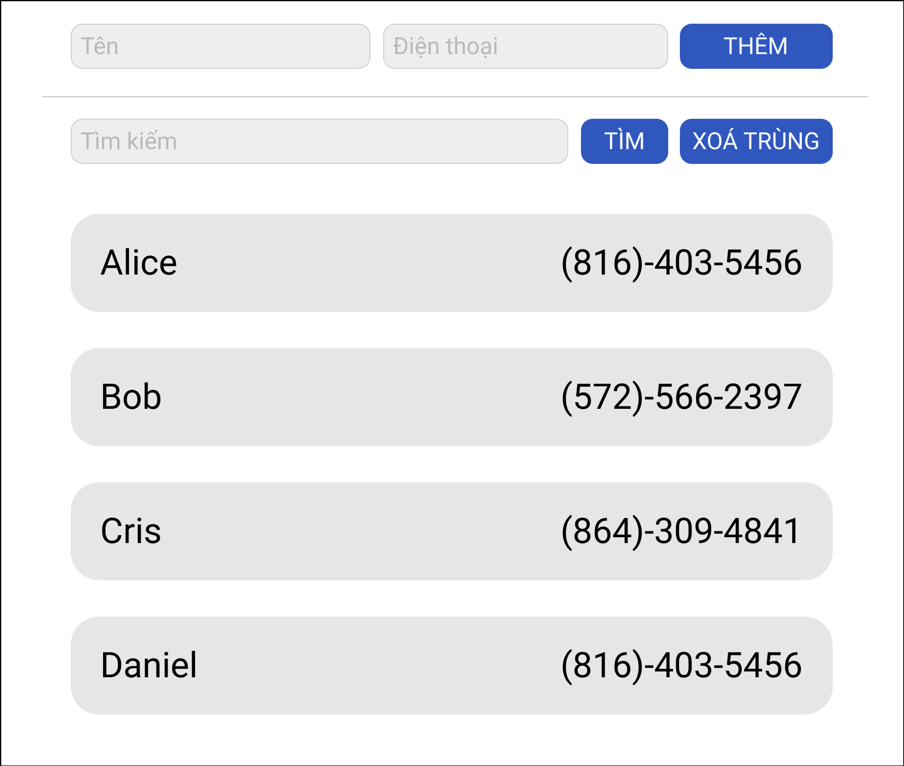

# Trắc nghiệm

**Câu 1:** `var` khai báo một biến có phạm vi trong block?

1. True
2. False

**Câu 2:** `const` khai báo một biến có phạm vi trong block?

1. True
2. False

**Câu 3:** `let` khai báo một biến có phạm vi trong block?

1. True
2. False

**Câu 4:** Giá trị sau cùng của `obj` trong ví dụ sau là gì?

```jsx
const obj = { foo: 1 }
obj.bar = 2
```

1. `{foo: 1}`
2. `Error`
3. `{foo: 1, bar: 2}`
4. `{foo: 1, 2: bar}`

**Câu 5:** Kết quả của ví dụ sau đây là gì?

```jsx
const speed = 'quick'
`The ${speed} brown fox jumps over the lazy dog.`
```

1. `TypeError`
2. `SyntaxError`
3. 'The speed brown fox jumps over the lazy dog.’
4. 'The quick brown fox jumps over the lazy dog.’

**Câu 6:** Giá trị của câu lệnh `obj[123]` trong ví dụ sau:

```jsx
const obj = {

}
```

1. `undefined`
2. `‘party!’`

**Câu 7:** Giá trị của `array` trong ví dụ sau:

```jsx
const array = [1, 2, 3]
const extension = [4, 5, 6]

array = [...extension, ...array]
```

1. `[1, 2, 3]`
2. `[1, 2, 3, 4, 5, 6]`
3. `[4, 5, 6, 1, 2, 3]`
4. `Error`

**Câu 8:** Giá trị của a trong ví dụ sau?

```jsx
function mystery(...params) {
	return params
}
let a = mystery(1, 23, 4);
```

1. `undefined`
2. `[1, 23, 4]`
3. `“1 23 4”`
4. `1 23 4`

**Câu 9:** Giá trị của biểu thức sau?

```jsx
[...[..."..."]].length
```

1. `3`
2. `6`
3. `9`
4. `Error`

**Câu 10:** Giá trị của a và b với ví dụ sau?

```jsx
let a = 12, b = 3;
[a, b] = [b, a];
```

1. a = 12, b = 3
2. a = 3, b = 12
3. a = 12, b = 12
4. a = 3, b = 3

**Câu 11** Giá trị của obj sau trong ví dụ sau?

```jsx
const obj = {
	name: "T3h"
}
const sayHello = (x) => {
	let {name} = x
  name = "Code Intensive"
}
sayHellO(obj)
```

1. `{name: “T3h”}`
2. `{name: “Code Intensive”}`
3. `Error`

**Câu 12:** Giá trị của biểu `arr` trong ví dụ sau?

```jsx
let arr = [1, 2, 3, 4, 5]
arr.map(item => {
  if (item % 2 === 0) {
		return item;
  }
	return item * 2;
})
```

1. `[1, 2, 3, 4, 5]`
2. `[2, 2, 6, 4, 10]`
3. `[2, 4, 6, 8, 10]`

**Câu 13:** Giá trị của `total` trong ví dụ sau?

```jsx
const arr = [1, 2, 3, 4, 5]
const total = arr.filter(item => item % 2 === 0)
								 .reduce((value, item) => value + item , 10)
```

1. `Error`
2. `15`
3. `6`
4. `16`

***

# Thực hành:

1. Viết một function đảo ngược một string bất kỳ, sử dụng các phương thức của array.
    
    ```jsx
    Input: "abcdef"
    Ouput: "fedcba"
    ```
    
2. Viết một function xoá các phần từ trùng lặp trong một mảng các số:
    
    ```jsx
    Input: [1, 2, 3, 5, 4, 2, 6, 4]
    Output: [1, 2, 3, 5, 4, 6]
    ```
    
3. Viết một chương trình lấy phần tử xuất hiện nhiều nhất trong một mảng và số lần suất hiện của nó trong mảng:

4. Viết một ứng dụng web danh bạ có giao diện và yêu cầu như sau:
    
    
    
    - Danh bạ được sắp xếp bằng tên theo bảng chữ cái
    - Thêm mới danh bạ với tên và số điện thoại
    - Tìm kiếm danh bạ theo tên và số điện thoại
    - Xoá các danh bạ bị trùng số điện thoại (ở trong ví dụ là Alice và Daniel). Sẽ xoá người nào đứng sau (Daniel sẽ bị xoá)