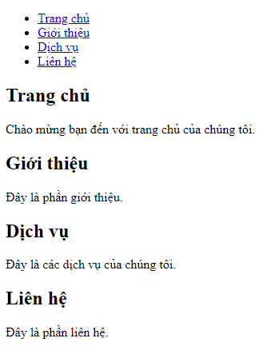

Bài tập 1: Form Đăng Ký
Yêu cầu: Tạo một form đăng ký với các trường sau: Họ tên (text), Email (email), Mật khẩu (password), Giới tính (radio), Sở thích (checkbox), và nút Gửi (submit).

Bài tập 2: Tạo bảng
Yêu cầu: Tạo một bảng với nhiều hàng và cột, bao gồm các thuộc tính rowspan và colspan.

Bài tập 3: Nhúng video và âm thanh
Yêu cầu: Nhúng một video từ YouTube và một tệp âm thanh vào trang HTML.

Bài tập 4: Tạo Thẻ Điều Hướng (Navigation Bar)
Yêu cầu: Tạo một thanh điều hướng chứa các liên kết đến các phần khác nhau của trang như "Trang chủ", "Giới thiệu", "Dịch vụ", và "Liên hệ".

Bài tập 5: Tạo Trang Web Giới Thiệu Cá Nhân
Yêu cầu: Tạo một trang giới thiệu cá nhân gồm các phần: Ảnh đại diện, Thông tin cá nhân, Kinh nghiệm làm việc, Kỹ năng, và Sở thích.

Bài tập 6: Tạo Trang FAQ (Câu Hỏi Thường Gặp)
Yêu cầu: Tạo một trang FAQ với ít nhất 3 câu hỏi và câu trả lời.

Bài tập 7: Tạo Trang Web Dự Báo Thời Tiết
Yêu cầu: Tạo một trang web hiển thị dự báo thời tiết cho 3 ngày tới. Mỗi ngày gồm các thông tin: ngày, nhiệt độ, và tình trạng thời tiết.

