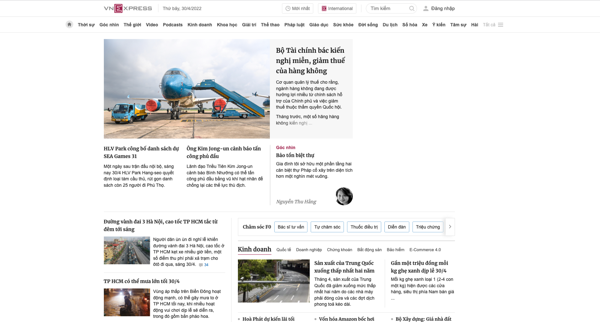
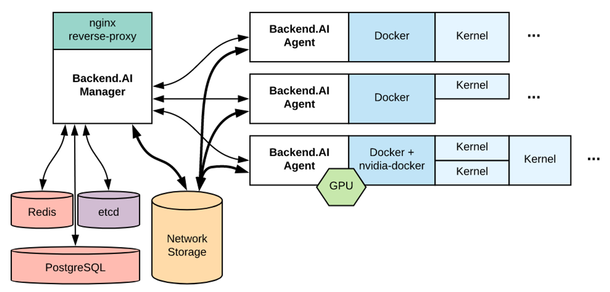
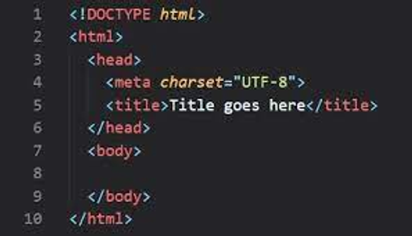
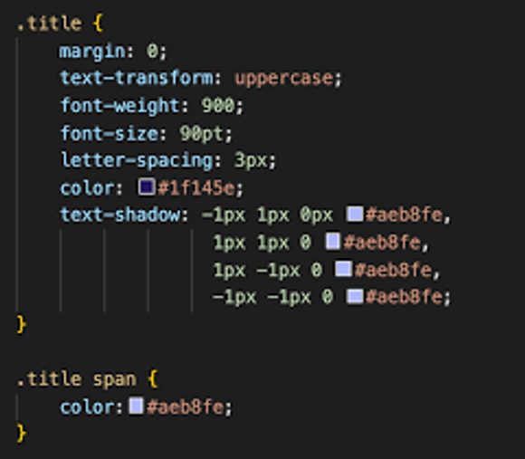
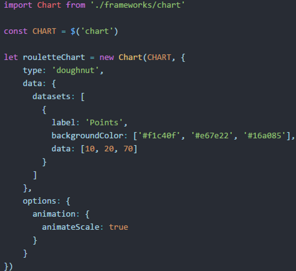

## Lesson 1: Introduction

### 1. Ứng dụng Web là gì?

Kết nối internet đã thay đổi cuộc sống của tất cả chúng ta. Nhờ internet, chúng ta có thể truy cập được kho kiến thức khổng lồ của nhân loại, kết nối và trò chuyện với những người nằm cách nửa vòng trái đất, hoặc thậm chí làm việc mà không cần tới văn phòng.

> Trang tin tức VNExpress

Các ứng dụng web là một trong những ứng dụng quan trọng của internet. Có vô vàn các loại ứng dụng web khác nhau: tin tức, xem phim, bóng đá, lập trình, blog, du lịch, ... Có hàng tỷ trang web đang chạy, cung cấp những tính năng khác nhau.

Ngoài các nội dung tĩnh (hình ảnh, văn bản), các ứng dụng web có thể chứa nhiều những nội dung đa dạng khác như âm thanh, video,... Nhiều ứng dụng như Youtube hay Google maps có những tương tác rất phức tạp với người dùng. Những trải nghiệm đó không thể có được trên các phương tiện thông tin truyền thống như sách báo.

Trong khoá học này, chúng ta sẽ học cách để xây dựng những ứng dụng web, tạo ra các trang web có giá trị đối với người dùng.

---

# 2. Các thành phần của một ứng dụng web

Dưới góc độ kỹ thuật, phần lớn các ứng dụng web hiện nay được chia ra làm hai thành phần

### Frontend: những gì người dùng tương tác

Frontend là phần người dùng tương tác trực tiếp. Tất cả những thứ một người dùng thông thường nhìn thấy: nội dung, màu sắc, phông chữ, bố cục, ... đều là các thành phần thuộc frontend. Nhiệm vụ của một frontend developer là tạo ra các trang web có giao diện bắt mắt và trải nghiệm người dùng tốt. Frontend developer giống như nhà thiết kế nội thất cho một ngôi nhà, nhiệm vụ của họ là làm cho nội thất được hài hoà và tiện dung.

Lập trình viên frontend sẽ kết hợp HTML, JS, CSS để xây dựng giao diện: từ bố cục, màu sắc đến các chi tiết nhỏ như button, menu, checkbox,...

Ngoài những kiến thức cơ bản về HTML, JS, CSS, với sự phát triển của ứng dụng web ngày nay, một frontend developer còn cần phải nắm bắt và sử dụng được các công nghệ và thư viện hiện đại, giúp cho việc xây dựng các ứng dụng web được nhanh chóng và dễ bảo trì. Một vài thư viện và framework phổ biến ngày nay là:

- ReactJS
- AngularJS
- VueJS
- Bootstrap, Foundation, Tailwind, ...

ReactJS đang là một trong những thư viện lập trình Frontend phổ biến nhất thế giới. Chúng ta sẽ học sử dụng nó ở những khoá học tiếp theo trong lộ trình.

### Backend: nhân tố trung tâm nằm sau cánh gà

Một ứng dụng web hoàn chỉnh thì không chỉ cần có frontend. Những thông tin người dùng cung cấp cần phải được xử lý và lưu trữ một cách hiệu quả. Các hệ quản trị cơ sở dữ liệu, máy chủ, dịch vụ, ... là các thành phần thường thấy của trong backend. Nhiệm vụ chính của backend developers là xử lý lượng dữ liệu người dùng cung cấp và phân phối dữ liệu đó cho các ứng dụng web. Các backend developer có thể được ví như các kĩ sư xây dựng, chịu trách nhiệm cho phần móng, tường, sàn, trần,...

Nếu như với thế giới frontend, lập trình viên chỉ có lựa chọn là HTML, CSS và JS, thì đối với một backend developer, họ có đa dạng hơn các lựa chọn về công nghệ. Có rất nhiều công cụ và ngôn ngữ lập trình có thể được sử dụng để xây dựng các ứng dụng backend:

- NodeJS
- Java
- C#
- PHP
- Golang
- MySQL, MongoDB, ...

Trong các phần sau của lộ trình, chúng ta sẽ học cách sử dụng NodeJS và MongoDB để xây dựng ứng dụng backend.

---

# 3. Bắt đầu với frontend...

Như đã nói ở trên, các ứng dụng frontend được xây dựng bằng 3 công cụ: HTML, CSS và JS. Vậy cụ thể chúng là gì?

**HTML (HyperText Markup Language)** là ngôn ngữ đánh dấu “siêu văn bản”. Siêu văn bản ở đây có nghĩa là bao gồm các nội dung dạng chữ và các các nội dung như hình ảnh, âm thanh, video,... HTML được sử dụng để tạo ra nội dung cho trang web.

**CSS (Cascading Style Sheets)** là ngôn ngữ lập trình được sử dụng để mô tả giao diện của các “tài liệu” được viết bằng các ngôn ngữ đánh dấu như HTML. CSS chịu trách nhiệm thay đổi màu sắc, font chữ, bố cục của các thành phần trên ứng dụng web.

**Javascript** là một ngôn ngữ lập trình dạng kịch bản. Javascript được sử dụng để thêm các tương tác của người dùng đối với ứng dụng: click, kéo thả, ... Ngoài ra, JS còn có thể được sử dụng để chỉnh sửa HTML/CSS, thực hiện các network request, tương tác với các tính năng của trình duyệt...

---

# 4. Các công cụ cần được cài đặt trong khoá học

- Visual Studio Code: https://code.visualstudio.com/
  - Extension: https://marketplace.visualstudio.com/items?itemName=ritwickdey.LiveServer
- Chrome Browser
