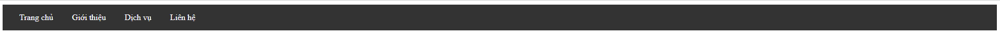
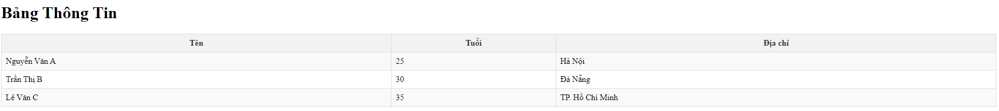
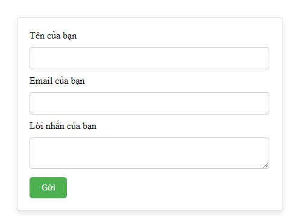
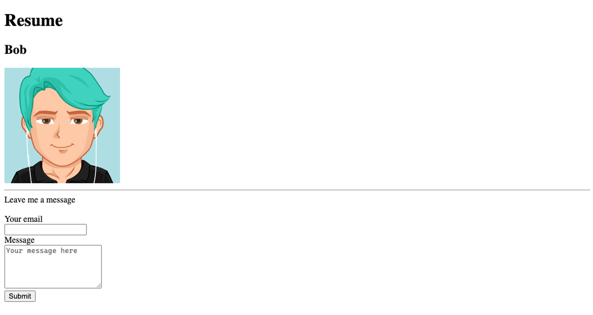
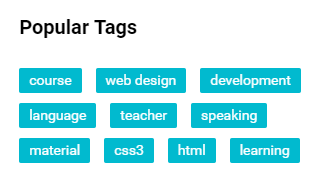
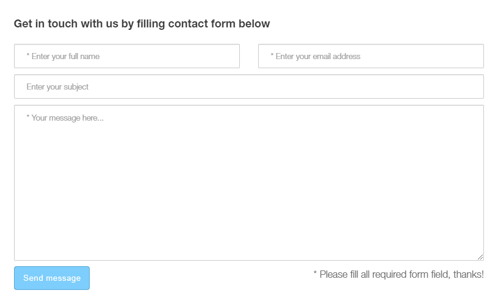
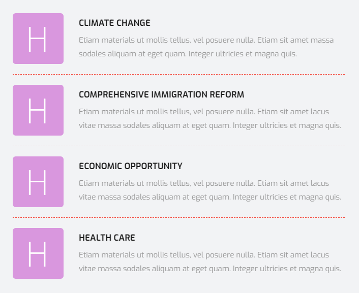
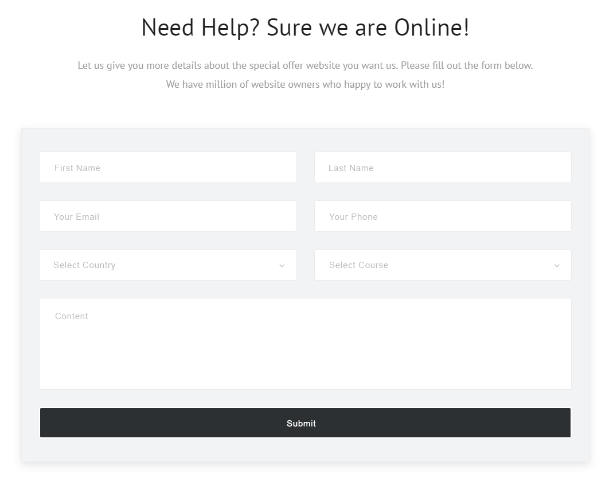

Bài tập 1: Tạo Thẻ Điều Hướng (Navigation Bar) với Màu Sắc và Kiểu Chữ
Yêu cầu: Tạo một thanh điều hướng chứa các liên kết. Sử dụng CSS để thiết lập màu nền, màu chữ, và kiểu chữ cho các liên kết.

Bài tập 2: Tạo Bảng với Các Kiểu Dáng
Yêu cầu: Tạo một bảng HTML và sử dụng CSS để thiết lập các kiểu dáng như viền, màu nền, và màu chữ cho bảng.

Bài tập 3: Tạo Form Liên Hệ với Kiểu Dáng
Yêu cầu: Tạo một form liên hệ đơn giản và sử dụng CSS để thiết lập kiểu dáng cho các phần tử của form.

Hoàn thành các giao diện sau (giống trong ảnh, màu sắc tương đối không nhất thiết phải giống, chủ yếu tập chung vào sử dụng các thẻ html, các thuộc tính css để dựng layout)

