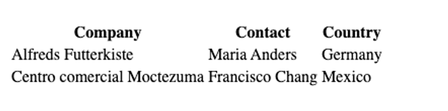
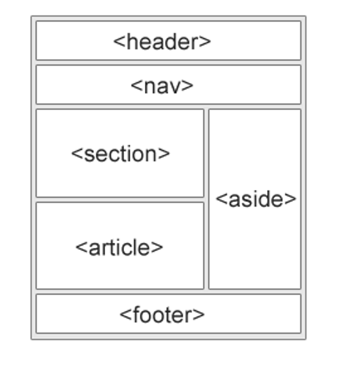
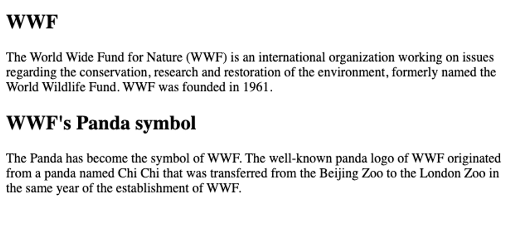
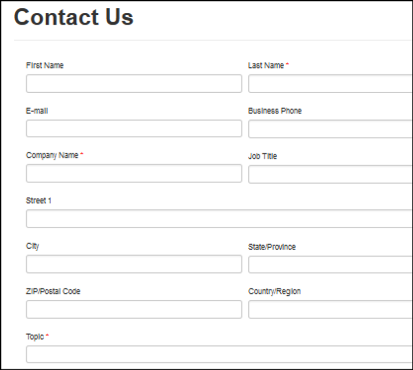
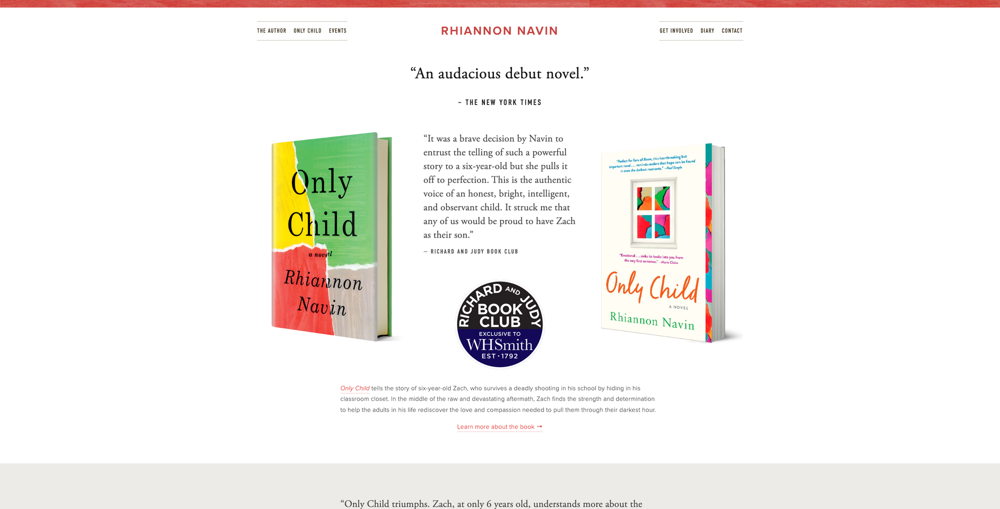
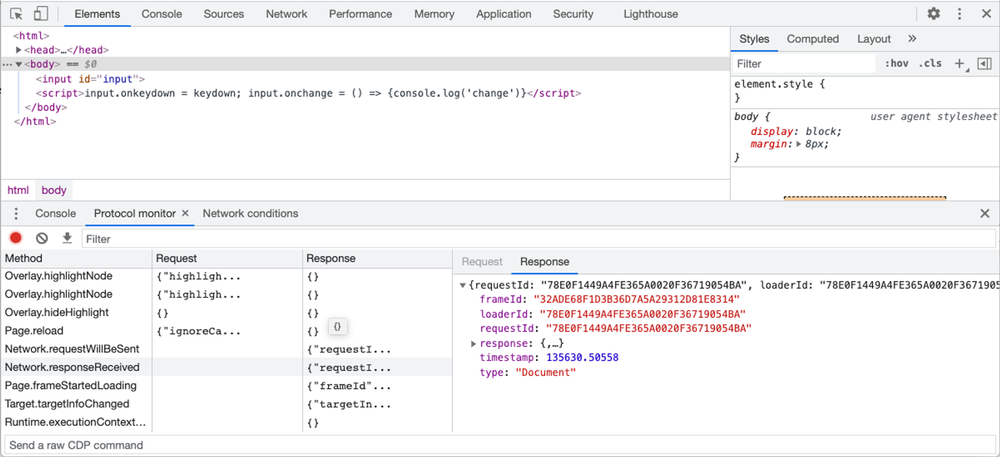
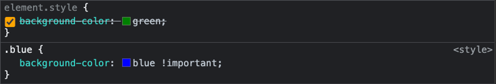

## Lesson 2: HTML

# HTML là gì

HTML là viết tắt của Hypertext Markup Language (ngôn ngữ đánh dấu siêu văn bản). HTML là ngôn ngữ tiêu chuẩn để tạo ra các trang web ngày nay.

> 💡 Siêu văn bản là các nội dung không đơn thuần là chữ. Siêu văn bản là dạng văn bản có thể chứa nhiều thành phần khác bên trong như hình ảnh, video, audio hoặc nhiều tương tác với người dùng

Có nhiều trình duyệt web đang được sử dụng trên thị trường. Một vài cái tên nổi bật là Google Chrome, Mozilla Firefox hay Safari. Tuy nhiên, cách hoạt động của chúng đều đơn giản là: nhận về một file HTML từ web server hoặc trên máy tính, và sau đó thực hiện việc hiển thị các trang web dưới dạng đa phương tiện. HTML mô tả cấu trúc một trang web theo một cách có hệ thống.

HTML chứa một loạt các phần tử HTML khác nhau. Đây là các cấu kiện, được sử dụng để xây dựng nên các trang web với vô vàn biến thể khác nhau. Có thể xem các phần tử HTML giống như những viên gạch, thanh thép tạo nên các ngôi nhà.

Một trang HTML thường sẽ có cấu trúc cơ bản như sau:

```
<!DOCTYPE html>
<html>
	<head>
		<title>Page Title</title>
	</head>
	<body>
		<h1>My First Heading</h1>
		<p>My first paragraph.</p>
	</body>
</html>
```

> <span style="font-size: 10px">Những thành phần nằm trong đoạn code trên sẽ được giải thích rõ hơn phía dưới</span>

Phiên bản hiện tại được tổ chức W3C khuyến nghị là phiên bản HTML5. Đây cũng là phiên bản mà hầu hết các trình duyệt phổ biến hiện tại đang hỗ trợ.


---

# Cấu trúc cơ bản của HTML

Để bắt đầu với HTML, ta cần tạo một file có phần đuôi mở rộng là `.html`. Bên trong file này, ta có nội dung như sau:

```jsx
<!DOCTYPE html>
<html>
	<head>
		<title>Page Title</title>
	</head>
	<body>
		<h1>My First Heading</h1>
		<p>My first paragraph.</p>
	</body>
</html>
```

Một file HTML sẽ có vài đặc điểm sau:

- Cần phải khai báo loại tài liệu ở trên cùng: `<!DOCTYPE html>`
- Cần phải bắt đầu với `<html>` và kết thúc với `</html>`
- Phần nội dung hiển thị cần nằm giữa `<body>` và `</body>`

Để xem được output của đoạn code vừa rồi, chúng ta có thể mở file index.html trực tiếp bằng trình duyệt mà bạn đang sử dụng.

> 📌 Trong khoá học này, chúng ta sẽ sử dụng một extension của vscode là “Live server“ để thực hiện việc chạy file HTML. Ngoài ra, extension này sẽ giúp trình duyệt tự động làm mới lại nội dung mỗi khi chúng ta thực hiện thay đổi nội dung của các file HTML.

# HTML Elements

HTML là một ngôn ngữ có cấu trúc dạng thẻ, bao gồm **thẻ mở** và **thẻ đóng.** Thẻ mở được ký hiệu với dấu `<>` và thẻ đóng được ký hiệu với dấu `</>`. Phần nội dung nằm giữa được gọi là thân thẻ.

Một cặp thẻ mở, thẻ đóng và phần thân của nó sẽ tạo nên một phần tử HTML. Trong HTML có một tập hợp định sẵn các phần tử khác nhau. Mỗi phần tử HTML sẽ có những chức năng khác nhau. Sử dụng kết hợp chúng sẽ tạo ra các giao diện tương ứng.

```html
<tagname>Body</tagname>
```

Có nhiều phần tử HTML cho phép phần thân của nó chứa các phần tử HTML khác. Ví dụ như `<body>` được lồng bên trong `<html>`

Một số ví dụ về các phần tử HTML

```html
<h1>Heading</h1>
<p>Paragraph here</p>
<button>Click</button>
```

### HTML Attributes

Các thuộc tính HTML có tác dụng cung cấp các thông tin thêm cho các HTML elements. Tất cả các HTML elements đều có thể có các thuộc tính khác nhau. Các thuộc tính HTML có dạng một cặp key-value và được khai báo ở phần thẻ mở của các HTML elements.

Một số ví dụ về HTML attributes:

```
<a href="https://www.google.com">Visit Google</a>

```

​
HTML Self-closing tag
Nếu một HTML element không có nội dung bên trong, HTML cho phép khai báo các thẻ HTML mà không cần sử dụng thẻ đóng. Việc đóng thẻ được thực hiện ngay bên trong thẻ mở. Một số ví dụ như sau:

```
<input type="text" />
<br />
<hr />

```

---

# Một số HTML phổ biến

### HTML Heading

Các thẻ heading là các thẻ tiêu đề, thường được sử dụng để là đề mục cho văn bản. Có tất cả 6 thẻ heading trong HTML, lần lượt là `<h1>`, `<h2>`, `<h3>`, `<h4>`, `<h5>`, `<h6>`, đại diện cho các kích cỡ heading khác nhau. Kích cỡ của heading giảm dần từ 1 đến 6

```html
<h1>Heading 1</h1>
<h2>Heading 2</h2>
<h3>Heading 3</h3>
<h4>Heading 4</h4>
<h5>Heading 5</h5>
<h6>Heading 6</h6>
```

> 💡 Các thẻ heading thường khá quan trọng trong ứng dụng web, do các máy tìm kiếm như Google hay Bing sử dụng chúng để xác định nội dung bài viết

### HTML Paragraph

Thẻ `<p>` được sử dụng để tạo ra một đoạn văn bản. Một đoạn văn bản luôn luôn bắt đầu trên một dòng mới, và các trình duyệt sẽ tự động thêm các khoảng trắng ở trước và sau đoạn văn bản đó.

```html
<p>This is a paragraph.</p>
<p>This is another paragraph.</p>
```


### Link

Thẻ `<a>` được sử dụng để tạo ra một đường dẫn bên trong trang web. Khi click vào một link, người dùng có thể di chuyển từ trang web này sang trang web khác.

```html
<a href="https://www.google.com">Visit Google</a>
```


### Images

Thẻ `` được sử dụng để hiển thị hình ảnh lên màn hình. Thẻ này là một thẻ self-closing, nó không chưa nội dung bên trong. Sử dụng thuộc tính `src` để hiển thị ảnh với đường dẫn tương ứng.

```html
<h2>HTML Image</h2>

```


### Table

Thẻ `<table>` trong HTML cho phép lập trình viên có thể sắp xếp dữ liệu theo dạng dòng và cột. Bên trong `<table>` sẽ bao gồm một vài những thành phần khác như sau:

- `<thead>` đánh dấu thành phần tiêu đề của bảng
- `<tbody>` đánh dấu phần thân của bảng
- `<tr>` một dòng của bảng
- `<td>` mỗi ô của bảng
- `<caption>` chú thích cho bảng

```html
<table>
  <thead>
    <tr>
      <th>Company</th>
      <th>Contact</th>
      <th>Country</th>
    </tr>
  </thead>
  <tbody>
    <tr>
      <td>Alfreds Futterkiste</td>
      <td>Maria Anders</td>
      <td>Germany</td>
    </tr>
    <tr>
      <td>Centro comercial Moctezuma</td>
      <td>Francisco Chang</td>
      <td>Mexico</td>
    </tr>
  </tbody>
</table>
```

---



### List

Trong HTML có 2 dạng list cơ bản:

- `<ul>` Unordered list: Danh sách không có thứ tự. Các phần tử được đánh thứ tự bằng dấu chấm (bullet)
- `<ol>` Ordered list: Danh sách có thứ tự. Các phần tử được đánh thứ tự bằng số.

Sử dụng thẻ `<li>` để khai báo các phần tử bên trong danh sách

```html
<h2>An unordered HTML list</h2>

<ul>
  <li>Coffee</li>
  <li>Tea</li>
  <li>Milk</li>
</ul>

<h2>An ordered HTML list</h2>

<ol>
  <li>Coffee</li>
  <li>Tea</li>
  <li>Milk</li>
</ol>
```


---

### `<div>` & `<span>`

### `<div>` & `<span>`

`<div>` là một thẻ “tổng quát”, không cứ ý nghĩa hoặc thể hiện bất cứ điều gì trên ứng dụng web. Trong HTML, `<div>` được sử dụng để phân chia trang web thành nhiều thành phần khác nhau. `<div>` thường được sử dụng trong việc chia layout cho ứng dụng web. Chúng ta sẽ nói thêm về `<div>` trong những lesson tiếp theo.

`<span>` cũng có tính chất gần tương tự như `<div>`. Điểm khác biệt giữa `<div>` và `<span>` là đặc tính hiển thị của nó: `<div>` sẽ chiếm hết chiều ngang màn hình, trong khi `<span>` sẽ chiếm phần nội dung bên trong của nó. Như đã đề cập ở trên, chúng ta sẽ nói thêm về `<div>` và `<span>` ở những lesson tiếp theo.

---

### Các phần tử HTML có “ngữ nghĩa”:

Trong HTML, những thẻ như `<div>` và `<span>` không mang ý nghĩa gì. Nó không ám chỉ bất cứ nội dung nào bên trong của nó. Tuy nhiên, có nhiều phần tử HTML mang một vài ý nghĩa nhất định, ám chỉ nội dung nằm bên trong của nó

- `<article>`
- `<aside>`
- `<details>`
- `<figcaption>`
- `<figure>`
- `<footer>`
- `<header>`
- `<main>`
- `<mark>`
- `<nav>`
- `<section>`
- `<summary>`
- `<time>`



Các phần tử HTML trên không thực sự làm cho giao diện của ứng dụng web trở nên khác biệt. Để đạt được giao diện như mong muốn, chúng ta vẫn sẽ cần phải thực hiện styling thông qua CSS cho chúng.

Tuy nhiên, bạn nên sử dụng các phần tử đó một cách hợp lý. Các máy tìm kiếm như Google, Bing, ... sẽ sử dụng các thẻ trên để thực hiện đánh chỉ số cho trang web của chúng ta. Vì vậy, sử dụng đúng mục đích sẽ giúp trang web trở nên “thân thiện” với các máy tìm kiếm, giúp cho trang web có được vị trí tốt hơn trên các công cụ đó.

```html
<section>
  <h1>WWF</h1>
  <p>
    The World Wide Fund for Nature (WWF) is an international organization
    working on issues regarding the conservation, research and restoration of
    the environment, formerly named the World Wildlife Fund. WWF was founded in
    1961.
  </p>
</section>

<section>
  <h1>WWF's Panda symbol</h1>
  <p>
    The Panda has become the symbol of WWF. The well-known panda logo of WWF
    originated from a panda named Chi Chi that was transferred from the Beijing
    Zoo to the London Zoo in the same year of the establishment of WWF.
  </p>
</section>
```



---

# HTML Form

Form là một trong những thành phần quan trọng trong bất cứ ứng dụng web nào. Form được sử dụng để người dùng có thể nhập dữ liệu vào. Dữ liệu này thường được sử dụng để gửi lên web server.



Một form với nhiều ô input, cho phép người dùng nhập dữ liệu.

Để bắt đầu khai báo form bên trong HTML, chúng ta sử dụng thẻ `<form>` và các thẻ `<input>`

```html
<form>
  <label>Your name</label>
  <input type="text" />
</form>
```

Bên trong một form thường sẽ là các thẻ `<input>`. Các thẻ `<input>` sẽ có những type khác nhau, phục vụ cho việc người dùng cung cấp nhiều kiểu dữ liệu khác nhau:

- `type=”text”`: nội dung văn bản thông thường trên một dòng
- `type=”password`”:  nội dung là mật khẩu, các ký tự được “đeo mặt nạ”
- `type=”submit”`: một button sử dụng để gửi dữ liệu bên trong form
- `type=”reset”`: một button được sử dụng để reset dữ liệu trong form về dữ liệu mặc định
- `type=”radio”`: một radio button, người dùng chọn một trong nhiều giá trị
- `type=”checkbox”`: một checkbox, người dùng được phép bật hoặc tắt giá trị
- `type=”date”`: nội dung là ngày, giao diện lịch được hiển thị
- `type=”color”`: chọn màu sắc
- `type=”email”`: nội dung cần phải là email
- `type=”file”`: nội dung là một file trong máy tính.
- `type=”number”`: nội dung là số.

```
📖 Tất cả các input types được định nghĩa với HTML được liệt kê trong danh sách sau: https://developer.mozilla.org/en-US/docs/Web/HTML/Element/input
```

Với `<input type="text"/>`, chúng ta chỉ có thể xử lý với nội dung là văn bẳn nằm trên một dòng. Để có thể xử lý được văn bản có nhiều dòng, chúng ta có thể sử dụng một thẻ HTML là `textarea` để xử lý.

```html
<form>
  <textarea cols="40" rows="5" />
</form>
```

Thực tế, một form trong ứng dụng web sẽ có rất nhiều trường dữ liệu khác nhau. Không nên để một form có quá nhiều input, khiến cho form bị rối và người dùng cảm thấy khó chịu khi phải nhập dữ liệu quá nhiều.

```
🧑‍💻 1. Hãy thử sử dụng <input/> với type là color và xem kết quả
    1. Hãy thử đặt thẻ <input /> bên trong thẻ <label> và xem kết quả
```

---

# CSS là gì?

CSS là ngôn ngữ được sử dụng để tạo phong cách cho trang web - Cascading Style Sheet. Nó được dùng để tạo phong cách và định dạng cho các ngôn ngữ markup như HTML. CSS tham gia vào công việc thay đổi bố cục, màu sắc hoặc font chữ trong một ứng dụng web.

Trước khi có CSS, chúng ta sử dụng những thẻ HTML như `<font>`, `<center>` hay `<table>` để định dạng. Việc này dễ dàng khiến ứng dụng web trở nên phức tạp và khó bảo trì sau này. Đặc biệt là khi căn chỉnh bố cục của trang web.



Một trang web bắt mắt hơn nhiều với các chỉnh sửa về bố cục, màu sắc, font chữ.

---

# CSS Inline

Bắt đầu với một trang HTML, ta có thể thay đổi màu nền của trang web bằng cách thêm thuộc tính `style` cho thẻ `<body>`

```html
...

<body style="background-color: blue;">
  ...
</body>

...
```

Refresh trang web, chúng ta sẽ thấy CSS được áp dụng. Màu nền của trang web được đổi thành màu xanh.
Nội dung trong thuộc tính style của thẻ `<body>`

- `background-color`: tên của thuộc tính CSS chúng ta muốn thay đổi
- `blue`: giá trị của thuộc tính đó. Trong ví dụ này, “blue” là màu nền mà chúng ta muốn thay đổi.

> 📌 Màu sắc trong CSS có thể viết dưới dạng tên màu hoặc mã hex. CSS có sẵn một danh sách màu sắc được định nghĩa với tên. Tham khảo danh sách ở đường dẫn: https://developer.mozilla.org/en-US/docs/Web/CSS/color_value/color_keywords. Ngoài ra, nếu muốn sử dụng các màu sắc không nằm trong danh sách, chúng ta có thể sử dụng mã hex của màu sắc. Tham khảo https://www.color-hex.com/ để chọn những mã màu yêu thích để xây dựng ứng dụng web của bạn

---

# Internal CSS

Với cách viết CSS Inline bên trên, ta cần phải copy CSS nhiều lần cho các phần từ khác nhau. Để có thể viết CSS cho toàn bộ trang web, ta có thể sử dụng thẻ `<style>`

Đặt thẻ `<style>` bên trong thẻ `<head>` của trang web và thêm nội dung như sau:

```html
...

<head>
  <style>
    body {
      background-color: blue;
    }
  </style>
</head>

...
```

Cấu trúc bên trong thẻ `<style>`:

- `body` (selector) phần tử mà chúng ta muốn thay đổi các giá trị CSS.
- `background-color: blue;` thay đổi giá trị CSS, tương tự với Inline style bên trên

Với cách viết CSS này, chúng ta có thể thay đổi giá trị CSS cho nhiều thành phần trên trang web mà không cần phải đến từng phần tử HTML trên màn hình. Ví dụ, thay đổi màu nền của tất cả các thẻ `<p>` trên màn hình

```html
...

<head>
  <style>
    p {
      color: red;
    }
  </style>
</head>

...
```

---

# External CSS

Với việc sử dụng internal CSS như trên, ta đã có thể tạo ra các mã CSS áp dụng cho nhiều thành phần trên một trang web. Tuy nhiên, nếu như chúng ta muốn tạo ra các mã CSS có thể sử dụng được trên nhiều trang web khác nhau, chúng ta sẽ cần viết CSS thành những file riêng biệt.

Tiến hành tạo một file là `style.css` với nội dung bên trong như sau:

```css
body {
  background-color: blue;
}

p {
  color: red;
}
```

Sau đó, tiến hành link file `style.css` với file html với thẻ `<link>` như sau

```html
...

<head>
  <link rel="stylesheet" href="style.css" />
</head>

...
```

Kết quả đạt được sẽ giống như với internal CSS. Nhưng chúng ta có thể sử dụng những mã CSS này ở nhiều trang web khác nhau.

---

# Debug CSS

Debug là một trong những kỹ năng cần thiết của bất cứ lập trình viên nào. Trình duyệt Chrome đi kèm với công cụ “Chrome developer tool” sẽ giúp chúng ta dễ dàng biết lỗi CSS nằm ở đâu.

Để mở công cụ Chrome developer tool, chúng ta có thể:

- Click chuột phải > chọn “Inspect”
- Click Menu > More tools > Developer tool
- Ấn phím F12 trên bàn phím



Giao diện của Chrome developer tool

Với trang web hiện tại, ta sửa nội dung bên trong file `index.html` thành như sau:

```html
...

<head>
  <link rel="stylesheet" href="styles.css" />
  <head>
    <body style="background-color: white;">
      ...
    </body>
    ...
  </head>
</head>
```

### Vấn đề đầu tiên

Lúc này, nếu như mở developer tools, ta thấy ở tab Console sẽ xuất hiện thông báo lỗi như sau:

`Failed to load resource: net::ERR_FILE_NOT_FOUND`

Đây là lỗi khi chúng ta link một file không tồn tại. Chúng ta đã link tới một file CSS là `styles.css`. File này không tồn tại trong ứng dụng, do chúng ta đã chỉnh sửa tên file từ `style.css` thành `styles.css`. Với lỗi này, chúng ta chỉ đơn giản là chỉnh sửa lại tên file cho đúng.

### Vấn đề thứ hai

Phần `background-color` của trang web không còn màu blue như ban đầu. Nó đã trở thành màu trắng.

Với developer tools, thao tác như sau:

- Chọn tab Elements
- Chọn thẻ `<body>` bên trong tab Elements
- Quan sát phần Styles bên phải

Lúc này ta thấy, thuộc tính `background-color: blue;` đã bị gạch đi, bị ghi đè bởi thuộc tính `background-color: white;` ở bên trên. Với `background-color: blue;`, ta thấy nguồn gốc của nó đến từ file `style.css`. Còn với `background-color: white;`, nó chính là inline style của `<body>`. Như vậy, ta thấy đã có xung đột xảy ra khi với 2 phần style riêng biệt, nó đã cùng chỉnh sửa một phần tử trong trang web. Phần này cũng liên quan tới một khái niệm trong CSS là **Độ ưu tiên.** Chúng ta sẽ nói về độ ưu tiên ở những phần sau.

---

# CSS Selectors

Ta thấy một đoạn mã CSS sẽ có dạng như sau:

```html
selector { attribute: value }
```

- `selector`: đinh danh các thành phần sẽ được style bên trong trang web
- `attribute`: thuộc tính được thay đổi
- `value`: giá trị muốn thay đổi

Ở các phần trên, ta đã sử dụng các tên của thẻ để làm định danh. Đây là cách đơn giản nhất để chỉ ra các phần tử nào trên trang web được áp dụng các thuộc tính CSS. Với cách làm này, tất cả các thẻ HTML trên trang web đều sẽ được cập nhật.

Để có thể áp dụng các thuộc tính CSS cho các thẻ HTML một cách cụ thể hơn, chúng ta cần “chọn” vào các HTML element một cách cụ thể hơn.

```html
<style>
  div {
    background-color: blue;
  }
</style>

...

<div>Blue</div>
<div>Red</div>
```

### CSS Classes & ID

Đê có thể phân biệt được 2 thẻ `<div>` trong ví dụ trên, ta sẽ thêm một thuộc tính đặc biệt cho các thẻ HTML là `class`

```html
<div class="blue">Blue</div>
<div class="red">Red</div>
```

Lúc này, ta thêm đoạn mã CSS để áp dụng các màu nền khác nhau cho các class riêng biệt. Khác với selector bên trên, để chọn các class trong CSS, ta sử dụng dấu chấm (.) để đánh dấu đó là một CSS class

```html
<style>
  .blue {
    background-color: blue;
  }
  .red {
    background-color: red;
  }
</style>

...

<div class="blue">Blue</div>
<div class="blue">Red</div>
```

Lúc này, ta sẽ nhận được kết quả là 2 thẻ div đã có màu sắc khác nhau.

Ngoài class, mỗi một thẻ HTML trên ứng dụng còn có một thuộc tính khác là `id`. Chúng ta cũng có thể sử dụng thuộc tính này để làm selector bên trong CSS. Với `id`, chúng ta sử dụng dấu thăng (#) để CSS nhận diện được đó là một ID. Ví dụ như sau:

```html
<style>
  #green {
    background-color: green;
  }
</style>

...

<div id="green">Green</div>
```

Mặc dù cùng là CSS selector, class và ID lại có những điểm khác nhau.

| ID                                                                                                                                   | Classes                                                                                                                            |
| ------------------------------------------------------------------------------------------------------------------------------------ | ---------------------------------------------------------------------------------------------------------------------------------- |
| Một HTML element chỉ có thể có một giá trị ID                                                                                        | Một HTML element có thể có nhiều hơn một class. Các class được phân tách nhau bởi dấu cách. Ví dụ: <div class=”red blue”>Red</div> |
| Trong một trang web, ID thường được sử dụng làm định danh cho một phần tử. Do đó, chúng ta hạn chế sử dụng 2 phần tử có chung một ID | Một class có thể được sử dụng cho nhiều phần tử HTML khác nhau trên ứng dụng.                                                      |

> 📌 Trong thực tế, Class là cách thường được sử dụng để tạo ra các selector. Có thể tham khảo các thư viện CSS nổi tiếng và học cách viết của họ (Bootstrap, Tailwind, …)

### Các selector khác

Ngoài class và ID, CSS còn có rất nhiều những cách để “chọn” các phần tử HTML để áp dụng các style trong ứng dụng. Một vài ví dụ selector nổi bật:

- `.class1.class2`: HTML elements cần phải có đủ 2 class bên trong.
- `.class1 .class2`: Các HTML elements có class `.class2` mà có thẻ bao ngoài có chứa `.class1`
- `div > p`: Tất cả thẻ `<p>` nằm trực tiếp bên trong một thẻ `<div>`
- `a:hover`: Thẻ `<a>` khi được hover (con trỏ chuột nằm ở trên)

Và còn rất nhiều selector khác nữa. Việc sử dụng thuần thục các CSS selector sẽ giúp chúng ta tạo ra được những hiệu ứng CSS khác nhau tuỳ thuộc vào từng hoàn cảnh cụ thể.

> 📌 Chúng ta có thể tham khảo danh sách các cú pháp selector ở đường link sau: https://www.w3schools.com/cssref/css_selectors.asp

---

# Độ ưu tiên trong CSS

Xét ví dụ sau:

```html
<style>
  div {
    background-color: red;
  }
  .blue {
    background-color: blue;
  }
</style>

...

<div class="blue" style="background-color: green;">Which color?</div>
```

Với ví dụ này, thẻ `<div>` sẽ nhận màu sắc nền là màu nào?

Với các xung đột như vậy, CSS có thứ tự ưu tiên nhất định để quyết định xem luật nào được áp dụng. Thứ tự của một vài thuộc tính CSS theo chiều giảm dần (ưu tiên cao nhất ở trên đầu)

1. Inline CSS: CSS trực tiếp trên dòng có độ ưu tiên cao.
2. `id`
3. `class`
4. Độ “cụ thể” của selector

CSS có một bảng tính toán “điểm” cho độ cụ thể với ví dụ như sau:

| Selector | Điểm “độ cụ thể” |
| -------- | ---------------- |
| p        | 1                |
| p.test   | 1 + 10           |

Chúng ta có thể tính toán được thuộc tính nào sẽ được áp dụng dựa vào bảng tính trên 😎

### `!important`

Các thuộc tính CSS có thể được thêm một giá trị đặc biệt ở cuối. Xét ví dụ sau:

```html
<style>
  .blue {
    background-color: blue !important;
  }
</style>

...

<div class="blue" style="background-color: green;">Blue</div>
```

Mặc dù có giá trị cụ thể lớn hơn, tuy nhiên inline style ở đây vẫn có độ ưu tiên thấp hơn so với class `.blue` ở trên. Với việc thêm thuộc tính `!important`, trình duyệt sẽ hiểu giá trị này sẽ ko bị ghi đè bởi các thuộc tính CSS khác.

> 📌 Trên trình duyệt, với developer tools, chúng ta có thể nhìn thấy được thuộc tính CSS nào đang được áp dung cho phần tử hiện tại. Các thuộc tính bị ghi đề sẽ có dòng kẻ gạch ngang qua


