Bài tập 1: Tạo Bài Viết Blog
Yêu cầu: Tạo một bài viết blog với tiêu đề, đoạn văn, và hình ảnh. Sử dụng box model để định kiểu cho các phần tử.
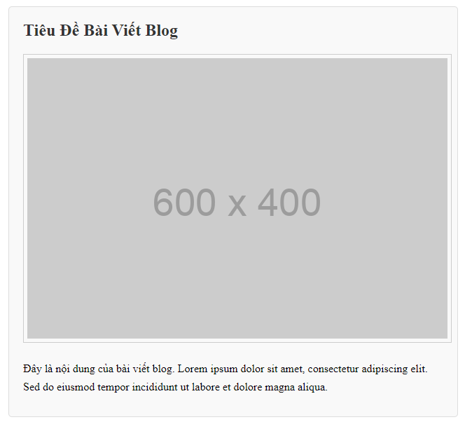

Bài tập 2: Tạo Thẻ Sản Phẩm
Yêu cầu: Tạo một thẻ sản phẩm với hình ảnh, tên sản phẩm, giá, và nút mua hàng. Sử dụng box model để định kiểu cho các phần tử.
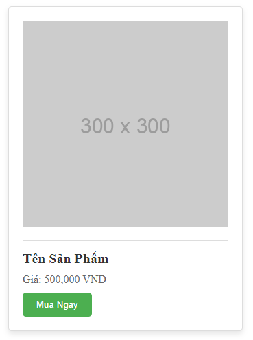

Bài tập 3: Tạo Menu Điều Hướng
Yêu cầu: Tạo một menu điều hướng với các mục menu. Sử dụng box model để định kiểu cho các mục menu.
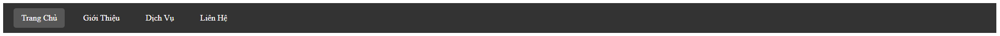

Bài tập 4: Tạo Footer với Thông Tin Liên Hệ
Yêu cầu: Tạo một footer với thông tin liên hệ và các liên kết mạng xã hội. Sử dụng box model để định kiểu cho các phần tử.

Bài tập 5: Tạo Danh Sách Bài Viết
Yêu cầu: Tạo một danh sách các bài viết với tiêu đề và đoạn mô tả ngắn. Sử dụng box model để định kiểu cho các phần tử.
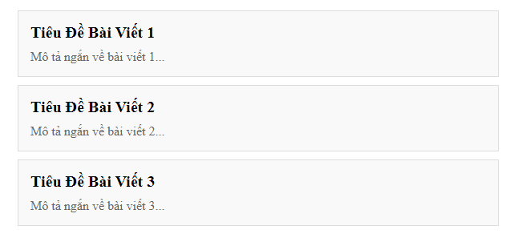

Bài tập 6: Tạo Thẻ Thông Tin Người Dùng
Yêu cầu: Tạo một thẻ thông tin người dùng với hình đại diện, tên và mô tả ngắn. Sử dụng box model để định kiểu cho các phần tử.

Bài tập 7: Tạo Trang Liên Hệ
Yêu cầu: Tạo một trang liên hệ với form liên hệ và thông tin liên hệ bên cạnh. Sử dụng box model để định kiểu cho các phần tử.
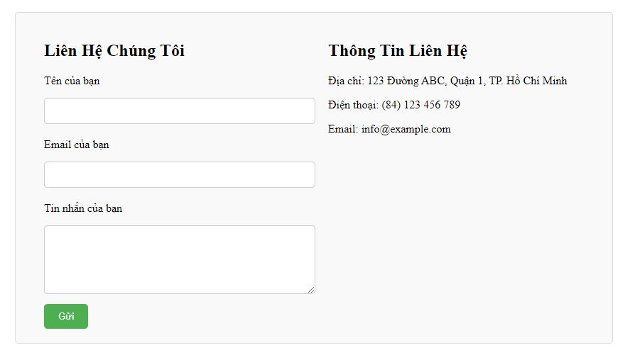

Bài tập 8: Tạo Hộp Thoại (Modal)
Yêu cầu: Tạo một hộp thoại hiển thị ở giữa màn hình với nền mờ phía sau.
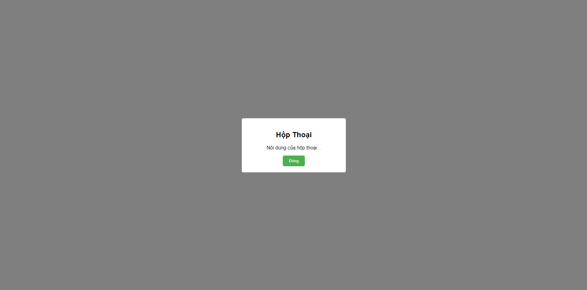

Bài tập thêm: Hoàn thành các giao diện sau (giống trong ảnh, màu sắc tương đối không nhất thiết phải giống, chủ yếu tập chung vào sử dụng các thẻ html, các thuộc tính css để dựng layout)

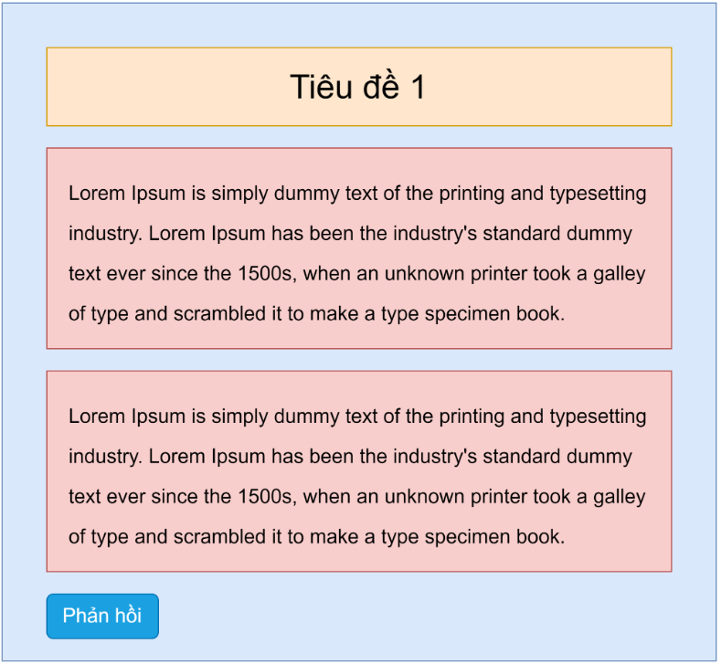

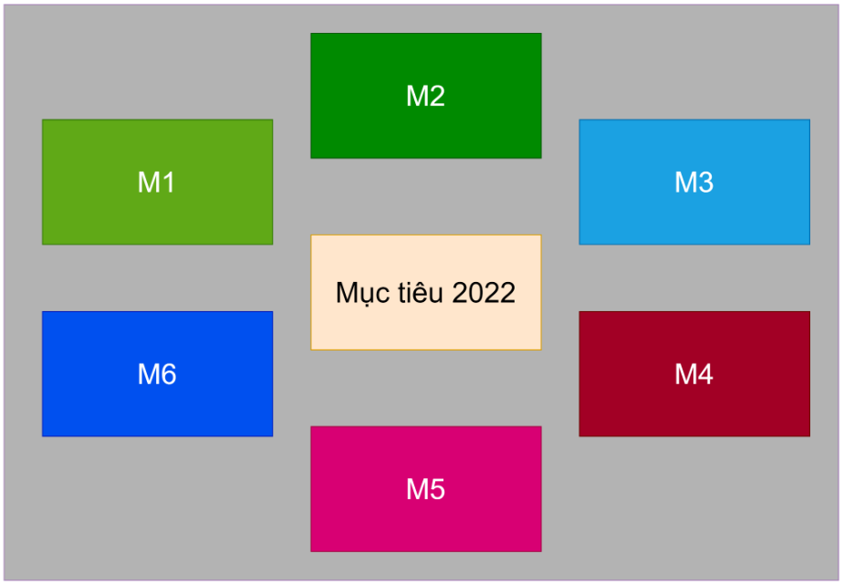

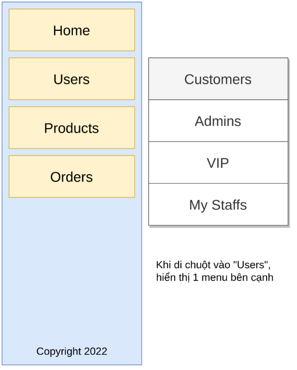

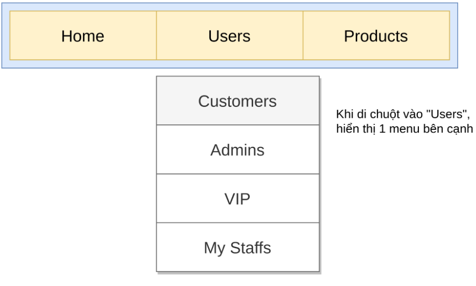

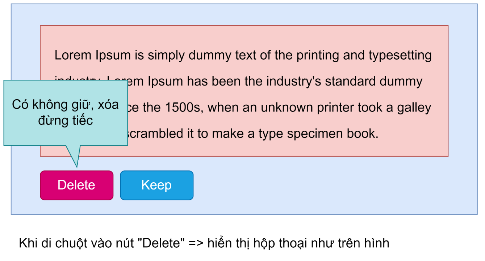

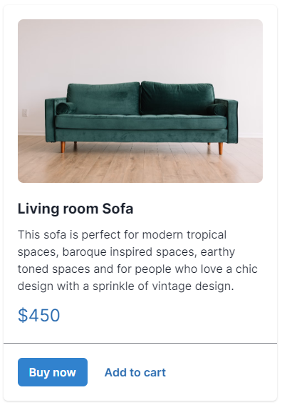

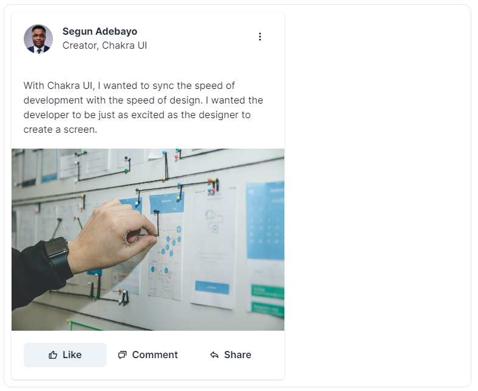

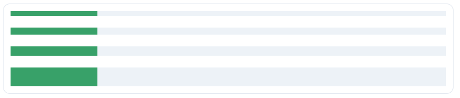
