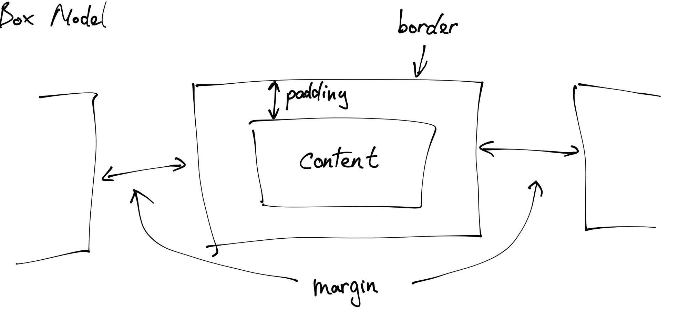
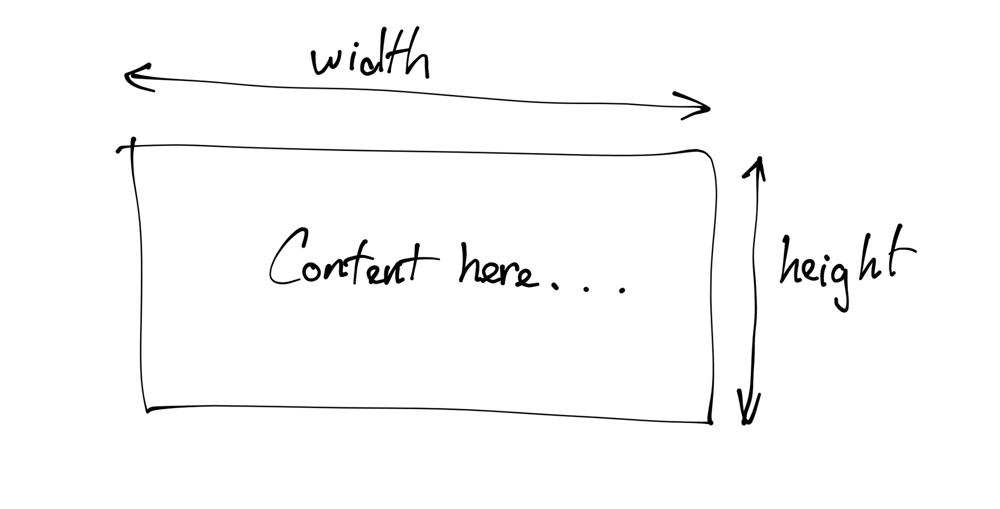
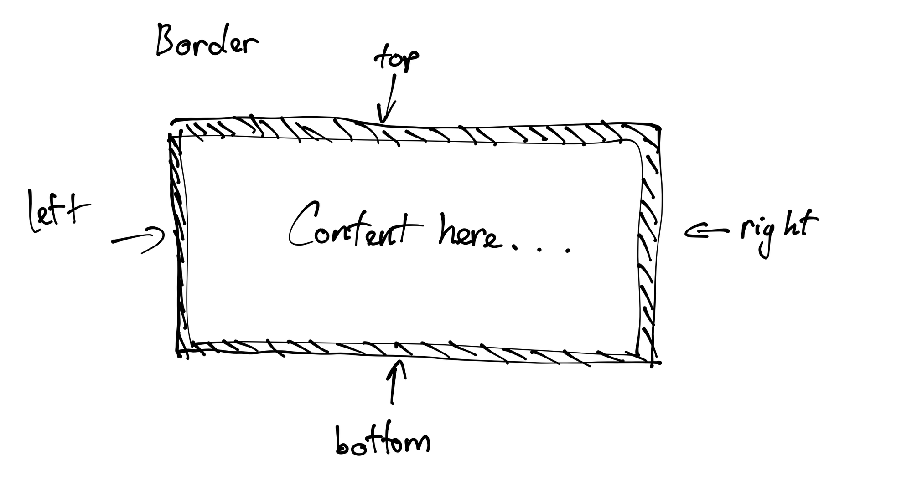
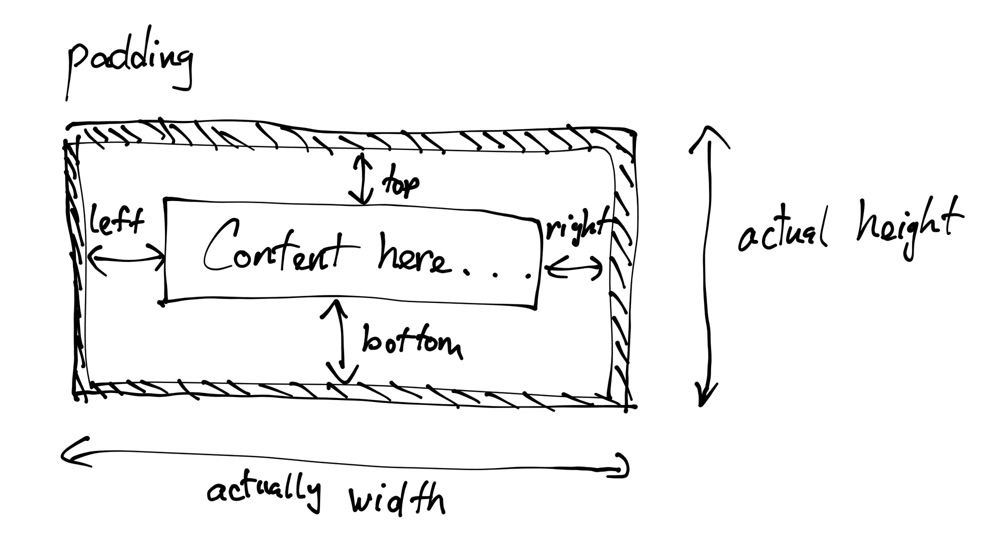
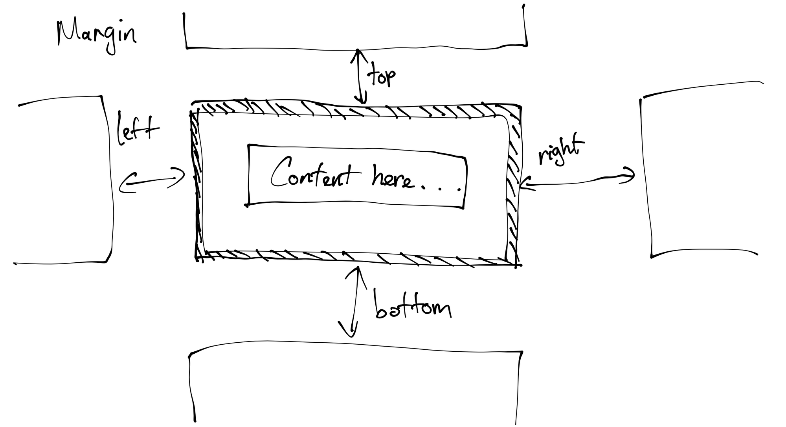
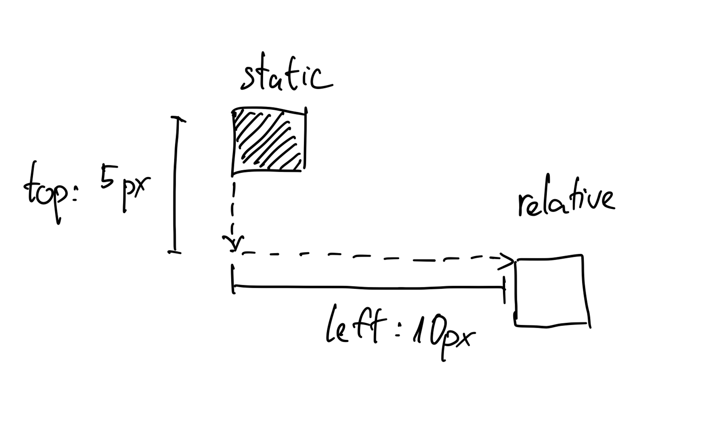
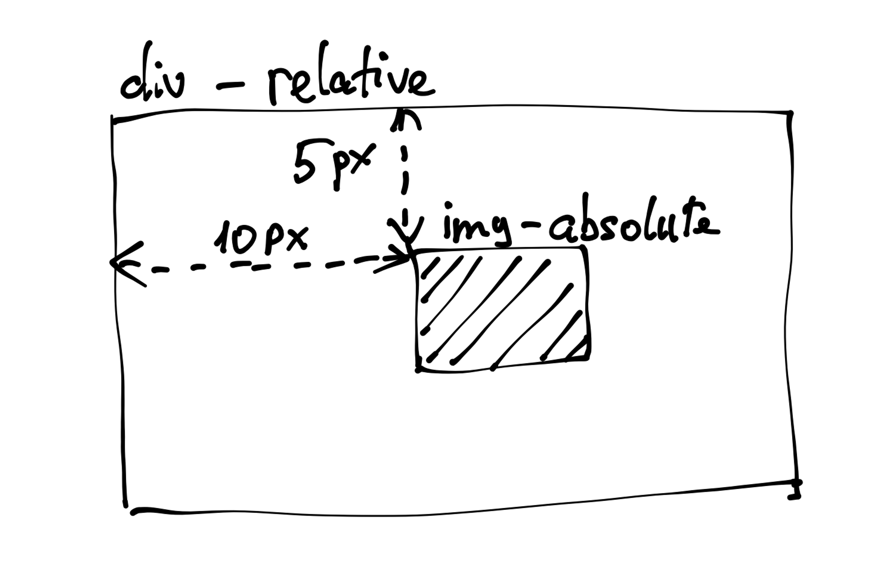
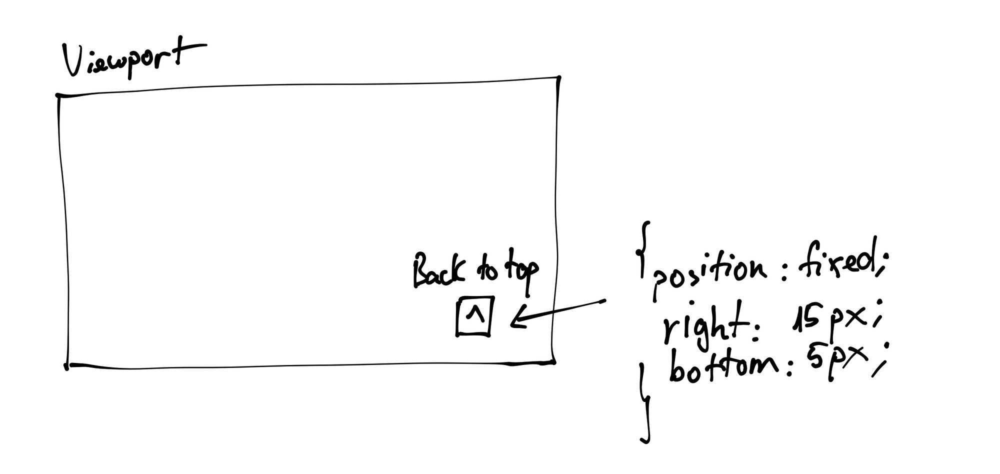

## Lesson 3: CSS box model & Position

>💡 Các chiều của một phần tử HTML trong ứng dụng web




# Tất cả HTML elements đều là hộp

Trong thế giới của CSS, tất cả các HTML elements đều được xử lý như những cái hộp (hình chữ nhật). Một HTML element sẽ chiếm một phần trên màn hình, được định nghĩa bằng các thông số: chiểu rộng (width), chiều cao (height), viền (border), cách viền (padding) và khoảng cách tới những phần tử khác (margin).

Những thành phần trên cấu tạo nên khái niệm “Box model” trong CSS.

Xét ví dụ sau:

```html
<style>
    #test {
      width: 300px;
      height: 300px;
      background-color: #98cacd
    }
</style>

...

<div id="test"></div>
```

Ta nhận được output là một hình vuông có chiều dài 300px và chiều cao là 300px.

Nếu như chúng ta tăng chiều cao của thẻ `div#test` đó lên thành 600px, chiều cao của thẻ này sẽ được tăng lên, và nó sẽ đẩy tất cả các phần tử bên dưới của nó xuống thêm một khoảng 300px nữa. Tương tự với việc tăng chiều rộng của nó, các phần tử bên phải (nếu có) cũng sẽ bị đẩy ra một khoảng 300px.

Việc tăng chiều rộng và chiều cao này ngoài sử dụng đơn vị đo tuyệt đối là px, chúng ta còn có thể sử dụng các đơn vị đo khác như phần trăm, viewport, …

>💡 Viewport là khái niệm chỉ toàn bộ màn hình có thể nhìn thấy được của trình duyệt. Viewport sẽ có kích thước tuỳ thuộc vào thiết bị chúng ta sử dụng.


### `width` và `height`


Đây là 2 thuộc tính quyết định kích thước nội dung bên trong của một HTML element. `width` và `height` nhận giá trị là một kích thước trong CSS. Chúng ta có thẻ set giá trị tuyệt đối (px) hoặc tương đối (%)



```
<style>
	#square {
		width: 300px;
		height: 300px;
		background-color: blue;
	}
</style>

...

<div id="test"></div>
```
​
### `border`

Border là phần viền của một HTML element. Mỗi một HTML element có 4 phần viền khác nhau: top, right, bottom, left. Các phần viền này có thể được tuỳ chỉnh riêng biệt. Border cũng có kích thước (độ dày), và kích thước của nó sẽ không được tính vào chiều dài hoặc chiều cao của một HTML element.  Nếu một element có chiều dài là 100px, và phần viền là 2px cho tất cả các hướng, thì tổng chiều dài thực tế của nó là 104px: `width + 2 * border`.



Một số thuộc tính của border:

- `border-width`: độ dày của viền
- `border-style`: kiểu viền (dash, dotted, solid, …)
- `border-color`: màu của viền
- `border-radius`: độ cong của viền

```html
<style>
	#square {
		width: 300px;
		height: 300px;
		background-color: blue;
		border: 5px solid #ececec;
	}
</style>

...

<div id="test"></div>
```

### `padding`

Padding trong CSS là khoảng cách giữa phần nội dung và phần viền. Có thể hiểu padding giống như phần lề của một trang giấy. Tương tự như border, padding cũng sẽ có 4 chiều tương ứng. Độ lớn của padding cũng sẽ không được tính vào `width` và `height` của content. Như vậy, độ rộng của một HTML element lúc này sẽ là: `width + padding-left + padding-right + border-left + border-right`



### `margin`

Margin trong CSS là khoảng cách từ phần viền của phần từ này tới các phần tử tiếp theo trên trang web. Tương tự với padding, margin cũng sẽ có 4 chiều: top, right, bottom, left. Tuy nhiên phần margin **KHÔNG** được tính vào trong kích thước của element. Như vậy, kích thước thực sự của một element chỉ được tính từ bên trong phần border của nó.



```
📌 Các thuộc tính như `padding`, `margin` sẽ có những cách viết ngắn gọn giúp chúng ta xác định được cả 4 chiều của một element.
Ví dụ như sau: `padding: 4px 5px 6px 7px;`
Nghĩa là:
- top: 4px
- right: 5px
- bottom: 6px
- left: 7px;
Thứ tự của chúng là theo chiều kim đồng hồ bắt đầu từ top. Ngoài ra chúng cũng có những cách viết ngắn gọn khác. Có thể xem thêm ở đây: https://www.w3schools.com/css/css_padding.asp

```

```
📌 Một cách để căn giữa các phần tử.
Thông thường, chúng ta sử dụng `text-align: center` để căn giữa các phần tử. Tuy nhiên, điều đó chỉ hoạt động với các thẻ có thuộc tính `display: block` (chúng ta sẽ nói về phần này ở những bài sau).
Có một cách để căn giữa các phần từ với margin. Margin có thể nhận vào một giá trị đặc biệt là `auto`. Lúc này, phần tử sẽ được tự động căn giữa, do phần margin hai bên bằng nhau: `<div style=”margin: auto”>Will be center</div>`

```

---

# Position

Position bên trong CSS là cách để chúng ta xác định thuộc tính “vị trí” bên trong của một phần tử HTML.

Chúng ta nhận thấy rằng:

- Mỗi HTML element đều có chiều rộng và chiều cao phụ thuộc vào phần nội dung bên trong của nó. Một phần tử `<h1>` với một font size lớn hơn sẽ chiếm nhiều diện tích hơn một phần tử `h1` có font size nhỏ hơn.
- Trong một trang web HTML, chúng ta thấy các phần tử có thứ tự từ trên xuống dưới, theo đúng thứ tự mà chúng ta tạo ra chúng trong source code.

Đây là các quy luật mặc định của HTML, ngay cả khi chúng ta không áp dụng bất cứ style nào cho chúng. Tuy nhiên, với thuộc tính position, chúng ta có thể thay đổi được vị trí hiện thị của các HTML elements, ghi đè lên các quy luật mặc định.

Position trong CSS về cơ bản có 4 giá trị như sau:

- static
- relative
- absolute
- fixed

## `static`

Static chính là giá trị mặc định của position. Static chính là các quy luật về thứ tự mà chúng ta nhìn thấy khi không định nghĩa ra bất cứ thuộc tính position nào.

## `relative`

Thuộc tính này khác với static ở chỗ: ***chúng cho phép chúng ta dịch chuyển vị trí của element một cách tương đối tính từ vị trí của nó khi được set `static`***. Với việc set vị trí `top: 5px;` và `left: 10px;` ta đã dịch chuyển element một khoảng tương ứng so với chính nó khi có vị trí là `static`




```
<style>
  #test {
    position: relative;
    top: 5px;
    left: 10px;
  }
</style>

...

<div id="test"></div>
```

Khi chúng ta thay đổi vị trí của một phần tử với relative position, các phần tử còn lại của HTML sẽ không bị thay đổi vị trí. Nghĩa là chúng vẫn sẽ ở vị trí tương tự như khi phần tử được di chuyển ở trạng thái static. 

## `absolute`

Thuộc tính `absolute` cho phép chúng ta ***căn chỉnh một phần tử dựa vào thẻ bao ngoài có giá trị của position là `relative`.***



```
<style>
  #parent {
    position: relative;
    width: 100px;
    height: 100px;
    background-color: blue;
  }
  #child {
    position: absolute;
    top: 5px;
    right: 10px;
  }
</style>

...

<div id="parent">
  
</div>
```

Nếu tất cả các thẻ bao ngoài của `````` đều không có thuộc tính  position: relative, thẻ img đó sẽ được căn vị trí theo body
Khác với relative, absolute hoàn toàn làm thay đổi “flow” của HTML. Các phần tử khác sẽ được sắp xếp giống như element absolute không tồn tại.

## `fixed`

Giá trị `fixed` của position cho phép chúng ta ***neo đậu một phần tử dựa vào màn hình mà người dùng đang nhìn thấy được***



Với vị trí là `fixed`, HTML element sẽ luôn nằm ở một vị trí đó, ngay cả khi trang web có xuất hiện scroll bar và người dùng cuộn xuống. Vì vậy, `fixed` thường được sử dụng cho các mục đích như làm nút “Go to top” hoặc “Navigation bar”

Tương tự như `absolute`, các element có giá trị position là `fixed` sẽ không nằm trong flow của toàn bộ trang web.


>📖 Ngoài các giá trị trên, position cũng có một giá trị khác là `sticky`. Tuy nhiên có một vài trình duyệt và các phiên bản khác nhau có thể không hỗ trợ nó. Đọc thêm về sticky ở đây: https://www.w3schools.com/css/css_positioning.asp