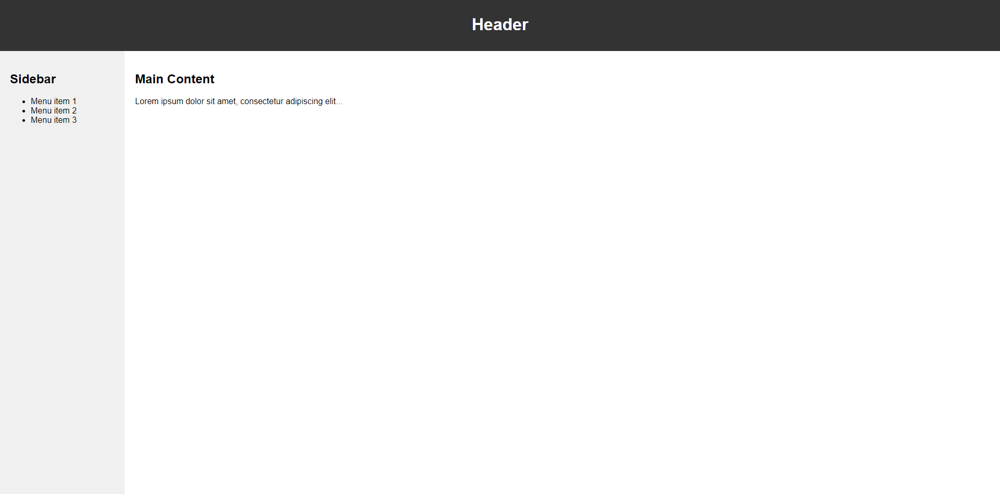

Bài tập 1: Tạo Layout Đơn Giản Sử Dụng Flexbox
Yêu cầu:
+ Tạo một layout đơn giản gồm hai cột bằng nhau, với một header và một footer cố định ở trên và dưới cùng, nội dung ở giữa.
+ Sử dụng Flexbox để căn chỉnh và sắp xếp các phần tử.

Bài tập 2: Tạo Thẻ Sản Phẩm Sử Dụng Flexbox
Yêu cầu:
+ Tạo một danh sách các thẻ sản phẩm, mỗi thẻ chứa hình ảnh và thông tin sản phẩm.
+ Sử dụng Flexbox để sắp xếp các thẻ sản phẩm trong một dòng, tự động chuyển hàng nếu không đủ chỗ.

Bài tập 3: Tạo Menu Đơn Giản Sử Dụng Flexbox
Yêu cầu:
+ Tạo một menu đơn giản với các mục menu nằm ngang bằng nhau.
+ Sử dụng Flexbox để căn chỉnh và chia đều các mục menu.

Bài tập 4: Tạo Trang Thẻ Sổ Sử Dụng Flexbox
Yêu cầu:
+ Tạo một trang thẻ sổ với các ô để điền thông tin.
+ Sử dụng Flexbox để sắp xếp các ô vào một lưới.
+ Thiết kế sao cho ô nhãn và ô nhập liệu được căn chỉnh và chia đều.

Bài tập 5: Tạo Bố Cục Đa Cột Động Sử Dụng Flexbox
Yêu cầu:
+ Tạo một bố cục đa cột linh hoạt với số lượng cột có thể thay đổi dựa trên kích thước màn hình.
+ Sử dụng Flexbox để tự động chia số cột và căn chỉnh sao cho phù hợp trên mọi thiết bị.

Bài tập 6: Tạo Layout Đa Cấp Sử Dụng Flexbox
Yêu cầu:
+ Tạo một layout đa cấp với sidebar, nội dung chính và footer.
+ Sử dụng Flexbox để căn chỉnh và sắp xếp các phần tử một cách hiệu quả.

Bài tập 7: Tạo Thẻ Sản Phẩm Grid Sử Dụng Flexbox
Yêu cầu:
+ Tạo một danh sách các thẻ sản phẩm sử dụng Grid layout với Flexbox.
+ Sử dụng Flexbox để sắp xếp các thẻ sản phẩm vào một lưới có số cột khác nhau tùy vào kích thước màn hình.

Bài tập 8: Tạo Bố Cục Header, Sidebar và Content Sử Dụng Flexbox
Yêu cầu:
+ Tạo một bố cục với header, sidebar và nội dung chính.
+ Sử dụng Flexbox để sắp xếp các thành phần và đảm bảo chúng thay đổi linh hoạt theo kích thước màn hình.

Hoàn thành các giao diện sau (giống trong ảnh, màu sắc tương đối không nhất thiết phải giống, chủ yếu tập chung vào sử dụng các thẻ html, các thuộc tính css để dựng layout)

