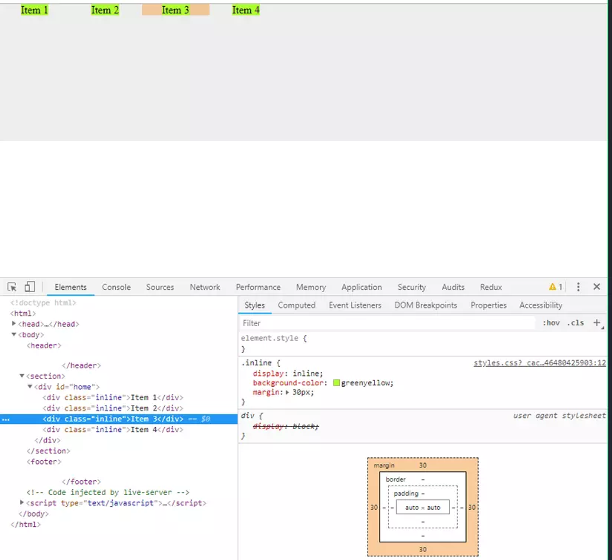
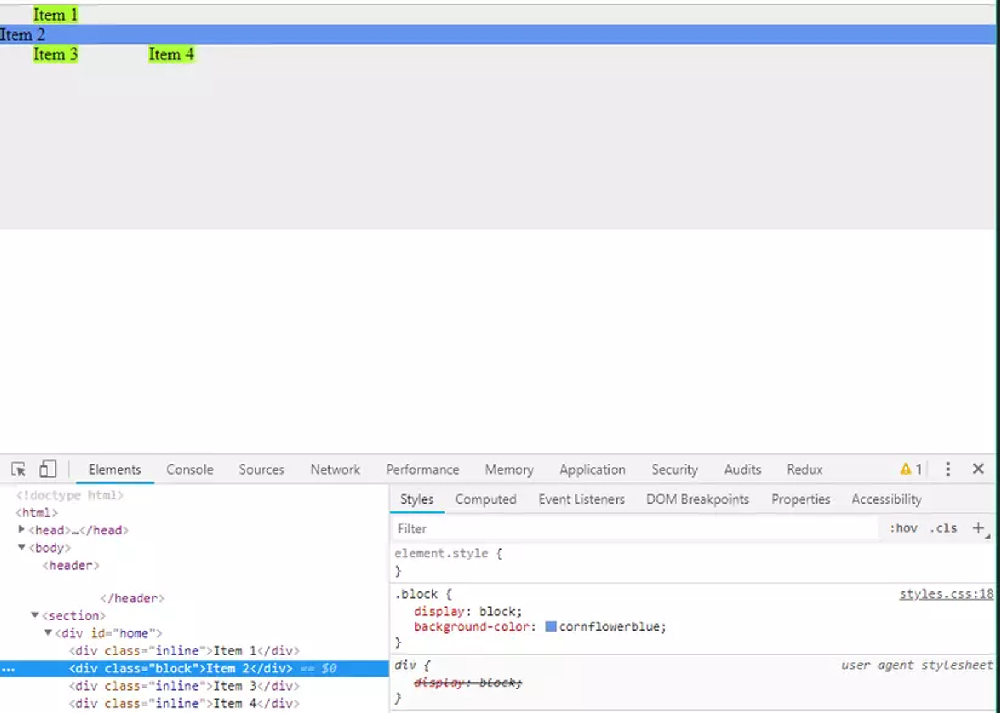
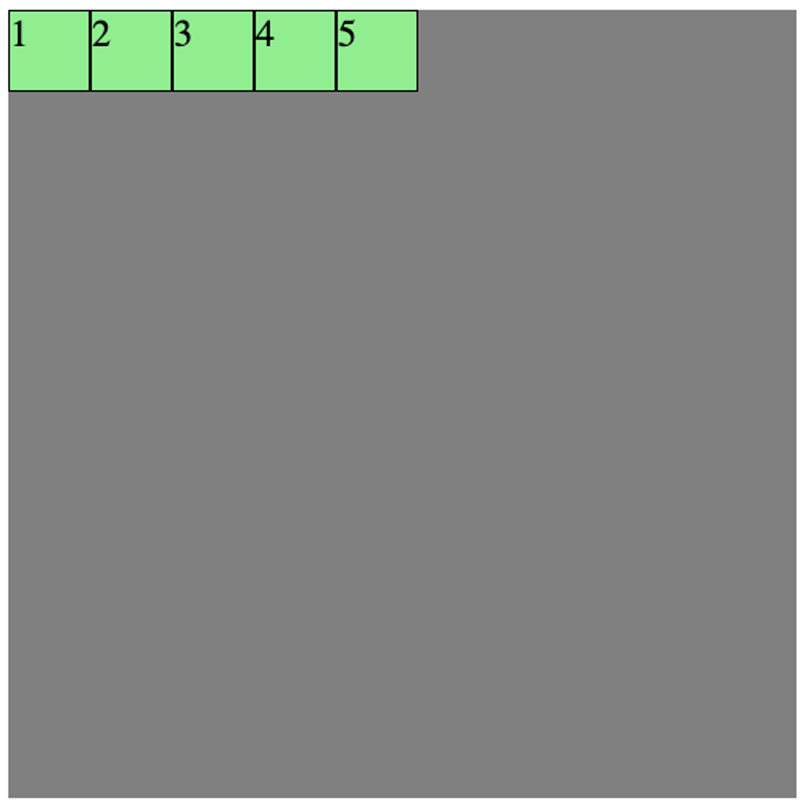
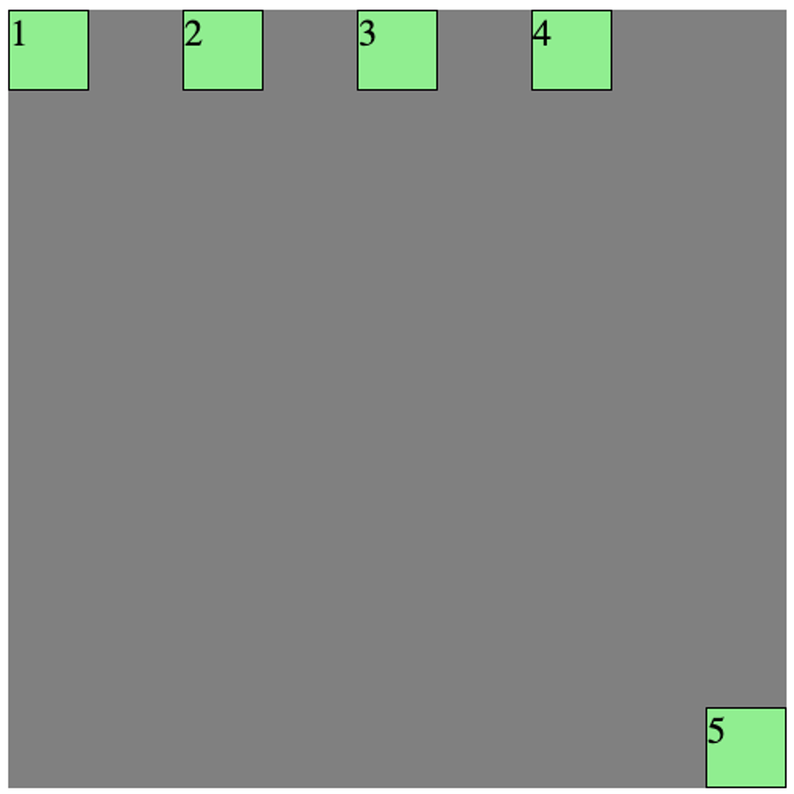
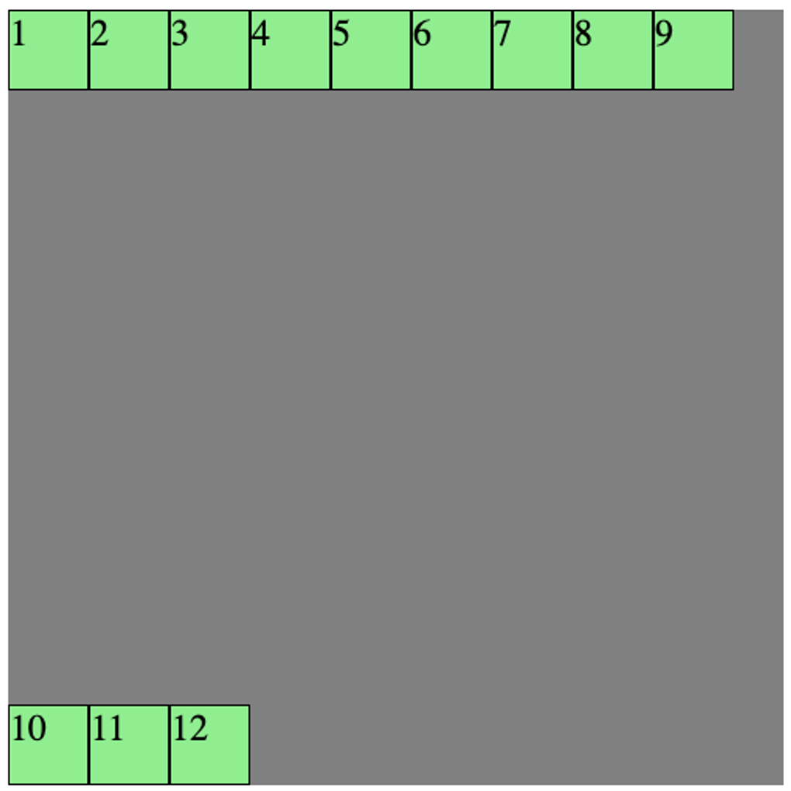
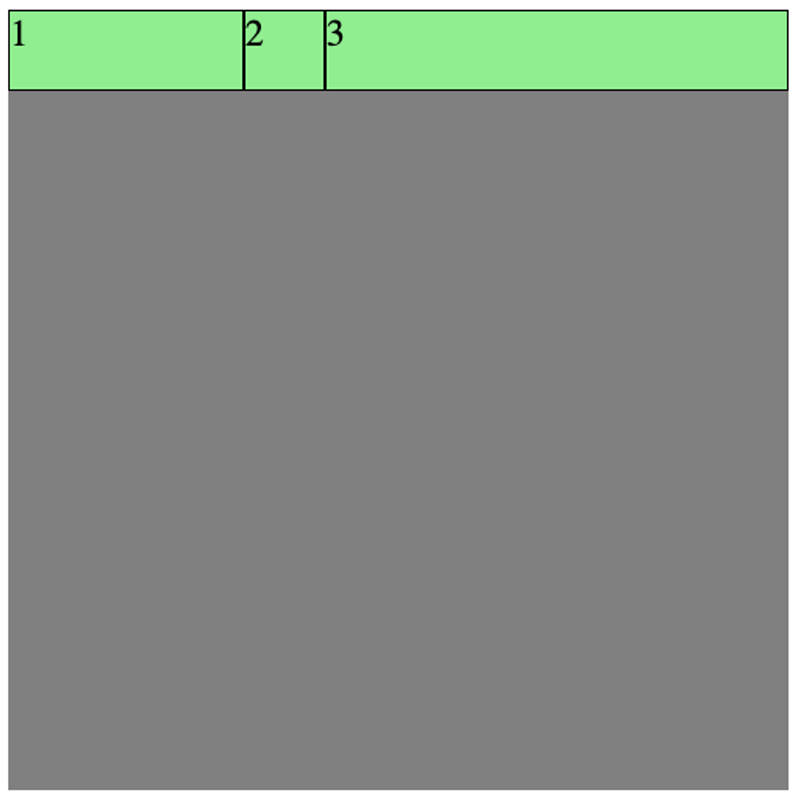
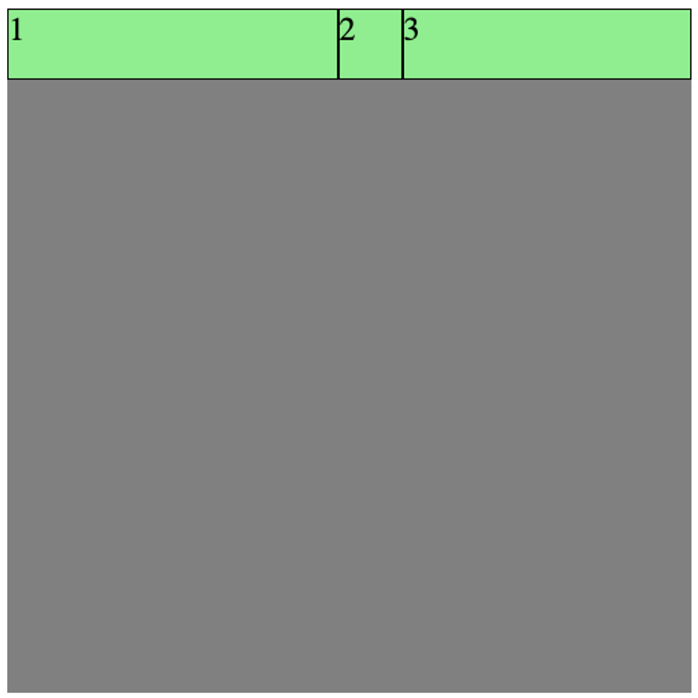
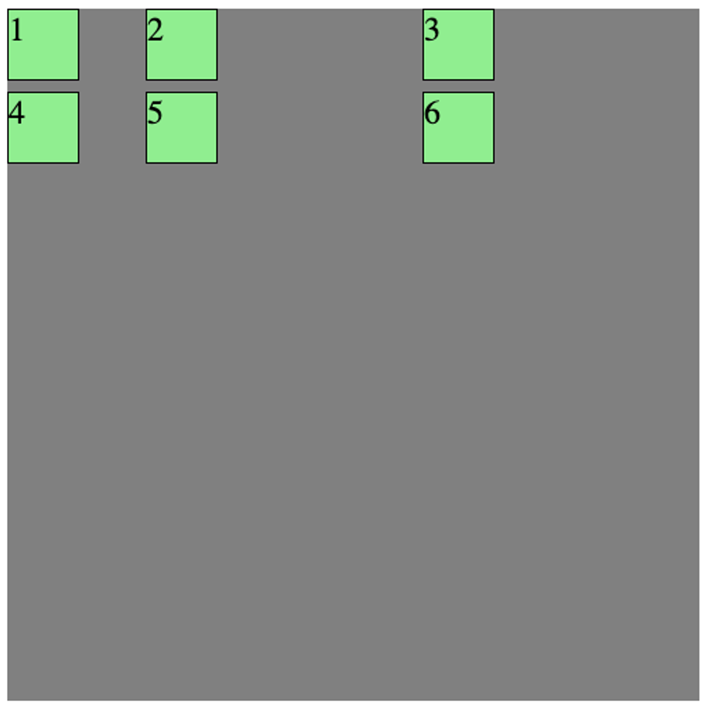
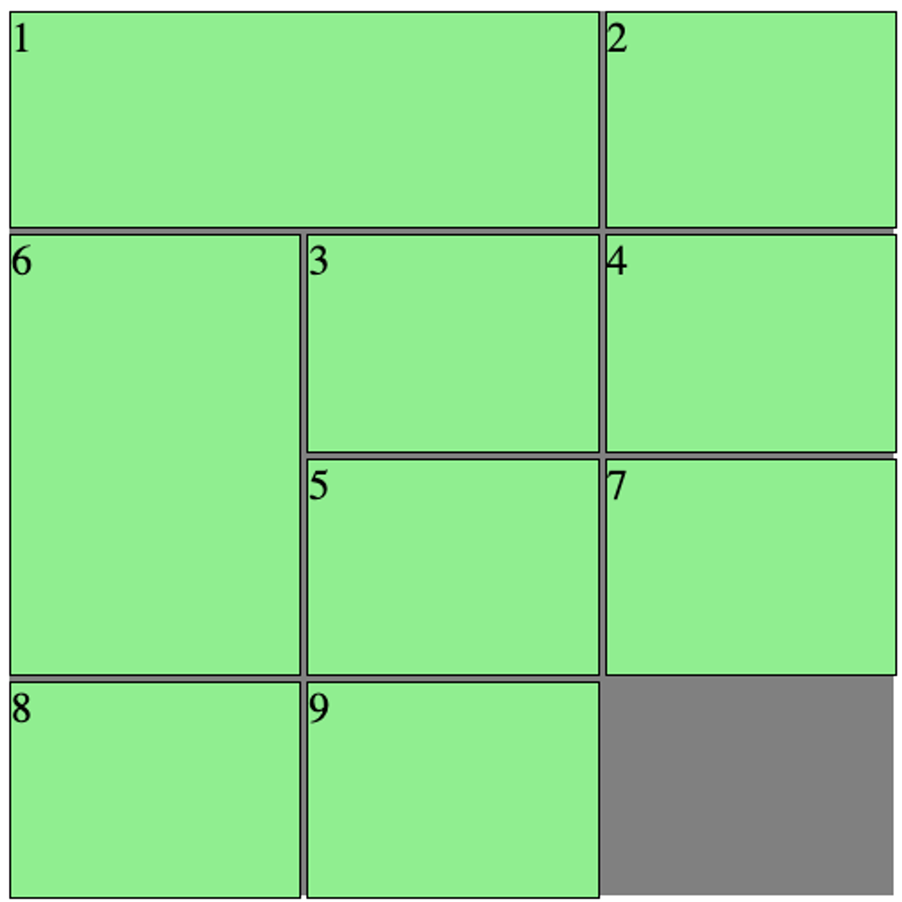

## Lesson 4: CSS display & Layout


>💡 Sử dụng flexbox hoặc grid để xây dựng layout cho ứng dụng.


# `inline`, `inline-block` và `block`

Trong bài trước, ta thấy có thể sử dụng `width`, `height` để thay đổi chiều rộng hoặc chiều cao của các elements. Tuy nhiên, không phải lúc nào việc thay đổi 2 giá trị CSS trên cũng giúp chúng ta thay đổi được kích thước hiển thị. Có những thuộc tính khác cũgn sẽ gây ảnh hưởng tới vấn đề này.`display` là một thuộc tính CSS quyết định việc render box model của một element, cho phép chúng ta tuỳ chỉnh được các hành vi hiển thị box khác nhau của phần từ

## `display: inline`

Với giá trị là `inline`, HTML element đó sẽ chiếm một diện tích theo nội dung của nó. Các phần tử HTML inline tiếp theo sẽ được tiếp trên cùng một dòng. Các element có kiểu display này **không thể** thay đổi được `width` và `height` của nó. Tuy nhiên, chúng ta có thể thay đổi được `margin` và `padding` theo chiều `left` và `right`.

Các thẻ `<span>`, `<a>` là một trong số các thẻ HTML có kiểu display mặc định là `inline`.



## `display: block`

Giá trị `display: block` sẽ luôn chiếm một dòng trong trang web. Và nếu không thay đổi giá trị `width`, một HTML element có kiểu display là block sẽ chiếm 100% `width` của thẻ cha của nó.

Tuy nhiên, ngay cả khi thay đổi giá trị `width` của một HTML block element (ví dụ `width: 100px`), mặc dù thay đổi được chiều rộng của nó, nó vẫn sẽ chiếm một dòng. Các HTML elements tiếp theo vẫn sẽ nằm trên một dòng mới.



## `display: inline-block`

Giá trị `inline-block` tương tự như giá trị `inline`: các phần tử HTML `inline` hoặc `inline-block` tiếp theo sẽ nằm trên cùng một dòng. Tuy nhiên, khác biệt ở đây là với các thẻ HTML có thuộc tính này sẽ **cho phép** thay đổi `width` và `height` cũng như `padding` và `margin` theo chiều dọc.


# Flexbox

`display: flex` là một giá trị đặc biệt, khi nó không trực tiếp thay đổi cách hiển thị của nó. Thay vào đó, nó được sử dụng để làm thay đổi cách hiển thị của các elements con nằm bên trong nó. Dựa vào `display: flex`, chúng ta có thể căn chỉnh được bố cục của các HTML elements con nằm bên trong nó. Từ đó xây dựng lên các bố cục khác nhau cho trang web.

>📌 Từ phần này, các HTML element có thuộc tính `display: flex` sẽ được gọi là các “flex container”


Ta xét ví dụ sau:

```html
<style>
  .container {
    width: 500px;
    height: 500px;
    background-color: gray;
  }

  .item {
    width: 50px;
    height: 50px;
    background-color: lightgreen;
    border: 1px solid black;
    font-size: 24px;
  }
</style>

...

<div class="container">
  <div class="item">1</div>
  <div class="item">2</div>
  <div class="item">3</div>
  <div class="item">4</div>
  <div class="item">5</div>
</div>
```

Và giao diện hiện tại sẽ như sau:



### Trục chính và trục phụ

Đây là khái niệm cơ bản trong một flex container:

- **Trục chính** là trục mà các HTML element con nằm trong một container sẽ được sắp xếp theo. Với hình vẽ ở trên, các HTML element được xếp thành một hàng ngay từ trái qua phải.
- **Trục phụ** là chiều còn lại, vuông góc với trục chính. Với hình trên, trục phục của chúng ta là chiều dọc.

Để thay đổi được trục chính của một flex container, ta sử dụng thuộc tính CSS là `flex-direction`, nhận vào những giá trị sau:

- `row` (mặc định): chiều ngang, **từ trái qua phải** (theo chiều của trang web)
- `row-reverse`: chiều ngang, **từ phải qua trái** (ngược chiều của trang web)
- `column`: chiều dọc, **từ trên xuống dưới**
- `column-reverse`: chiều dọc, từ dưới lên trên

```html
<style>
.container {
  display: flex;
  width: 500px;
  height: 500px;
  background-color: gray;
  flex-direction: column-reverse;
}
</style>
```


Giao diện của ứng dụng được cập nhật với `flex-direction: column-reverse` Lúc này, trục phụ của container sẽ là chiều ngang

Các khái niệm bên dưới đây sẽ phụ thuộc vào giá trị trục chính của flex container

### `justify-content`

Đây là thuộc tính CSS được sử dụng để thay đổi các sắp xếp trong một flex container theo **trục chính**. Các giá trị có thể nhận vào là:

- `flex-start` (mặc định): các elements được sắp xếp ở đầu của trục chính
- `flex-end`: các elements được sắp xếp ở cuối của trục chính
- `center`: các elements được sắp xếp ở giữa của trục chính
- `space-between`: các elements được dàn đều trên trục chính, chúng sẽ có những khoảng cách ở giữa.
- `space-around`: các elements sẽ có khoảng cách ở đầu và ở cuối của chúng
- `space-evenly`: khoảng cách giữa các elements và đầu, cuối sẽ đều nhau

```html
.container {
  display: flex;
  width: 500px;
  height: 500px;
  background-color: gray;
  justify-content: space-between;
}
```


Với `justify-content: space-between;` ta thấy các elements sẽ có cách khoảng cách ở giữa

### `align-items`

Đây là thuộc tính CSS được sử dụng để thay đổi cách sắp xếp trong một flex container theo **trục phụ.** Các giá trị có thể nhận vào là:

- `stretch`: (mặc định) căng tràn. Các elements sẽ có chiều tương ứng với trục phụ được kéo dãn và lấp đầy 100% container. Tuy nhiên, điều này chỉ xảy ra khi chiều kích thước tương ứng của element con không được xác định. Xem hình bên dưới.
- `flex-start` các phần tử được căn theo đầu của trục phụ.
- `flex-end`: các phần tử được căn theo phần cuối của trục phụ.
- `center`: các phần tử được căn theo giữa của trục phụ
- `baseline`: các phần tử được căn theo đường baseline của container.

```html
.container {
  display: flex;
  width: 500px;
  height: 500px;
  background-color: gray;
  justify-content: space-between;
  align-items: stretch;
}

.item {
  width: 50px;
  background-color: lightgreen;
  border: 1px solid black;
  font-size: 24px;
}
```


Với việc `align-items: stretch` và `flex-direction: row` , khi ta không cố định chiều tương ứng với trục phụ (ở đây là `height`) thì các elements bên trong sẽ có kích thước theo chiều đó là 100% container

>📌 Ta có thể định nghĩa là một CSS class như sau: `.center {display: flex; justify-content: center; align-items: center}` . Ta có thể sử dụng lại class `center` này để căn giữa nội dung của các thẻ HTML khi cần thiết.

### `align-self`
Thuộc tính này có cách hoạt động tương tự như align-items. Điểm khác biệt ở đây là nó được sử dụng cho các element con thay vì sử dụng cho container. align-self được sử dụng để ghi đè lên giá trị align-items cho từng element khi cần thiết.
<style>
  .container {
    display: flex;
    width: 500px;
    height: 500px;
    background-color: gray;
    justify-content: space-between;
    align-items: flex-start;
  }

  .item {
    width: 50px;
    height: 50px;
    background-color: lightgreen;
    border: 1px solid black;
    font-size: 24px;
  }
</style>

...

<div class="container">
  <div class="item">1</div>
  <div class="item">2</div>
  <div class="item">3</div>
  <div class="item">4</div>
  <div class="item" style="align-self: flex-end">5</div>
</div>



### `flex-wrap`

Khi kích thước các elements vượt quá kích thước của trục chính, ta có thể cho phép nó xuống dòng hoặc không với `flex-wrap`. Thuộc tính này nhận các giá trị sau:

- `nowrap` (mặc định): không cho phép xuống dòng.
- `wrap`: cho phép xuống dòng khi cần thiết
- `wrap-reverse`: cho phép xuống dòng khi cần thiết, nhưng theo chiều ngược lại


`nowrap`


`wrap`


`wrap-reverse`

### `align-content`

`align-content` cho phép chúng ta định nghĩa được cách sắp xếp của các dòng khi có wrap xảy ra trong một flex container. Ý nghĩa của nó tương tự với `align-items`, tuy nhiên nó áp dùng cho các dòng thay vì các elements. Các giá trị nhận vào:

- `stretch`: (mặc định) căng tràn. Các dòng sẽ có chiều tương ứng với trục phụ được kéo dãn và lấp đầy 100% container. Đây là lý do cho việc hình trên, chúng ta có 2 dòng, mỗi dòng chiếm một nửa container
- `flex-start` các dòng được căn theo đầu của trục phụ.
- `flex-end`: các dòng được căn theo phần cuối của trục phụ.
- `center`: các dòng được căn theo giữa của trục phụ
- `space-between`: các dòng được trải đều trên trục phụ
- `space-around`: mỗi dòng sẽ có khoảng cách 2 bên theo trục phụ
- `space-evenly`: mỗi dòng sẽ có khoảng cách đều nhau và có khoảng cách tới 2 đầu của trục phụ

```html
.container {
  display: flex;
  width: 500px;
  height: 500px;
  background-color: gray;
  flex-wrap: wrap;
  align-content: space-between;
}
```



Các dòng được rải đều trên container.

### Flex basis, grow & shrink
Đây là các công cụ để thay đổi kích thước của các elements trong một container khi kích thước trục chính của container bị thay đổi.

### `flex-basis`

`flex-basis` là **kích thước theo trục chính** của một element bên trong container. Giá trị `flex-basis` này sẽ ghi đè giá trị `width` nếu trục chính là `row` hoặc `row-reverse` và sẽ ghi đè giá trị `height` nếu trục chính là `column` hoặc `column-reverse`

```html
<div class="container">
  <div class="item" style="flex-basis: 100px">1</div>
  <div class="item">2</div>
  <div class="item" style="flex-basis: 100px">3</div>
</div>
```


### `flex-grow`

Ta thấy hiện tại kích thước của container vẫn còn đủ để chứa được cả 3 phần tử trên. Đây là lúc `flex-grow` được sử dụng. `flex-grow` cho phép chúng ta định nghĩa kích thước của phần tử sẽ tăng lên bao nhiêu phần so với các phần tử còn lại khi container còn thừa chỗ trống.

```html
<div class="container">
  <div class="item" style="flex-basis: 100px; flex-grow: 1">1</div>
  <div class="item">2</div>
  <div class="item" style="flex-basis: 100px; flex-grow: 4">3</div>
</div>
```



Việc tính toán lúc này xảy ra như sau:

- Phần còn thừa của container là độ rộng của nó trừ đi các kích thước ban đầu của các elements con: `500 - 100 - 50 - 100 = 250`
- Chia phần còn thừa này ra thành nhiều phần bằng nhau. Số phần được tính bằng “tổng của các `flex-grow` của các elements bên trong container”. Trong ví dụ này, ta thấy số phần có giá trị lá `1 + 4 = 5`. Như vậy, mỗi phần sẽ có kích thước là `250 / 5 = 50`
- Tăng kích thước của các elements con với số `flex-grow` tương ứng được khai báo. Ở đây. Component 1 sẽ được tăng lên `50`, component 3 sẽ tăng lên `200`

`flex-grow` được sử dụng để lấp đầy toàn bộ kích thước trục chính của container.

### `flex-shrink`

Trong trường hợp ngược lại, `flex-shrink` được sử dụng để định nghĩa kích thước của các elements sẽ giảm thế nào khi container không đủ chỗ để chứa được chúng. Xét ví dụ sau:

```html
<div class="container">
  <div class="item" style="flex-basis: 300px; flex-shrink: 2">1</div>
  <div class="item">2</div>
  <div class="item" style="flex-basis: 300px; flex-shrink: 3">3</div>
</div>
```



Lúc này ta thấy:

- Tổng của 3 elements đã là `300 + 300 + 100 = 700` , vượt quá kích thước của container. Số lượng cần giảm xuống là  `700 - 500 = 200`
- Số phần shrink của các elements bên trong là `2 + 3 = 5`
- Lấy số lượng cần giảm xuống chia đều cho các elements với tỉ lệ shrink tương ứng. Như vậy, element 1 sẽ cần phải giảm đi `200 / 5 * 2 = 80`, element 3 sẽ cần giảm đi `200 / 5 * 3 = 120`

Đó là lý do tại sao ta thấy element 1 lại rộng hơn element 2, vì element 1 chỉ bị mất đi 80px trong khi element 2 bị mất tới 120px.

>📖 Flexbox là một khái niệm quan trong của CSS. Có thể thực hành thêm về flexbox dưới dạng game ở đường dẫn sau: https://flexboxfroggy.com/

Bất cứ element nào có thuộc tính `display: flex` đều là một flex container. Như vậy một element vừa có thể nằm trong một flex container, đồng thời chính nó cũng có thể là một flex container cho những elements con của nó.

---
# Grid

Grid cũng là một công cụ giúp chúng ta xây dựng các layout. Điểm khác biệt của grid so với flexbox là grid cho phép tạo bố cục theo 2 chiều thay vì chỉ một chiều như flexbox.

Trong một grid có 2 khái niêm chính là `row` và `column`


Các `column`


Các `row`

Để tạo một grid container, chúng ta có thể sử dụng thuộc tính `display: grid` hoặc `display: inline-grid`

Để tạo một grid container, chúng ta có thể sử dụng thuộc tính `display: grid` hoặc `display: inline-grid`

Ví dụ với grid:

```html
<style>
.container {
  display: grid;
  width: 500px;
  height: 500px;
  background-color: gray;
  grid-template-columns: 100px 200px auto;
  grid-template-rows: 60px;
}

.item {
  width: 50px;
  height: 50px;
  background-color: lightgreen;
  border: 1px solid black;
  font-size: 24px;
}
</style>

...

<div class="container">
  <div class="item">1</div>
  <div class="item">2</div>
  <div class="item">3</div>
  <div class="item">4</div>
  <div class="item">5</div>
  <div class="item">6</div>
</div>
```



Một số thuộc tính của grid:

- `grid-template-columns`: khai báo số lượng cột và độ rộng của mỗi cột bên trong một grid. Các cột được cách nhau bởi dấu cách
- `grid-template-rows`: khai báo dòng và chiều cao của mỗi dòng bên trong một grid.
- `grid-row-gap`: khoảng cách giữa các dòng trong grid
- `grid-column-gap`: khoảng cách giữa cách cột trong grid

Với các elements của grid, chúng ta cũng có thể thay đổi kích thước của các ô trong một grid với các thuộc tính bên trong các elements:

- `grid-row-start: 1` và `grid-row-end: 3`  cho phép một ô bắt đầu từ dòng số 1 và kết thúc ở dòng số 3
- grid-column-start: 1 và grid-column-end: 3 cho phép một ô bắt đầu từ cột số 1 và kết thúc ở cột số 3

