## Lesson 5: Responsive & Bootstrap

>💡 CSS cho các kích cỡ màn hình khác nhau

# Responsive là gì?

Thiết kế ứng dụng web dạng responsive là một cách thiết kế ứng dụng web sao cho ứng dụng hiển thị tốt và có thể sử dụng được ở nhiều kích thước màn hình của các loại thiết bị khác nhau.

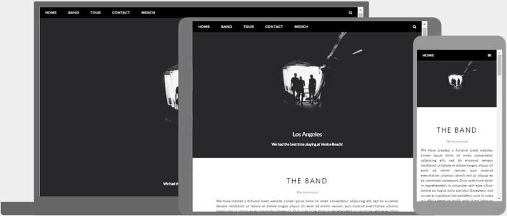

Hiểu một cách đơn giản, ứng dụng web của chúng ta cần tự động thay đổi giao diện, bố cục để có thể vừa với nhiều loại kích thước màn hình khác nhau.

### Tại sao cần Responsive

Với sự lên ngôi của các thiết bị di động như hiện nay, đa phần lưu lượng truy cập internet đều đến từ các trình duyệt di động. Vì vậy, việc các websites cần phải thân thiện với các thiết bị nhỏ hơn này là điều cần thiết. Nếu chúng ta bê nguyên giao diện trên máy tính để bàn xuống dưới một màn hình nhỏ, người dùng sẽ liên tục cần phóng to và cuộn để có thể xem được nội dung. Từ đó làm giảm chất lượng trải nghiệm của người dùng.

### Responsive web design vs Adaptive web design

Để có thể có giao diện thân thiện với nhiểu kích cỡ màn hình khác nhau, chúng ta còn có thể tiếp cận theo một hướng khác. Lập trình viên có thể tạo ra một phiên bản dành riêng cho các thiết bị di động (VD: `m.facebook.com`). Điều này so với responsive vừa có lợi điểm và vừa có điểm chưa tốt.

- Responsive sẽ giúp chúng ta tiết kiệm chi phí phát triển ứng dụng. Chúng ta chỉ cần một phiên bản web cho tất cả các cỡ màn hình. Tuy nhiên, trên giao diện màn hình nhỏ, ứng dụng web vẫn cần phải download toàn bộ resource tương tự như máy tính. Vì vậy ứng dụng có thể sẽ chậm hơn trên các thiết bị yếu.
- Adaptive sẽ giúp người dùng có một trải nghiệm nhanh nhất có thể với các thiết bị có cấu hình thấp hơn, do lúc này có thể loại bỏ nhiều thành phần không cần thiết. Tuy nhiên, chúng ta cũng sẽ cần phải tốn thời gian và công sức để xây dựng song song nhiều ứng dụng cùng một thời điểm. Chi phí phát triển vì thế mà cũng tăng lên.

Việc lựa chọn tiếp cận theo hướng nào còn tuỳ thuộc vào số lượng thành viên và năng lực của từng nhóm.

>📌 Để có thể xem được ứng dụng web hiển thị trên nhiều kích thước màn hình khác nhau, với trình duyệt Chrome, chúng ta làm theo các bước sau:
>- Mở developer tools
>- Click vào nút “Toggle Device toolbar” hoặc tổ hợp phím Ctrl + Shift + M
>- Chọn thiết bị trong dropdown

---

Thẻ meta viewport
Khai báo một thẻ meta có thuộc tính name="viewport" để hướng dẫn trình duyệt điều chỉnh chiều rộng của ứng dụng web sẽ bằng với chiều. rộng của màn hình trên thiết bị.
Đồng thời, chúng ta khai báo giá trị initial-scale=1, trình duyệt sẽ hiển thực ở mức độ zoom ban đầu
<html>

<head>
	<meta name="viewport" content="width=device-width, initial-scale=1"/>
</head>

...

</html>
​


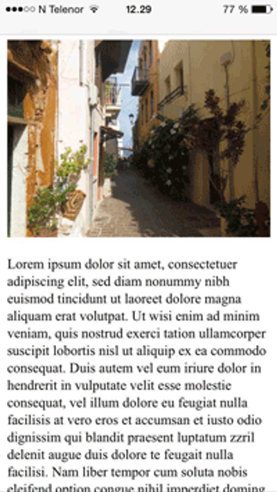

Để có thể đạt được hiệu ứng responsive như mong muốn, chúng ta cần tránh những việc sau:

- Không style cho các thẻ HTML có một chiều rộng cố định quá lớn (vượt quá kích thước màn hình thiết bị)
- Nội dung không được phép chỉ hiển thị tốt ở một cỡ màn hình nhất định.
- Tránh sử dụng các giá trị đo tuyệt đối của CSS (px). Thay vào đó, nên sử dụng các giá trị đo tương đối (%).

---

# Media Queries

Media Query là một tính năng mới trong CSS3. Nó cho phép chúng ta được áp dụng các thuộc tính CSS khi ứng dụng thoả mãn một số điều kiện nhất định. Media Query được bắt đầu với cú pháp `@media` trong CSS.

Cú pháp cơ bản của Media Query sẽ như sau:

```css
@media not|only mediatype and (mediafeature: value) {
  CSS-Code;
}
```

### `mediatype`

Trong CSS chúng ta có các loại media type như sau:

- `all`: tất cả các thiết bị media
- `screen`: các thiết bị media hiển thị trên màn hình: điện thoại, máy tính bảng, máy tính bàn
- `print`: hiển thị trên các văn bản in.
- `speech`: các thiết bị có chức năng “đọc” nội dung trên màn hình

Một số ví dụ:

```css
/*
Body sẽ có background-color: green ở trên các thiết bị màn hình.
Tuy nhiên khi in, chúng sẽ không còn màu nền
*/
@media screen {
	body {
		background-color: green;
	}
}

/*
Thẻ HTML tương ứng sẽ có màu xanh trên tất cả các thiết bị khác nhau trừ khi in.
*/
@media not print {
	#test {
		color: green;
	}
}

@media screen, print {
   /* CSS được áp dụng trên hai loại thiết bị là màn hình và in ấn */
}
```

Chú ý:

- `mediatype` không bắt buộc khi khai báo một media query. Nếu như không được khai báo, giá trị `all` sẽ là giá trị mặc định được chọn.
- Có thể kết hợp nhiều hơn một `mediatype` trong một media query. Giữa các `mediatype` được phân tách nhau bởi dấu phẩy, được hiểu là “hoặc” (thoả mãn một trong nhiều điều kiện)

### `mediafeature`

Feature là một loạt các điều kiện mà thiết bị hiển thị hiện tại cần thoả mãn. Chúng ta có một số các feature thường được sử dụng trong thực tế như sau:

- `aspect-ratio`: tỉ lệ màn hình cần thoả mãn
- `device-height`: Chiều cao của thiết bị
- `device-width`: Chiều rộng của thiết bị
- `height`: Chiều cao của viewport
- `width`: Chiều rộng của viewport
- `max-width`: Chiều rộng tối đa của viewport
- `min-width`: Chiều rộng tối thiểu của viewport
- `max-height`: Chiều cao tối đa của viewport
- `min-height`: Chiều cao tối thiểu của viewport
- `min-device-width`: Chiều rộng tối thiểu của thiết bị
- `max-device-width`: Chiều rộng tối đa của thiết bị
- `min-device-height`: Chiều cao tối thiểu của thiết bị
- `max-device-height`: Chiều cao tối đa của thiết bị
- `orientation`: Định hướng của khung nhìn (xoay hoặc không xoay thiết bị)

Chúng ta có thể sử dụng kết hợp các feature này với nhau để tạo nên các điều kiện tương đối phức tạp cho CSS. Một số ví dụ sau:

```css
/* Màn hình có chiều rộng không vượt quá 480px */
@media only screen and (max-width: 480px){
  .large{
      display: none;
  }
}

/* Các thiết bị có màn hình có chiểu rộng tối thiểu là 600px và tối đa là 800px */
@media (min-width: 600px) and (max-width: 800px) {
  html { background: red; }
}

/* Các thiết bị có màn hình có chiều rộng tối đa là 600px hoặc chiều rộng tối thiểu là 800px */
@media (max-width: 600px), (min-width: 800px) {
  html { background: red; }
}

/* Loại trừ tất cả các thiết bị có màn hình có chiều rộng tối đa là 600px */
@media not all and (max-width: 600px) {
  html { background: red; }
}
```

>📌 Chúng ta có thể viết các thuộc tính CSS như display, position và các thuộc tính CSS khác để xem kết quả.

---

# Breakpoints và Mobile first

Breakpoints có thể hiểu đơn giản là các vị trí kích thước chiều rộng cố định mà khi vượt qua nó, chúng ta sẽ đến với một cỡ màn hình khác.

Đây là ví dụ một hệ thống breakpoint thường được sử dụng:

- `<576px: Cỡ màn hình điện thoại`
- `576px → 768px: Cỡ màn hình tablet`
- `768px → 992px: Cỡ màn hình máy tính laptop`
- `992px → 1200px: Màn hình máy tính lớn`
- `>1400px màn hình siêu lớn`

>📌 Các thiết bị di động thướng có độ phân giải hiển thị nhỏ hơn rất nhiều so với độ phân giải thực tế của màn hình của chúng. Để kiểm tra được độ phân giải hiển thị thực tế của màn hình, có thể truy cập http://whatismyscreenresolution.net/

Các điểm breakpoints này đóng vai trò quan trọng trong việc tạo ra các trang web responsive. Dựa vào chúng, ta có thể xác định được các style được áp dụng cụ thể cho từng loại màn hình.

Và xu hướng hiện tại khi thiết kế các ứng dụng là **MOBILE FIRST**

Mobile first là triết lý thiết kế ứng dụng để nó hiển thị tốt trên các thiết bị nhỏ trước khi thiết kế cho các màn hình lớn hơn. Việc này sẽ giúp trải nghiệm được tối ưu hoá trên màn hình nhỏ. Trái ngược với nó là Desktop First: trải nghiệm được tối ưu cho màn hình lớn trước. Việc đỉ từ nhỏ tới lớn sẽ dễ dàng hơn là đi từ lớn về nhỏ. Vì chúng ta có thể quyết định thêm các thành phần gì, thay vì phải bớt đi thành phần nào nếu đi ngược lại.

Để hiểu rõ về mobile first, chúng ta có ví dụ sau:

```css
#test {
	width: 100%
}
@media (min-width: 576px) {
	#test {
		width: 100%;
	}
}

@media (min-width: 768px) {
	#test {
		width: 50%;
	}
}

@media (min-width: 992px) {
	#test {
		width: 25%%;
	}
}
```

Mặc định khi viết style, chúng ta luôn luôn style cho cỡ màn hình bé nhất trước, dần dần sau đó, chúng ta tiếp tục style cho các màn hình lớn hơn cho đến khi đạt được size màn hình lớn nhất. Điều này đảm bảo cho ứng dụng web luôn hoạt động tốt trên các thiết bị có màn hình nhỏ.

>📖 Đọc thêm về cách các thư viện CSS nổi tiếng xử lý responsive
>- https://getbootstrap.com/docs/5.0/layout/breakpoints/
>- https://tailwindcss.com/docs/responsive-design

---

# Bootstrap là gì?

Bootstrap bao gồm HTML và CSS để tạo những bố phận cơ bản của các ứng dụng web thông thường như forms, buttons, dropdown, alerts, modals, tabs, … và nhiều thành phần khác.

Bootstrap cho phép chúng ta tạo ra các layout responsive một cách nhanh chóng và không tốn công sức.
Bootstrap được tạo ra bởi các kĩ sư làm việc trong Twitter từ năm 2010. Hiện tại, Bootstrap có mã nguồn mở. Repo của bootstrap nằm trên Github ở địa chỉ này: https://github.com/twbs/bootstrap

Với bootstrap, chúng ta có thể làm những điều sau:

- Tạo ra các responsive website.
- Sử dụng hệ thống column để tạo ra các layout khác nhau
- Tạo ra nhiều layout khác nhau cho một form
- Xây dựng các navigation bars
- Tạo các component như accordions, modals, … mà không cần phải viết JS
- Xây dựng layout dạng Tabs.
- Sử dụng các tooltip hoặc popover để hiển thị các mô tả.
- Tạo các image sliders.
- Hiển thị các thông báo với nhiều kiểu Alert Box.

Bootstrap mang lại nhiều lợi ích cho development team. Ví dụ như:

- Tiết kiệm rất nhiều thời gian phát triển ứng dụng frontend
- Support responsive
- Thiết kế đồng nhất giữa các trang web
- Dễ sử dụng
- Tương thích nhiều trình duyệt và các phiên bản khác nhau.

---

### Cài đặt Bootstrap

Để cài đặt Bootstrap, ta chỉ cần thêm vào trong ứng dụng web các file CSS và JS của Bootstrap

```html
<link href="https://cdn.jsdelivr.net/npm/bootstrap@5.2.0/dist/css/bootstrap.min.css" rel="stylesheet" integrity="sha384-gH2yIJqKdNHPEq0n4Mqa/HGKIhSkIHeL5AyhkYV8i59U5AR6csBvApHHNl/vI1Bx" crossorigin="anonymous">
```

```html
<script src="https://cdn.jsdelivr.net/npm/@popperjs/core@2.11.5/dist/umd/popper.min.js" integrity="sha384-Xe+8cL9oJa6tN/veChSP7q+mnSPaj5Bcu9mPX5F5xIGE0DVittaqT5lorf0EI7Vk" crossorigin="anonymous"></script>
<script src="https://cdn.jsdelivr.net/npm/bootstrap@5.2.0/dist/js/bootstrap.min.js" integrity="sha384-ODmDIVzN+pFdexxHEHFBQH3/9/vQ9uori45z4JjnFsRydbmQbmL5t1tQ0culUzyK" crossorigin="anonymous"></script>
```

---

# ****Bootstrap Containers****

Containers là element cơ bản nhất trong Bootstrap. Nó cũng là element bắt buộc cần phải hiểu để có thể sử dụng được hệ thống lưới của Bootstrap. Về cơ bản, containers được sử dụng để bao bọc các nội dung bên trong nó, kèm với khoảng cách so với lề. Container trong Bootstrap cũng có thể được sử dụng để căn nội dung nằm giữa màn hình.

Bootstrap cung cấp 3 loại container

- `.container` có một chiều rộng nhất định so với mỗi “breakpoint".
- `.container-fluid` có chiều rộng là 100% ở tất cả các “breakpoint”
- `.container-{breakpoint}` có chiều rộng là 100% ở một điểm “breakpoint” nhất định

### Breakpoints là gì?

Breakpoints là các điểm độ dài cố định được quy định bởi Bootstrap. Khi chiểu rộng của phần hiện thị vượt qua một điểm breakpoint, Bootstrap sẽ hiểu rằng đó là một cỡ màn hình khác. Trong Bootstrap, chúng ta có những cỡ màn hình khác nhau như sau:

| Breakpoint | Class infix | Dimensions | Description |
| --- | --- | --- | --- |
| Extra small | None | <576px | Cỡ nhỏ nhất, thường là cỡ của các thiết bị di động |
| Small | sm | ≥576px | Cỡ thường gặp với các tablet |
| Medium | md | ≥768px | Cỡ thường gặp với các tablet lớn hoặc máy tính laptop |
| Large | lg | ≥992px |  |
| Extra large | xl | ≥1200px | Cỡ màn hình lớn, thường là các màn hình máy tính để bàn |
| Extra extra large | xxl | ≥1400px |  |

Một vài ví dụ với `container`

```html
<div class="container">
    <h1>This is a heading</h1>
    <p>This is a paragraph of text.</p>
</div>
<div class="container-sm">100% wide until screen size less than 576px</div>
<div class="container-md">100% wide until screen size less than 768px</div>
```

### Hệ thống lưới trong Bootstrap
Grid system trong Bootstrap là một công cụ đơn giản và mạnh mẽ để tạo ra các Responsive layout. Grid system được xây dựng dựa trên flexbox với tư tưởng mobile-first. Grid system sử dụng hệ thống 12 cột để chia một dòng. Cùng với hệ thống breakpoints, grid system giúp chúng ta xây dựng được các layout khác nhau cho từng cỡ màn hình.

Với grid system trong bootstrap, chúng ta có khái niệm về `row`. Về cơ bản thì `row` là một flex container

```html
<div class="row"></div>
```

Bên trong `row`, chúng ta có thể khai báo các `col` với một độ dài mong muốn. Mỗi một `row` có thể chứa tới 12 `col`

```html
<div class="row">
	<div class="col-1">1</div>
  <div class="col-2">2</div>
	<div class="col-3">3</div>
</div>
```

Trong ví dụ trên, ta thấy tổng số `col` là 6. Do đó, các phần tử sẽ chiếm một nửa `row`. Nếu chúng ta thêm một element nữa với `col-7`, tổng số columns sẽ là 13. Element mới được thêm vào sẽ nằm xuống dòng dưới.

Ta có thể sử dụng kết hợp với các breakpoints bên trên để tạo thành nhiều layout trên các kích cỡ màn hình khác nhau. Ta có bảng sau:

| Screen size | Dimension | Class |
| --- | --- | --- |
| xs | <576px | .col-* |
| sm | ≥576px | .col-sm-* |
| md | ≥768px | .col-md-* |
| lg | ≥992px | .col-lg-* |
| xl | ≥1200px | .col-xl-* |
| xxl | ≥1400px | .col-xxl-* |

Ở các dấu `*`, chúng ta có thể thay thế bởi số cột mong muốn, từ 1 đến 12.
Chúng ta có thể kết hợp nhiều class column khác nhau cho nhiều kích cỡ màn hình khác nhau. Ví dụ như sau:

```html
<div class="container">
	<div class="row">
	  <div class="col-12 col-md-6">Column left</div>
	  <div class="col-12 col-md-6">Column right</div>
	</div>
</div>
```

Với bảng trên, ta thấy một điều quan trọng: với `col-md-6` trong ví dụ trên sẽ có tác dụng không chỉ cỡ màn hình medium, mà nó sẽ được áp dụng với cả các cỡ màn hình lớn hơn nếu chúng ta không định nghĩa các class `col-lg`, `col-xl` hay `col-xxl`

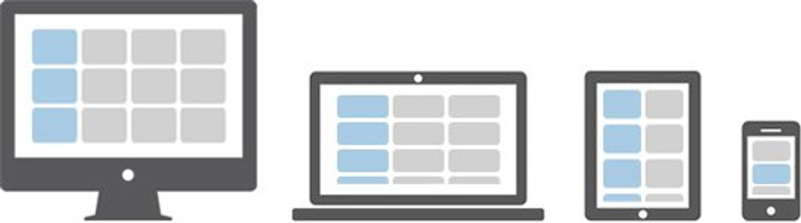

Để có thể tạo được layout giống hình vẽ trên, ta có thể sử dụng grid system của Bootstrap như sau:

```html
<div class="row">
  <div class="col-xl-4 col-md-6 col-xxl-3"><p>Box 1</p></div>
  <div class="col-xl-4 col-md-6 col-xxl-3"><p>Box 2</p></div>
  <div class="col-xl-4 col-md-6 col-xxl-3"><p>Box 3</p></div>
  <div class="col-xl-4 col-md-6 col-xxl-3"><p>Box 4</p></div>
  <div class="col-xl-4 col-md-6 col-xxl-3"><p>Box 5</p></div>
  <div class="col-xl-4 col-md-6 col-xxl-3"><p>Box 6</p></div>
  <div class="col-xl-4 col-md-6 col-xxl-3"><p>Box 7</p></div>
  <div class="col-xl-4 col-md-6 col-xxl-3"><p>Box 8</p></div>
  <div class="col-xl-4 col-md-6 col-xxl-3"><p>Box 9</p></div>
  <div class="col-xl-4 col-md-6 col-xxl-3"><p>Box 10</p></div>
  <div class="col-xl-4 col-md-6 col-xxl-3"><p>Box 11</p></div>
  <div class="col-xl-4 col-md-6 col-xxl-3"><p>Box 12</p></div>
</div>
```

Một lưu ý, chúng ta có thể khai báo một `row` bên trong một `col`. Bên trong `row` đó, ta vẫn sẽ có đủ 12 cột bên trong `row` đó.

```html
<div class="container">
  <div class="row">
    <div class="col-sm-8">Column left</div>
    <div class="col-sm-4">
      <div class="row">
        <div class="col-12"></div>
      </div>
      <div class="row">
        <div class="col-6"></div>
        <div class="col-6"></div>
      </div>
    </div>
  </div>
</div>
```

---

# Bootstrap Form
Với Bootstrap, chúng ta có thể tạo ra các HTML form một cách đơn giản, với nhiều form control được xây dựng sẵn.

Bootstrap cung cấp 3 loại form layout như sau:

- Dạng dọc.
- Dạng ngang.
- Form trên một dòng.

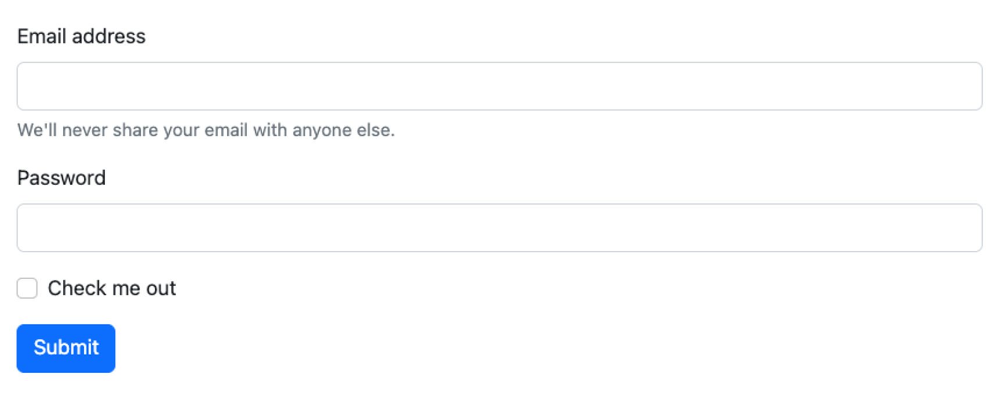

```
<form>
  <div class="mb-3">
    <label for="exampleInputEmail1" class="form-label">Email address</label>
    <input type="email" class="form-control" id="exampleInputEmail1" aria-describedby="emailHelp">
    <div id="emailHelp" class="form-text">We'll never share your email with anyone else.</div>
  </div>
  <div class="mb-3">
    <label for="exampleInputPassword1" class="form-label">Password</label>
    <input type="password" class="form-control" id="exampleInputPassword1">
  </div>
  <div class="mb-3 form-check">
    <input type="checkbox" class="form-check-input" id="exampleCheck1">
    <label class="form-check-label" for="exampleCheck1">Check me out</label>
  </div>
  <button type="submit" class="btn btn-primary">Submit</button>
</form>
```

Các controls được xây dựng sẵn bên trong Bootstrap:

### Text input

```html
<div class="mb-3">
  <label for="exampleFormControlInput1" class="form-label">Email address</label>
  <input type="email" class="form-control" id="exampleFormControlInput1" placeholder="name@example.com">
</div>
```

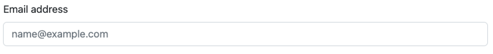

### Select

```html
<select class="form-select" aria-label="Default select example">
  <option selected>Open this select menu</option>
  <option value="1">One</option>
  <option value="2">Two</option>
  <option value="3">Three</option>
</select>
```

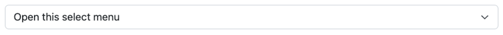

### Checkbox và Radio button

```html
<div class="form-check">
  <input class="form-check-input" type="checkbox" value="" id="flexCheckDefault">
  <label class="form-check-label" for="flexCheckDefault">
    Default checkbox
  </label>
</div>
<div class="form-check">
  <input class="form-check-input" type="checkbox" value="" id="flexCheckChecked" checked>
  <label class="form-check-label" for="flexCheckChecked">
    Checked checkbox
  </label>
</div>
```

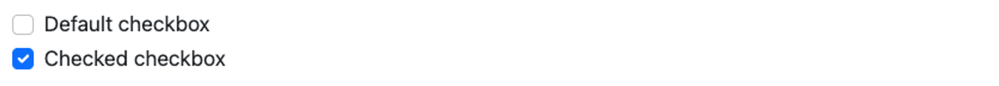

```html
<div class="form-check">
  <input class="form-check-input" type="radio" name="flexRadioDefault" id="flexRadioDefault1">
  <label class="form-check-label" for="flexRadioDefault1">
    Default radio
  </label>
</div>
<div class="form-check">
  <input class="form-check-input" type="radio" name="flexRadioDefault" id="flexRadioDefault2" checked>
  <label class="form-check-label" for="flexRadioDefault2">
    Default checked radio
  </label>
</div>
```

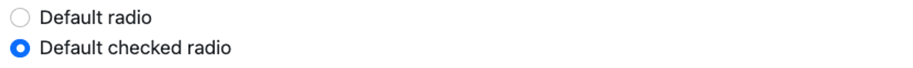

---

# Bootstrap components & Utilities
Danh sách các component trong Bootstrap được liệt kê bên trong tài liệu của Bootstrap ở địa chỉ sau: https://getbootstrap.com/docs/5.2/components
Một vài component đáng chú ý:

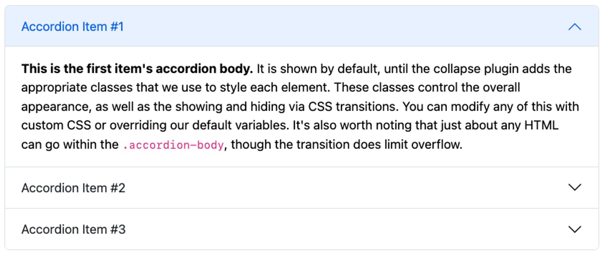

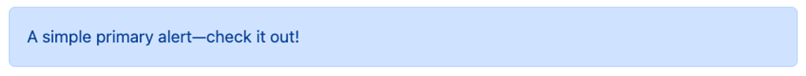

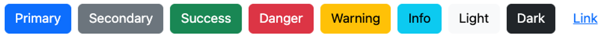

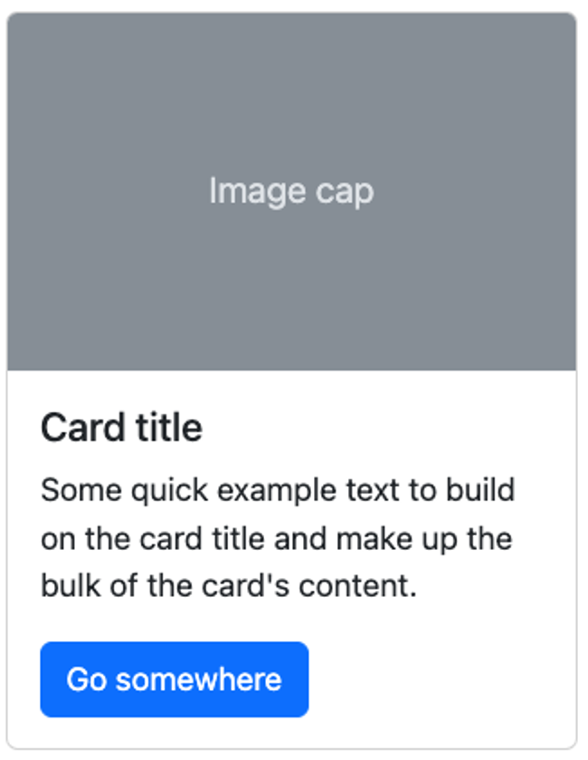

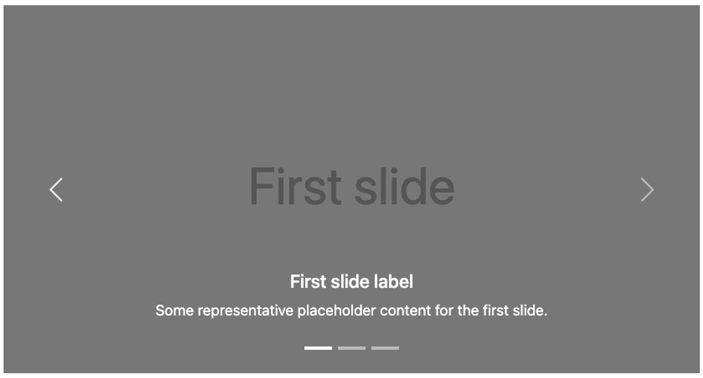

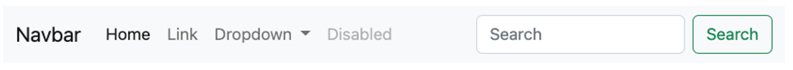

### Utilities

Ngoài các component dựng sẵn, Bootstrap còn cung cấp nhiều utilities class để sử dụng trong một vài trường hợp khác. Một số trường hợp có thể sử dụng các class utilities của Bootstrap:

- Spacing: Thêm nhanh margin hoặc padding
- Color: Thay đổi màu sắc của element
- Display: Thay đổi thuộc tính display
- Border: Thay đổi style của border

Danh sách các class utilities có thể được xem ở đây: https://getbootstrap.com/docs/5.2/utilities