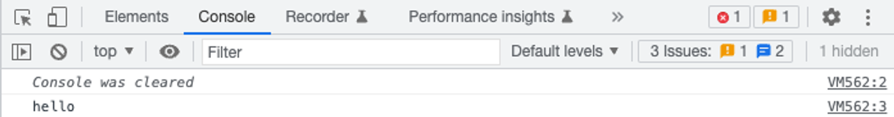

## Lesson 1: Overview JS

>💡 Cơ bản với Javascript

# Javascript là gì?

Javascript là một trong những công nghệ chủ yếu để xây dựng các ứng dụng website. Javascript được nhúng vào trong HTML để tăng cường trải nghiệm người dùng bằng cách thêm nhiều tương tác với ứng dụng.

Với các ứng dụng web hiện đại, vai trò của JS càng ngày càng quan trọng hơn. Toàn bộ ứng dụng có thể được tạo ra bằng Javascript.

JS còn có thể được sử dụng để tạo ra các ứng dụng chạy bên phía server (chạy trên máy tính thay vì trình duyệt) hay thậm chí cả các ứng dụng di động trên IOS và Android. Chúng ta sẽ nói về các ứng dụng khác của Javascript ở những lớp sắp tới.

---

# Chạy ứng dụng Javascript đầu tiên:

Thẻ `<script>` được sử dụng để cho phép chúng ta viết code JS bên trong một trang web HTML. Ta có ví dụ sau:

```jsx
<html>
<head>
	<title>First JS application</title>
</head>
<body>
	...
	<script>
		console.log("Hello")
	</script>
</body>
</html>
```

Để xem được kết quả, mở cửa sổ console bên trong công cụ phát triển của trình duyệt.



Ngoài ra. Javascript còn có thể được viết thành một module riêng biệt và import vào bên trong ứng dụng HTML. Đầu tiên, ta tạo ra một file javascript trong thư mục ứng dụng:

```jsx
console.log("Hello")
```

Sau đó, để liên kết vào trong ứng dụng, ta sử dụng cú pháp với thẻ script như sau:

```jsx
<html>
<head>
	<title>First JS application</title>
</head>
<body>
	...
	<script src="index.js"></script>
</body>
</html>
```

Ta có thể thấy kết quả nhận được vẫn giống với ví dụ ở trên.

Trong một ứng dụng HTML, ta có thể có nhiều thẻ `<script>` khác nhau, cũng như liên kết nhiều file `.js` khác nhau. Nhờ đó, ta có thể chia nhỏ ứng dụng thành nhiều file javascript để dễ bảo trì sau này.

Thứ tự thực thi code thông thường của trình duyệt sẽ là từ trên xuống dưới. Với những file js khác nhau, file nào được liên kết vào trước sẽ chạy trước.

>📌 Chúng ta nên có thói quen chia tách ứng dụng thành các file js nhỏ hơn. Ứng dụng sẽ dễ đọc, dễ bảo trì hơn sau này.

---

# Biến và khai báo biến

Biến (variable) là một trong ứng khái niêm cơ bản của bất cứ ngôn ngữ lập trình nào. Biến là đại diện cho một vùng nhớ trong ứng dụng. Biến được sử dụng để lưu trữ một dữ liệu, và có thể truy xuất tới dữ liệu đó qua tên của biến.

Để khai báo một biết, trong Javascript hiện tại có 3 cách với các từ khoá như sau:

```jsx
let x
var y
const z
```

Những cách trên có sự khác nhau về ý nghĩa. Ta sẽ nói về chúng ở những phần tiếp theo.

### Comment

Trong jS, để comment một dòng lệnh, người ta có thể sử dụng cú pháp `//` cho từng dòng hoặc `/* */` cho nhiều dòng. Những đoạn nằm trong comment sẽ bị bỏ qua, không được chạy trên trình duyệt

```jsx
// Comment line

let x // This is a variable

/*
This is a multile comments.
Use it if you want to explain things
*/
const gravity
```

### Phép gán (Assignment) và hằng số

Gán là một thao tác cơ bản để thay đổi giá trị mà biến nắm giữ. Trong JS, phép gán được thể hiện với dấu `=`, theo sau là giá trị ta muốn gán. Phép gán cũng có thể được sử dụng trực tiếp khi biến được khai báo

```jsx
let x = 10
console.log(x) // 10
x = 11
console.log(x) // 11

var y = 0;
y = 1
console.log(y) // 1

const GRAVITY = 9.8 
console.log(GRAVITY) // 9.8
GRAVITY = 10 // Error: Assignment to constant variable
```

Các biến được khai báo với từ khoá `const` có một điểm khác biệt với hai từ khoá `let` và `var`: **các biến khai báo với const được gọi là các hằng số.** Các hằng số là các giá trị không đổi trong suốt quá trình chạy của ứng dụng. Vì vậy, các hằng số này không cho phép giá trị được gán lại sau khi khởi tạo.

### Quy ước đặt tên biến trong JS.

Trong JS, đặt tên các biến cân phải tuân thủ những quy tắc sau:

- Chữ cái đầu tiên trong tên biến buộc phải là ký tự trong bảng chữ cái hoặc dấu gạch dưới (_) hoặc dấu đô la ($). `1a` là một tên biến không hợp lệ.
- Tên biến có thể sử dụng các chữ cái, chữ số hoặc dấu gạch dưới (_) và dấu đô la ($)
- Các biến có phân biệt viết hoa và viết thường (case-sensitive). `a` và `A` là 2 biến khác nhau
- Không được sử dụng các từ khoá của JS để đặt tên. Danh sách các từ khoá có thể xem tại đây: https://www.w3schools.com/js/js_reserved.asp

Ngoài các quy tắc bắt buộc phải tuân theo trên, chúng ta nên tuân theo quy ước đặt tên trong Javascript:

```jsx
// bad
var firstname = 'Robin';

// bad
var first_name = 'Robin';

// bad
var FIRSTNAME = 'Robin';

// bad
var FIRST_NAME = 'Robin';

// good
var firstName = 'Robin';
```

Với JS, convention thường được sử dụng là dạng “camelCase”.

### `let` & `var` và Hoisting

`let` được sử dụng thường xuyên hơn ngày nay để khởi tạo các biến có thể thay đổi giá trị. `var` cũng là một từ khoá được sử dụng chung mục đích đó. Tuy nhiên nó có những điểm khác nhau nhất định. Một trong những đặc tính đó là **Hoisting.**

Như đã biết, code của chúng ta được thực thi từ trên xuống dưới. Vậy, xét ví dụ sau:

```jsx
console.log(x)
let x = 1
```

Với đoạn code này, ta sẽ nhận được lỗi. Vì chúng ta đã sử dụng biến `x` trước khi nó được khởi tạo. Tuy nhiên, xét một ví dụ khác như sau:

```jsx
console.log(x) // undefined
var x = 1
```

Mặc dù chúng ta nhận lại `undefined` trên màn hình console. Tuy nhiê, ứng dung không hề gặp lỗi. Đây chính là tính năng hoisting trong javascript. Hoisting là hành vi JS tự động đẩy các khai báo biến lên trên đầu ứng dụng. Khiến cho việc truy cập vào các biến sau đó là hợp lệ. Đây là cách thực tế đoạn code trên được thực thi

```jsx
var x // hoisting
console.log(x)
x = 1
```

Các biến được khai báo với từ khoá `var` sẽ có tính chất này. Ngược lại, các biến khai báo với từ khoá `let` sẽ không có tính chất này.

>📌 Vì tính chất “khó đoán” hơn của `var`, trong hầu hết các ứng dụng ngày nay, người ta sử dụng `let` thay vì sử dụng `var`

Các hằng số khai báo với `const` cũng không có tính chất hoisting này.

---

# Kiểu dữ liệu cơ bản bên trong Javascript

Javascript có các kiểu dữ liệu cơ bản (nguyên thuỷ) sau:

1. Number: kiểu số. Sử dụng để thực hiện các tính toán toán học.
2. String: Kiểu chuỗi ký tự. Sử dụng trong các xử lý liên quan tới văn bản.
3. Boolean: Kiểu dữ liệu nhị phân. Đại diện cho đúng hoặc sai.
4. Null: Kiểu dữ liệu rỗng.
5. Undefined: Kiểu dữ liệu không xác định

Với một biến trong Javascript, chúng không có kiểu dữ liệu cố định. Thay vào đó, các biến javascript sẽ có kiểu dữ liệu dựa vào giá trị mà chúng đang mang. Để biết được kiểu dữ liệu hiện tại của một biến, ta có thể sử dụng từ khoá `typeof`

```jsx
let x = 10
console.log(typeof x) // number

x = "Hello"
console.log(typeof x) // string

x = true
console.log(typeof x) // boolean

x = null
console.log(typeof x) // null

x = undefined
console.log(typeof x) // undefined
```

Với các kiểu dữ liệu khác nhau, chúng ta sẽ có nhiều các phép tính toán khác nhau.

### Toán tử toán học

Các phép toán thông thường

| + | Cộng |
| --- | --- |
| - | Trừ |
| * | Nhân |
| ** | Mũ |
| / | Chia |
| % | Chia lấy dư |
| ++ | Tăng lên 1 đơn vị |
| -- | Giảm đi một đơn vị |

### Toán tử gán

Sử dụng để có thể gán nhanh một biến với giá trị mới

| = | x = y |
| --- | --- |
| += | x += y |
| -= | x -= y |
| *= | x *= y |
| /= | x /= y |
| %= | x %= y |
| **= | x **= y |

```jsx
let x = 0
x += 2
console.log(x) // 2
```

### Toán tử nối chuỗi

Hai hoặc nhiều giá trị string có thể được nối với nhau thông qua toán tử `+`

```jsx
x = "Hello"
y = "World"
console.log(x + " " + "World")
```

### Toán tử so sánh

Sử dụng để so sánh các dữ liệu với nhau

| == | bằng |
| --- | --- |
| === | bằng giá trị và cùng kiểu dữ liệu |
| != | không bằng |
| !== | không bằng giá trị và không cùng kiểu dữ liệu |
| > | lớn hơn |
| < | nhỏ hơn |
| >= | lớn hơn hoặc bằng |
| <= | nhỏ hơn hoặc bằng |

```jsx
let x = 9
let y = 10

console.log(y > x) // true
```

Toán tử logic
Sử dụng để tạo ra các kết quả logic giữa 2 giá trị.

| && | và  |
| --- | --- |
| <span>||</span> | hoặc |
| ! | phủ định |

```jsx
const x = true
const y = false

console.log(x && y) // false
```