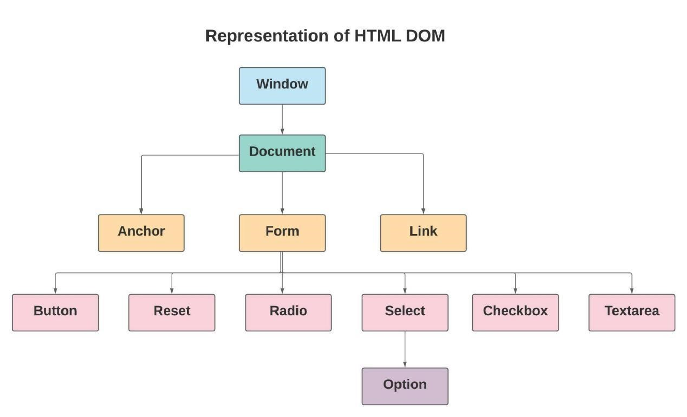

## Lesson 5: DOM và Event

>💡 Tương tác giữa Javascript và HTML

# DOM là gì?

Document Object Model là cách thể hiện của toàn bộ giao diện của ứng dụng web dưới dạng các object, thay vì là các thẻ HTML thông thường. Nó thể hiện lại toàn bộ trang web để chương trình có thể thay đổi được cấu trúc, style hoặc nội dung. DOM thể hiện lại ứng dụng web dưới dạng các  “nodes” và objects.

Một trang web là một tài liệu có thể hiển thị trên trình duyệt hoặc mã nguồn HTML trên các text editor. Và đối với các ngôn ngữ lập trình như Javascript, thể hiện của trang web đó chính là DOM.



Với DOM, Javascript có thể có khả năng:

- Thay đổi toàn bộ element HTML trên trang web.
- Thay đổi thuộc tính của tất cả các thẻ.
- Thay đổi style của tất cả các thẻ
- Xoá các HTML elements trên trang web.
- Thêm element vào bên trong trang web.
- Xử lý các events trong HTML

Trong hình trên, ta thấy các DOM element được tổ chức theo mô hình dạng cây (phân thứ bậc). Trong mô hình cây, chúng ta cơ bản có các khái niệm sau:

- Node: là một phần tử bất kỳ trong cây
- Node cha (parent node) là node nằm ở trên và cùng nhánh node hiện tại. Ví dụ: `Form` là node cha của `Button`, `Anchor` không phải là cha của `Radio`
- Node con (child node) là node nằm bên dưới thuộc nhánh của node hiện tại. Ví dụ: `Radio` là con của `Form` nhưng không phải con của `Anchor`
- Node anh em (sibling node) là các node cùng chung một cha. Ngang hàng với nhau. Ví dụ: `Button` và `Reset` là 2 node anh em

## Các thao tác với DOM document

Trong DOM, `document` chính là object đại diện cho trang web của chúng ta. Với document, chúng ta có thể thực hiện các việc sau:

### Tìm kiếm elements trong document:

- `document.getElementById()`: tìm element đầu tiên trong trang web với ID tương ứng
- `document.getElementsByTagName()`: tìm tất cả các elements trong trang web theo tên thẻ
- `document.getElementsByClassName()`: tìm tất cả các elements trong trang web có chứa class tương ứng.
- `document.querySelectorAll(selector)`: tìm tất cả các elements trong trang web dựa theo CSS Selector.

VD:

```jsx
// find element that have id is myElm
const myElm = document.getElementById("myElm")

// get all img element inside the page
const allImages = document.getElementsByTagNames('img')
```

### Thay đồi giá trị của một element:

- `element.innerHTML = new_html_content`: thay đổi nội dung bên trong một element
- `element.attribute = new_value`: thay đổi giá trị của một thuộc tính của element
- `element.style.attribute = new_value`: thay đổi style của một element

VD:

```jsx
const myElm = document.getElementById("myElm")
myElm.innerHTML = "Hello, World!"
myElm.style.backgroundColor = "green"

const input = document.getElementById("myInput")
input.type = 'password'
```

### Thêm mới hoặc xoá elements:

- `document.createElement()`: Tạo mới một element
- `document.removeChild()`: Xoá một element là node con của một element khác.
- `document.appendChild()`: Thêm một element con vào sau cùng của một element khác.
- `document.replaceChild()`: Thay thế node con bằng một node con khác

Các phương thức trên đều có thể sử dụng với tất các các Node trong DOM tree, không nhất thiết phải là document.

Ví dụ:

```jsx
const todoList = ["Homework", "Jogging", "Shopping"]

const ul = document.createElement("ul")

for (let i = 0; i < todoList.length; i++) {
	const li = document.createElement("li")
	li.innerHTML = todoList[i]
	ul.appendChild(li)
}

document.appendChild(ul)
```

---

# Events và tương tác với Events

Event được hiểu là các sự kiện xảy ra trên ứng dụng web. Ví dụ: khi người dùng click chuột vào một button, người dùng đó đã tạo ra một event là `click`; khi người dùng di chuyển con chuột qua một bức ảnh, người đó đã tạo ra một event là `mouseover`, … Tất cả các thao tác của người dùng tác động vào ứng dụng web của chúng ta đều được gọi là các sự kiện. Với DOM và Javascript, chúng ta có thể chạy một đoạn code bất kì khi sự kiện được tạo ra, từ đó nâng cao trải nghiệm người dùng với trang web. Ví dụ như đổi màu nền của `button` khi người dùng click vào nó.

Một số ví dụ về events trong HTML:

- Khi người dùng click chuột
- Khi trang web được tải thành công
- Khi một bức ảnh được tải thành công
- Khi di chuột qua một HTML element
- Khi giá trị `input` bị thay đổi
- Khi một `form` được submit
- Khi người dùng gõ một phím trên bàn phím

Trong tất cả các sự kiện HTML, chúng ta đều có thể sử dụng Javascript để can thiệp và thực hiện một logic bất kỳ

## `onClick`

Một trong những cách đơn giản nhất để xử lý một sự kiện với Javascript là sử dụng thuộc tính của các thẻ HTML. Các thẻ HTML đều có các thuộc tính là `onclick`,  `onchange`, … Chúng ta có thể truyển trực tiếp một function vào bên trong các thuộc tính đó để chạy một đoạn logic tương ứng khi event xảy ra.

```jsx
<button onclick="sayHello()">Click me</button>

...

<script>
	function sayHello() {
		alert("hello, world!")
	}
</script>
```

Chúng ta cũng có thể sử dụng Javascript để thay đổi giá trị `onclick` của các thẻ HTML thông qua DOM:

```jsx
<button id="clickMe">Click me</button>

...

<script>
	function sayHello() {
		alert("hello, world!")
	}
	const btn = document.getElementById("clickMe")
	btn.onclick = sayHello;
</script>
```

## `.addEventListener`

Ngoài sử dụng các thuộc tính HTML như `onclick` ở trên, chúng ta cũng có thể sử dụng một function đặc biệt là `addEventListener`.

Giống như tên gọi của nó, `addEventListener` làm một nhiệm vụ là “thêm” một “event listener” vào cho một element. “Event listener” có thể được hiểu đơn giản là một function sẽ được chạy khi một event được tạo ra. Nó có ý nghĩa khá tương tự so với `onclick` ở trên. Cú pháp của `addEventListener` là:

```jsx
element.addEventListener('<event>', function () {})
```

Trong đó, `<event>` ở đây là các sự kiện như `click`, `mousemove`, …

Một vài ví dụ như sau:

```jsx
const myBtn = document.getElementById("myBtn")
function sayHello() {
	console.log("hello")
}
myBtn.addEventListener("click", sayHello)

const myInput = document.getElementById("myInput")
myInput.addEventListener("change", function() {
	console.log("input changed")
})
```

Điểm khác biệt ở đây là với `addEventListener`, chúng ta có thể có nhiều listener cùng được chạy khi một event xảy ra.

```jsx
const myBtn = document.getElementById("myBtn")
function sayHello() {
	console.log("hello")
}
myBtn.addEventListener("click", sayHello)
myBtn.addEventListener("click", function() {
	console.log("another event listener");
})
```

Với cách này, chúng ta có thể sử dụng một function là `removeEventListener` để có thể remove các listener khỏi element đó

```jsx
const myBtn = document.getElementById("myBtn")
function sayHello() {
	console.log("hello")
}
myBtn.addEventListener("click", sayHello)
myBtn.addEventListener("click", function() {
	console.log("another event listener");
})

// later
myBtn.removeEventListener("click", sayHello)
```

## Tham số `event` bên trong listener

Các hàm event listener đều nhận được tham số đầu vào là một object `event`. Tham số đầu vào này cho phép chúng ta tương tác được với `event` đó. Một trong những trường hợp thường gặp là khi chúng ta xử lý sự kiện submit của form.

```html
<form id="myForm">
...
</form>

...

<script>
	const form = document.getElementById("myForm")
	form.addEventListener("submit", function(event) {
		event.preventDefault();
		// logic here
	})
</script>
```

Ngoài ra, trong object event, chúng ta còn có thể truy cập tới nhiều thuộc tính hoặc phương thức của chúng như `shiftKey`, `metaKey`, `target` hoặc `stopPropagation()`, …

## **Event Bubbling hay Event Capturing?**

Giả sử chúng ta có trường hợp sau:

```html
<div id="myDiv">
	<p id="myP">This is a paragraph</p>
</div>

...

<script>
	const p = document.getElementById('myP')
	const div = document.getElementById('myDiv')

	div.addEventListener('click', function() {
		console.log('div clicked')
	})

	p.addEventListener('click', function() {
		console.log('p clicked')
	})
</script>
```

Khi này, nếu ta click vào thẻ `p`, liệu rằng dòng log nào sẽ được hiển thị ra trước?

Javascript có 2 cách để xử lý việc này: Đi từ trong ra ngoài hoặc đi từ ngoài vào trong

- Với event bubbling trong ví dụ trên, sự kiện click sẽ xảy ra với thẻ `p` trước và sau đó là thẻ `div`. Hay nói cách khác, event được nổi từ bên trong ra bên ngoài.
- Với event capturing trong ví dụ trên, sự kiện click sẽ xảy ra với thẻ `div` trước và sau đó là thẻ `p` bên trong. Hay nói cách khác, event được bắt từ ngoài vào trong.

Để thay đổi được hành vi này, chúng ta có thể truyển thêm tham số thứ 3 cho function `addEventListener`. Tham số này nhận vào giá trị là boolean (`true` hoặc `false`). Mặc định, giá trị này được xác định là `false`, đồng nghĩa với việc event sẽ được bubbling: đi từ trong ra ngoài. Ta có thể thay đổi giá trị của tham số này để thay đổi hành vi của event

```html
<div id="myDiv">
	<p id="myP">This is a paragraph</p>
</div>

...

<script>
	const p = document.getElementById('myP')
	const div = document.getElementById('myDiv')

	div.addEventListener('click', function() {
		console.log('div clicked')
	}, true)

	p.addEventListener('click', function() {
		console.log('p clicked')
	}, true)
</script>
```
