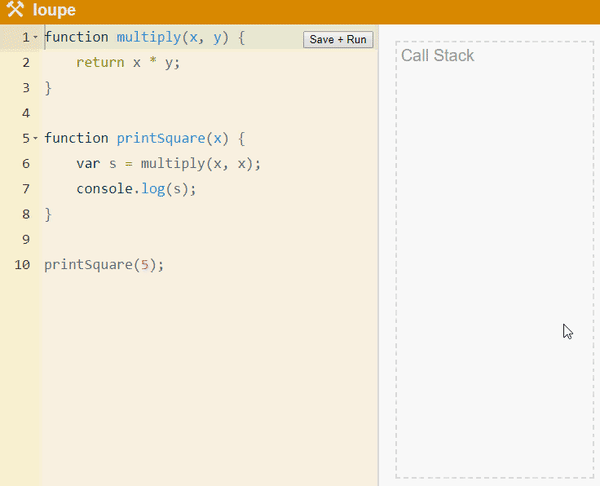

# Lesson 6: Event loop in JS and asynchronous handling

>💡 Hiểu về lập trình đồng bộ, lập trình bất đồng bộ và cách xử lý khi lập trình bất đồng bộ
# Introduction
## Synchronous & IO blocking
### Synchronous programming
Lập trình đồng bộ (synchronous programming) là cách lập trình mà các câu lệnh chạy tuần tự nhau, lệnh trước chạy xong thì lệnh sau mới có thể chạy.

```jsx
Task A > Task B > Task C

Task X > Task Y so slowwwwwwwwww > Task Z
```

Như vậy, khi xử lý các tác vụ IO như đọc file, query database, chờ network,... nói chung là những công việc tốn thời gian, thì trong synchronous chương trình phải chờ đợi những việc kia hoàn thành xong thì mới chạy tiếp, do đó dẫn tới hiện tượng IO blocking.

### IO blocking
Là hiện tượng xảy ra với code đồng bộ, khi thực hiện một tác vụ quá lâu (như ví dụ trên). Do đó, các câu lệnh sau phải chờ đợi một thời gian dài, và trình duyệt có thể không phản ứng với các sự kiện UI.

Nếu ứng dụng hay trang web không phản hồi những sự kiện UI thì hệ điều hành sẽ nghĩ rằng ứng dụng đang bị treo. Khi đó con trỏ chuột có thể thành hình tròn xoay xoay, hoặc tệ hơn là ứng dụng bị lỗi "Not responding" (trên Windows). Đối với web thì nó có thể bị crash, người dùng không thể tương tác, không thể làm gì khác ngoài chờ đợi.

## Asynchronous & non-blocking
### Asynchronous programming
Để khắc phục vấn đề blocking của synchronous, người ta đưa ra khái niệm lập trình bất đồng bộ (không đồng bộ - asynchronous programming). Về cơ bản, bất đồng bộ là các câu lệnh chạy có thể không theo thứ tự, lệnh chạy trước có thể kết thúc sau câu lệnh chạy sau.

```jsx
Task A > Task B > Task B end > ......... > Task A end
```

Bất đồng bộ không làm chương trình chạy nhanh hơn, đúng ra nó chỉ tránh lãng phí thời gian chờ đợi vô ích các tác vụ IO, network,... trong khi những tác vụ đấy thực hiện thì làm việc khác, khi nào chúng xong sẽ có cơ chế để thông báo lại cho mình.

Bất đồng bộ có hai dạng:

Asynchronous trong đơn luồng (single-threaded)
Asynchronous trong đa luồng (multi-threaded)
Đối với bất đồng bộ đa luồng, thì có thể thực thi nhiều công việc cùng lúc (mỗi việc thuộc một thread).

Đối với ngôn ngữ đơn luồng như JS thì bất đồng bộ có một số điểm đặc biệt, sẽ được trình bày sau.

### Non-blocking
Bất đồng bộ giải quyết được vấn đề blocking của đồng bộ, được gọi là non-blocking. Nghĩa là khi chạy một tác vụ nặng (IO, network,...) thì những lệnh tiếp theo được phép chạy ngay mà không cần chờ tác vụ kia hoàn thành.

## JavaScript asynchronous?
Người ta thường nói JavaScript là ngôn ngữ bất đồng bộ, nhưng thực tế không hẳn như vậy.

### JS luôn đồng bộ & blocking
Đúng là JS có những cơ chế hỗ trợ lập trình bất đồng bộ (callback, promise, async/await), nhưng bản thân JS runtime hoàn toàn không phải. Bạn không thể nào viết một hàm với callback, promise hay async/await và hi vọng nó hoạt động asynchronous và non-blocking.

Một vòng lặp vô tận trong JS luôn dẫn tới blocking, dù bạn có code bất đồng bộ kiểu nào đi chăng nữa.

Code JS là đơn luồng và hoàn toàn đồng bộ. Chỉ có những tác vụ sử dụng WebAPIs (do browser) như AJAX, timeout,... thì JS mới thực thi chúng dạng bất đồng bộ. (hoặc một số API như AJAX của jquery cho phép cả hai chế độ).

Do việc gọi và dùng các hàm WebAPIs tương tự như code bình thường, nên có thể bạn hiểu nhầm code JS cũng là bất đồng bộ.

Chỉ có những hàm gọi WebAPIs mới có thể bất đồng bộ. Bạn không thể nào viết một hàm trong JS và yêu cầu nó chạy bất đồng bộ và non-blocking.

Thú thực tôi đã tìm hiểu async trong JS khá lâu rồi, và vì không biết được câu trên nên tôi đã lãng phí khá nhiều thời gian của mình vì một việc vô ích.

### Callback, promise,... là gì?
Ok, chúng ta vừa biết được chỉ khi JS thực hiện các hàm của WebAPIs thì nó mới bất đồng bộ. Vậy những kĩ thuật như callback hay promise dùng để làm gì?

Callback, promise hay async/await, chúng chỉ là những kĩ thuật hỗ trợ trong việc xử lý các tác vụ bất đồng bộ (của WebAPIs)

Bản thân chúng không dùng để tạo ra các hàm bất đồng bộ.

Hỗ trợ ở đây có nghĩa, khi bạn thực hiện một hàm bất đồng bộ, đôi lúc bạn sẽ cần đợi nó hoàn thành để làm thêm việc gì đó. Nhưng nếu đợi nó bằng cách cho nó chạy dạng đồng bộ thì bị blocking.

Do đó, các kĩ thuật như callback hay promise được sinh ra để thực hiện các công việc mà yêu cầu hàm bất đồng bộ hoàn thành.

Ví dụ, bạn cần đợi hàm AJAX (bất đồng bộ) thực hiện xong để lấy dữ liệu, nhưng không muốn web bị blocking. Bình thường, nếu lấy dữ liệu ngay thì sẽ không lấy được do AJAX chưa thực hiện xong. Do đó, bạn dùng callback (hoặc promise) để giúp bạn thực hiện lấy dữ liệu ngay sau khi AJAX hoàn thành. Nghĩa là một callback dùng lấy dữ liệu nhận được sẽ được gọi.

### Code quá chậm thì sao?
Tìm hiểu về WebWorker, về cơ bản nó giúp tạo ra một thread mới để thực thi code JS, và những tác vụ tiếp theo trong thread hiện tại sẽ không bị ảnh hưởng. Nhược điểm là worker thread không thể truy cập vào DOM và một số object của JS như window, document,...

# How does it work?
# Concepts
## Execution context
Hiểu đơn giản, execution context là môi trường mà hàm thực thi. Một execution context chứa code của một hàm và tất cả những thứ liên quan mà hàm cần dùng (biến cục bộ, inner function,...).

Trong hình vẽ, thì có thể tưởng tượng execution context là một cái hộp chứa bên trong là một function.

Execution context có 3 loại:
- Global context: là context của hàm main (bạn nào học C/C++ sẽ biết). Đây là context được tạo ra đầu tiên, được đẩy vào call stack đầu tiên. Mặc dù JS không có hàm main, nhưng ngầm định là có.
- Function context: context chứa một function nào đó. Chú ý, nếu function được gọi nhiều lần, thì sẽ có bấy nhiêu lần context được tạo ra.
- Eval context: context chứa code trong hàm eval(). Hàm này bị bỏ và không dùng vì không an toàn.
### Call stack
Stack là cấu trúc dữ liệu dạng LIFO (Last In First Out), là thứ gì đưa vào stack sau sẽ được lấy ra đầu tiên. Có thể tưởng tượng nó như một chồng đĩa, đĩa nào nằm trên cùng (được đặt vào sau cuối) thì sẽ được lấy ra đầu tiên.

Call stack cũng là một stack, và nó chứa tất cả execution context trong chương trình. Như ví dụ trên thì chồng đĩa là call stack, thì những cái đĩa là các execution context. Và chỉ có context nằm trên cùng (trên đỉnh) của stack thì mới được thực thi.

Quy trình hoạt động của call stack:
- Khi chương trình chạy, context của hàm main được đẩy vào đầu tiên.
- Lúc này, chỉ có main context nên nó nằm ở top của call stack, và nó được chạy
- Khi main chạy tới lời gọi function khác, thì context của function đó được tạo ra và đẩy ngay vào stack
- Function được gọi đang nằm trên top, nên hàm main tạm dừng và function bắt đầu thực thi
- Nếu function gọi một function khác nữa, thì cứ tiếp tục như vậy.
- Sau khi function thực thi xong, thì context của nó sẽ được lấy ra khỏi stack. Lúc này context tiếp theo (đã trở thành top) sẽ được thực thi tiếp.
- Cứ như vậy cho tới khi hàm main lấy ra khỏi call stack
- Khi call stack rỗng, thì chương trình xong (nhưng chưa kết thúc được vì có thể còn các callback chưa xử lý trong queue).

Vì JS là đơn luồng, nên nó chỉ có một callstack. Điều đó đồng nghĩa với việc tại một thời điểm, chỉ có một lệnh trên cùng (top) của call stack được thực thi.

### Task queue
Queue là cấu trúc dữ liệu hơi khác với stack, có dạng FIFO (First In First Out), vào trước ra trước. Tưởng tượng giống như khi xếp hàng vậy.

Task queue (hay còn gọi là callback queue) là nơi chứa các callback đi kèm với các hàm bất đồng bộ.

Quy trình hoạt động:

- Khi gọi hàm bất đồng bộ (thuộc WebAPIs) kèm theo callback, thì nó sẽ đưa context vào cho WebAPIs xử lý.
- Khi WebAPIs xử lý xong, thì callback sẽ được đẩy vào callback queue.
- Các callback sẽ lần lượt được event loop đẩy vào call stack (chỉ khi stack rỗng thì 1 callback sẽ được đẩy vào), cứ như thế cho tới khi queue rỗng.

Ngoài task queue, còn có job queue, là một queue thứ 2 nhưng dùng xử lý các callback của promise. Và job queue có độ ưu tiên cao hơn callback queue, do đó các job sẽ được chạy trước callback.

d. Web APIs & C++ APIs
WebAPIs (hoặc C++ API bên Node.js) là những API được trình duyệt hoặc platform cung cấp cho JavaScript sử dụng. Các API có thể kể tới như:

- WebAPIs: AJAX, DOM, các hàm của browser API như setTimeout(),...
- Node.js C++ API: các hàm file system, query database,...

JS sử dụng các hàm này tương tự như việc gọi hàm bình thường, nhưng thường thì các hàm này sẽ gọi theo kiểu bất đồng bộ (mặc dù một số API cho phép dùng cả 2 kiểu). Và nên dùng bất đồng bộ vì thường những thao tác với WebAPIs đều khá tốn thời gian.

Quy trình hoạt động:
- Khi có một yêu cầu (lời gọi hàm) tới WebAPIs, thì nó sẽ xử lý công việc đó. Yêu cầu API có thể gửi kèm theo một callback (hoặc promise).
- Khi công việc được xử lý xong, callback tương ứng (nếu có) sẽ được đẩy vào task queue, và sẽ được thực thi (đối với promise thì đẩy vào job queue)
  
Có hai chú ý như sau:
- WebAPIs do browser thực thi, và browser thường chia thành các thread cho mỗi nhiệm vụ. Do đó, bản thân JS là đơn luồng, nhưng các hàm WebAPIs là đa luồng do trình duyệt thực thi.
- Thứ tự đẩy callback vào queue phụ thuộc vào task nào xong trước sẽ được đẩy vào trước. Ví dụ hai hàm setTimeout(fn, 1000) tuy gọi sau setTimeout(fn, 3000) nhưng callback của nó sẽ được đẩy vào task queue trước (do thời gian hoàn thành ngắn hơn).
  
### Event loop
Về cơ bản event loop là một vòng lặp vô tận của V8 engine, chỉ để thực hiện hai việc:
- Kiểm tra call stack có rỗng không
- Nếu stack rỗng rồi thì lấy một context trong queue đẩy thêm vào stack.
- Khi context đẩy vào stack thực hiện xong, stack lại rỗng thì tiếp tục lấy trong queue ra đẩy vào, cứ tiếp tục như thế tới khi queue rỗng hết.
- Job queue ưu tiên cao hơn task queue (callback queue), nên những context trong job queue được lấy ra trước.
- Bên trong task queue, những task dùng render UI thì sẽ được lấy ra trước 😃
  
Khi hết stack, hết tất cả queue, thì event loop vẫn không dừng lại.

## Work flow
Một trang siêu hay về phần này là trang http://latentflip.com/loupe/ như ví dụ bên dưới. Bạn viết code, và xem luồng chạy của nó, luồng đi của từng context trong từng call stack, queue, WebAPIs.


Phần này mình sẽ nói sơ qua về nguyên tắc hoạt động của nó (trong đây mình dùng từ hàm cho ngắn gọn, đúng ra phải là "execution context của hàm đó")
1. Đầu tiên hàm main sẽ được đẩy vào call stack, và vì nó ở trên top nên nó được thực thi
2. Trong hàm main có những lời gọi function khác, thì function đó được đẩy vào stack. Vì function mới này nằm trên top, nên hàm main tạm dừng và hàm mới thực thi.
3. Làm tương tự như vậy đối với mỗi lời gọi hàm
4. Khi hàm thực hiện xong, thì nó được lấy ra khỏi call stack.
5. Khi có một lời gọi hàm bất đồng bộ (của WebAPIs) kèm theo một callback, thì nó được đẩy qua phần WebAPIs.
6. Trình duyệt sẽ thực hiện WebAPIs trong từng thread riêng rẽ, khi thực hiện xong thì đẩy callback của nó (nếu có) vào queue. Chú ý ở trong WebAPIs thì không có thứ tự trước sau, ai xong trước thì vào queue trước.
7. Event loop sẽ luôn luôn kiểm tra stack có rỗng không, nếu stack rỗng thì tìm trong queue.
8. Mỗi lần như vậy, event loop lấy ra một context và cho nó vào lại stack.
9. Khi context kia thực hiện xong, call stack lại rỗng, thì tiếp tục lấy trong queue cho vào như trên.
10. Tới khi cả call stack và queue rỗng thì xong, nhưng event loop vẫn cứ chạy mãi.

## Problems
### Stack overflow
Vấn đề đầu tiên cần tránh là stack overflow. Đây là tình trạng stack bị đầy do chứa quá nhiều execution context. Như code ví dụ sau.

```jsx
function foo() {
    foo();
}
foo();
```

Hàm foo() thực hiện gọi lại chính nó mà không có điều kiện dừng lại, nên sẽ tới lúc nào đó trong call stack toàn là foo() foo() foo()... nhiều tới mức làm đầy stack.

Khi đó, trình duyệt sẽ báo lỗi Range Error.

Cách tránh thì đơn giản thôi, tránh việc gọi hàm vô tận, thường xảy ra khi đệ quy không có điều kiện dừng như trên.

# Async techniques
## Callback
### Callback?
Callback là kĩ thuật truyền một function (nó là callback) vào một function khác làm tham số, và khi function kia thực thi xong nó sẽ gọi lại thằng callback được truyền vào.

Có hai dạng callback:
- Callback bình thường: callback truyền cho hàm đồng bộ
- Async callback: là callback được truyền cho một hàm bất đồng bộ
  
Callback đảm bảo một function (callback là nó) phải được thực thi sau khi một function khác hoàn thành (function nhận callback).

Callback bình thường có thể thay thế bằng một đoạn code đồng bộ ngay phía sau, nên nó không cần thiết. Do đó, thường thì nhắc tới callback là nói tới async callback, được truyền cho hàm bất đồng bộ.

```jsx
setTimeout(function () {
    console.log('Done');
}, 1000);
```

Chú ý đoạn code trên, sử dụng setTimeout() để in ra chữ "Done" sau 1 giây. Ở đây, setTimeout() là async function (của WebAPIs), nhận vào một callback là hàm ẩn danh. Sau khi setTimeout() được browser thực hiện xong (đợi xong 1 giây), thì callback sẽ được gọi và dòng chữ "Done" được in ra.

### Error handling
Thường thì các WebAPIs hay C++ API bất đồng bộ khi sử dụng với callback, thì chúng thường tự mình xử lý lỗi và báo lỗi cho callback bằng một hoặc hai tham số.

Ví dụ như method $.get của jquery, thì callback truyền vào sẽ có thêm tham số thứ 2 là status, là chuỗi báo kết quả request.

```jsx
$.get('index.html', function (data, status) {
    if (status === 'success')
        // Xử lý data
    else
        console.log('Error');
});
```

Do đó, cần kiểm tra request có thành công hay không, chỉ khi không có lỗi thì callback mới thực hiện xử lý data nhận được.

### Callback hell
Khi bạn muốn thực hiện nhiều công việc bất đồng bộ liên tiếp nhau, thì sẽ dẫn tới callback hell. Về cơ bản, callback hell chỉ là những callback lồng vào nhau, nhưng vì quá nhiều nên sẽ làm code khó đọc, khó hiểu.

Ví dụ sau sẽ tải liên tiếp 3 file theo thứ tự index.html, style.css, script.js (chỉ là demo callback hell thôi chứ thực tế chả ai viết kiểu này 😄).

```jsx
$.get('index.html', function (data) {
    console.log('Got index.html');
    $.get('style.css', function (data) {
        console.log('Got style.css');
        $.get('script.js', function (data) {
            console.log('Got script.js');
            ...
        }
    }
}
```

Thử tưởng tượng cần phải tải nhiều file hơn nữa thì sẽ dẫn tới một đống callback lồng nhau. Do đó, nó sẽ sinh ra vấn đề là code siêu khó đọc,đó là chưa kể tới việc bắt lỗi cho từng callback. Từ đó, người ta tạo ra Promise để giải quyết vấn đề callback hell như trên.

## Promise
### Promise?
#### What is promise?

Promise là đối tượng đại diện cho kết quả của hành động nào đó sẽ hoàn thành trong tương lai, kết quả trả về sẽ là resolve nếu thành công và reject nếu thất bại.

Chúng ta sẽ thực hiện một hành động bất đồng bộ (trong hàm gọi là executor), và gắn thêm callback vào từng kết quả, từng trường hợp thành công hay thất bại. Ví dụ khi thành công, thì những callback gắn với trường hợp resolve sẽ được gọi, tương tự khi thất bại thì callback của reject được gọi.

```
B1. Gọi hàm execution, chứa lệnh bất đồng bộ
B2. Thêm callback cho trường hợp resolve, reject
B3. Khi executor thực hiện xong sẽ trả về kết quả
B4. Callback tương ứng khi resolve, reject sẽ được gọi
```

Bên trên là sơ đồ siêu đơn giản mô tả các promise hoạt động.

#### Promise states

Một promise từ khi tạo ra tới khi kết thúc sẽ có các trạng thái (state) sau:
- Pending: promise đang thực hiện chưa xong
- Full filled: trạng thái đã thực hiện xong, kết quả thành công
- Rejected: trạng thái đã thực hiện xong, kết quả thất bại

Ngoài ra còn một trạng thái nữa là settled, là chỉ chung cho full filled và rejected. Khi đó promise thực hiện xong, không quan tâm kết quả.

### Promise workflow
#### Executor

Promise về bản chất là một object. Constructor của nó nhận vào một hàm gọi là executor (thường là hàm ẩn danh), có cấu trúc như sau.

```jsx
function (resolve, reject) {
    // Thực hiện lệnh
    if (success)
        resolve();
    else;
        reject();
}
```

Executor function gồm 2 tham số là resolve và reject được xem như function. Executor sẽ:
- Thực hiện một số lệnh, thường có một lệnh bất đồng bộ
- Gọi resolve() để báo kết quả thành công, gọi reject để báo thất bại

Thường thì phần gọi resolve() hoặc reject() sẽ đặt trong lệnh bất đồng bộ, chứ không đặt bên ngoài, vì các lệnh bên ngoài sẽ chạy đồng bộ nên promise sẽ kết thúc rất nhanh, trước khi lệnh bất đồng bộ thực hiện xong.

#### Promise object

Executor sẽ được truyền vào cho Promise constructor khi tạo một promise object.

```jsx
let p = new Promise(function (resolve, reject) {
    // Thực hiện lệnh
    if (success)
        resolve();
    else
        reject();
});
```

Lúc này, một promise object được tạo ra. Khi nó vừa tạo ra, nó thực thi lệnh ngay lập tức. Các lệnh trong executor sẽ lần lượt được thực hiện cho tới phần gọi resolve() hoặc reject(). Khi gọi một trong hai, thì promise sẽ đẩy một callback tương ứng vào job queue, và thực hiện nốt những lệnh còn lại (nếu có, nhưng thường là không).

Callback ở trong job queue sẽ chờ 😡.

#### Then & catch

Khi lệnh bất đồng bộ thực hiện, luồng chạy sẽ tiếp tục các lệnh sau khi tạo object promise. Lúc này promise object có thể thuộc hai trường hợp:
- Đang pending, chưa gọi resolve() hoặc reject(), nên chưa có callback trong job queue
- Đã settled, resolve() hoặc reject() đã gọi rồi, và có một callback đang chờ trong job queue.

Dù trường hợp nào đi nữa, thì chắc chắn callback trong job queue chưa thực hiện ngay, hoặc là nó chưa có, hoặc job queue đang chờ chưa được thực thi (vì job queue phải chờ stack rỗng, là không còn lệnh nào sẽ chạy nữa). Do đó, có thể nói rằng callback trong job queue luôn thực thi sau cùng.

Luồng chạy vẫn tiếp tục các lệnh tiếp theo. Luồng chạy đi qua phần tạo object promise và tiến tới phần then() hoặc catch() (hai phần này thường nằm ngay sau khi tạo promise object). Cả then() và catch() thực ra đều là method của promise object.

```jsx
...
p.then(function () {
    console.log('Success');
})
p.catch(function () {
    console.log('Failed');
})
```

Method then() sẽ nhận vào callback, và gắn nó cho trường hợp thành công. catch() cũng thế nhưng callback sẽ gắn cho trường hợp thất bại. Và những callback sẽ được gọi bởi thằng callback bên trong job queue (có thể chưa tạo ra hay đang chờ).

#### Ending

Cuối cùng, trong call stack không còn gì nữa, thì callback trong job queue được event loop đẩy vào trong call stack để chạy.

Thằng callback này tùy vào kết quả promise, nó sẽ gọi các callback tương ứng với kết quả đó. Nếu trước đó:
- resolve() được gọi, nghĩa là thành công, thì những callback gắn bởi then() sẽ được chạy
- reject() được gọi, nghĩa là thất bại, callback gắn bởi catch() được chạy

Do đó, nhờ job queue luôn thực hiện sau cùng mà:
- Vẫn đủ thời gian để gắn callback vào bằng then(), catch()
- Đảm bảo những callback gắn vào luôn thực hiện sau khi lệnh bất đồng bộ hoàn thành.

Từ đó, chức năng của promise được thực thi.

#### Sending data
Khi gọi resolve() hoặc reject() có thể truyền thêm data dưới dạng đối số, thường là dữ liệu nhận được (received data) cho resolve() và thông tin lỗi cho reject(). Các data này được then() hoặc catch() callback nhận vào lại dưới dạng tham số.

Như bên dưới là ví dụ cơ bản nhất.

```jsx
let p = new Promise((resolve, reject) => {
    console.log('Bắt đầu tải xuống');
    // Method $.get của jquery là bất đồng bộ
    $.get('camly.mp3', (data, status) => {
        if (status === 'success')
            resolve(data);
        else
            reject(status);
    }
});
p.then((data_received) => {
    console.log('Đã nhận được data')
    // Thêm các lệnh xử lý data nhận được
});
p.catch((err) => {
    console.log('Lỗi', err);  // In ra lỗi
});
```

Hãy thử xem lại workflow của promise và áp dụng vào ví dụ trên thử xem.

#### Return promise
Do promise được gọi ngay sau khi tạo object, nên người ta cho nó vào một function. Function này sẽ return một promise khi được gọi.

```jsx
function downloadFile(url) {
    return new Promise((resolve, reject) => {
        $.get(url, (data, status) => {
            if (status === 'success')
                resolve(data);
            else
                reject(status);
        })
    })
}
```

Và rồi khi nào cần dùng thì gọi như hàm bình thường, gán nó vào một tham chiếu và dùng then() và catch() để thêm callback thực hiện cho từng trường hợp thành công hoặc thất bại.

```jsx
let p = downloadFile('https://example.com/file.zip');
p.then((data) => {
    // Xử lý data nhận được
}
p.catch((err) => {
    // Xử lý lỗi nếu có
})
```

#### Promise chaining
Promise được xem như phiên bản nâng cấp cho callback, bởi vì nó khắc phục được tình trạng callback hell khi phải lồng quá nhiều callback để thực hiện nhiều công việc bất đồng bộ liên tiếp.

Promise thực hiện điều đó như thế nào. Đó là do method then() của promise, nó cũng trả về một promise khác. Vì vậy, chúng ta có thể "chain" chúng thành một chuỗi các then().

```jsx
p.then(() => { console.log('Done 1'); })
.then(() => { console.log('Done 2'); });
```

Chú ý có thể chain nhiều then(), nhưng chỉ có một catch() duy nhất, và nó thường ở cuối cùng chuỗi chain.

Ok, đoạn code trên nhiều bạn sẽ bảo là sao không viết gọn lại thành như vầy cho dễ.

```jsx
p.then(() => {
    console.log('Done 1');
    console.log('Done 2');
});
```

Đúng là ví dụ trên quá đơn giản, cả hai lệnh console.log() đều là đồng bộ nên có thể làm như trên. Nhưng hãy thử nghĩ, nếu muốn thực hiện lệnh bất đồng bộ thì sau. Ví dụ tải 2 file camly.mp3 và camly.zip theo thứ tự. Rõ ràng, code sau không thực hiện được vì cả 2 file thực hiện cùng lúc.

```jsx
let p = downloadFile('camly.mp3');
p.then(() => {
    console.log('File camly.mp3 tải xong');
    // Function này return promise, đã viết ở trên
    downloadFile('camly.zip');
    console.log('File camly.zip tải xong');
    // File camly.zip chưa tải xong mà in ra rồi, sai
})
```

Thêm một cách chữa khác. Cách này có vẻ tốt hơn cách 1, tuy nhiên nó lại bị vấn đề tương tự callback hell.

```jsx
let p = downloadFile('camly.mp3');
p.then(() => {
    console.log('File camly.mp3 tải xong');
    let p1 = downloadFile('camly.zip');
    p1.then(() => {
        console.log('File camly.zip tải xong');
    })
})
```

Cả 2 cách vừa nêu đều có nhược điểm, và đây là cách tốt nhất.

```jsx
let p = downloadFile('camly.mp3');
p.then(() => {
    console.log('File camly.mp3 tải xong');
    return downloadFile('camly.zip');
}).then(() => {
    console.log('File camly.zip tải xong');
})
```

Code như trên lợi dụng tính năng then() return một promise mới, chúng ta sẽ return một promise khác, và thằng then() ngay tiếp theo sẽ nhận được data từ promise mới này.

Code như trên sẽ tránh được callback hell, vì các then() của promise thường không tab vào lồng nhau mà nằm cùng cấp. Tuy vậy, có thể sẽ gặp tình trạng promise hell khi quá nhiều đoạn then() liên tiếp nhau. Và khắc phục vấn đề đó, người ta lại giới thiệu async/await.

## Promise methods
### Then, catch, finally methods
#### Then & catch methods

Method then() dùng để gắn thêm callback sẽ thực hiện, khi promise thành công (full filled) thì callback sẽ được gọi.

Method catch() tương tự, nhưng callback sẽ được gọi khi promise thất bại (rejected).

```jsx
// Tạo promise download file
let p = new Promise((resolve, reject) => {
    $.get('file.zip', (err, data) => {
        if (err)
            reject(err);
        resolve(data);
    })
}

// Callback được gọi nếu promise thành công
p.then(data => { ... });

// Callback được gọi nếu promise thất bại
p.catch(err => { ... });
```

#### Finally method

Ngoài ra, còn một method khác của promise cũng dùng để gắn callback là finally(). Callback gắn bởi finally() sẽ luôn được gọi khi promise thực hiện xong (trạng thái settled).

```jsx
p.finally(() => {
    // Callback này sẽ luôn được gọi
    // khi promise thực hiện xong
}
```

Ba method trên đều nhận vào tham số là callback, và thường được viết dạng arrow function cho nó ngắn gọn.

### Promise constructor methods
Promise.resolve & Promise.reject

Hai method này khá là hay, dùng để return value bình thường thành dạng promise.

```jsx
let p = Promise.resolve(10);
p.then(value => { console.log(value) };  // 10
```

Promise.resolve trả về một promise đã full filled, tham số đưa vào lúc này trở thành value đã được resolve. Promise.reject() tương tự, và có lẽ bạn đã đoán ra được chức năng của nó là trả về ngay một promise đã bị rejected.

Vậy tại sao phải dùng chúng? Ok lý do siêu đơn giản, là để pass nhanh value từ mắt xích then này sang mắt xích then tiếp theo mà không cần return promise hoặc một function return promise.

Mặc định nếu một mắt xích không return promise, thì then sẽ return một promise object rỗng. Để có thể truyền dữ liệu qua mắt xích then tiếp theo, có 2 cách:
- Ghi đè promise mặc định bằng việc return một promise khác
- Dùng Promise.resolve()

Cách 1 thì nếu return một function đã return promise 😄, kiểu như return downloadFile('1.txt') thì dễ rồi, nếu như phải return một thứ gì đó không phải function như trên sẽ khá khó. Do đó dùng cách 2.

#### Promise.all & Promise.any
#### Promise.allSettled & Promise.race

## Async/await
### Async & await
Hai từ khóa async/await được bổ sung vào ECMAScript 2017 để hỗ trợ sử dụng promise được tốt hơn. Như những ví dụ về promise ở trên thì nó khá là dài dòng và rắc rối. Async/await được sinh ra để giải quyết vấn đề đó, giúp code gọn gàng hơn.

Async/await làm cho code bất đồng bộ trở nên có vẻ giống đồng bộ, do đó dễ đọc hơn. Tuy nhiên, chỉ nên dùng khi biết rõ về nó, có những trường hợp không thể dùng async/await được.

#### Async keyword

Từ khóa async được thêm vào đầu khai báo function, dùng để biến function đó thành function sẽ return một promise. Và câu lệnh return trong function nếu có sẽ trở thành return data cho promise đó.

Ví dụ như đoạn code sau.

```jsx
async function getValue() {
    return 10;
}
getValue().then((value) => { console.log(value); });  // 10
```

Function getValue() khi có async sẽ return một promise theo mặc định. Nó tương tự như cách viết return promise ở phía trên đã trình bày, nhưng ngắn gọn hơn.

#### Await keyword

Từ khóa await được đặt ở trước lời gọi một async function hoặc một promise, để tạm dừng luồng chạy cho tới khi promise trả về kết quả (async function cũng là promise).

```jsx
await getValue();
await new Promise((resolve, reject) => { ... });
```

Từ khóa await chỉ được sử dụng bên trong một function có đánh dấu async.

### Example
Nhớ lại ví dụ về hàm downloadFile() ở trên được viết bằng promise. Thử dùng lại nó để tải 3 file liên tiếp gồm index.html, style.css và script.js như trên ví dụ callback hell.

```jsx
function downloadFile(url) {
    return new Promise((resolve, reject) => {
        $.get(url, (data, status) => {
            if (status === 'success')
                resolve(data);
            else
                reject(status);
        })
    })
}

function downloadAll() {
    downloadFile('index.html')
    .then((data) => {
        console.log('Tải xong index.html');
        return donwloadFile('style.css');
     })
    .then((data) => {
        console.log('Tải xong style.css');
        return downloadFile('script.js');
    })
    .then((data) => {
        console.log('Tải xong script.js');
    })
}

downloadAll();
```

Well, một vấn đề gần giống callback hell xuất hiện, với tên gọi promise hell. Vấn đề xuất hiện khi có quá nhiều promise liên tiếp nhau do promise chaining. Hãy cùng viết lại code trên với async/await để xem cách nó giải quyết promise hell như thế nào.

```jsx
...
async function downloadAll() {
    // Các biến f1, f2, f3 là data tải được
    let f1 = await downloadFile('index.html');
    console.log('Tải xong index.html');
    let f2 = await downloadFile('style.css');
    console.log('Tải xong style.css');
    let f3 = await downloadFile('script.js');
    console.log('Tải xong script.js');
}

downloadAll();
```

Code đã rõ ràng và sáng sủa hơn rất nhiều rồi, và trông nó giống code đồng bộ hơn là bất đồng bộ. Vì lẽ đó, nó làm code dễ đọc và phù hợp với suy nghĩ logic hơn.

### Error handling
Nếu như đối với promise, chúng ta sử dụng catch callback để bắt trường hợp lỗi (thất bại), thì với async/await, chỉ cần dùng cấu trúc try catch finally để bắt lỗi như code đồng bộ.

Ví dụ trên về downloadAll() chưa có phần xử lý lỗi, nên ở đây tôi sẽ code thêm phần này.

```jsx
...
async function downloadAll() {
    try {
        let f1 = await downloadFile('index.html');
        console.log('Tải xong index.html');
        let f2 = await downloadFile('style.css');
        console.log('Tải xong style.css');
        let f3 = await downloadFile('script.js');
        console.log('Tải xong script.js');
    } catch(err) {
        console.log(err);
    }
}

downloadAll();
```

Xong, tất cả chỉ có vậy. Cấu trúc trên vừa bắt lỗi đồng bộ, vừa có thể bắt được khối catch của promise khi promise nào đó thất bại. Rất dễ dàng và tiện dụng.

#### Why async/await
Async/await có khá nhiều lợi ích, như việc giúp code rõ ràng hơn, ngắn gọn hơn, và xử lý lỗi đơn giản. Tuy nhiên, nó cũng có một số hạn chế như sau.

Thứ nhất là vì async/await thực thi code bất đồng bộ như code đồng bộ, nên await sẽ chặn các lệnh phía sau để chờ một promise nào đó hoàn thành. Vì vậy, chỉ khi bạn thực sự biết await sẽ làm gì thì mới nên dùng, vì nó có thể gây ra blocking.

Thứ hai là tính tương thích trình duyệt, những trình duyệt cũ không hỗ trợ async/await, nên nếu bạn muốn dùng bạn cần sử dụng thêm công cụ khác bên thứ ba như Babel để chuyển code async/await thành dạng promise.

## try-catch trong javascript

`try` và `catch` là cấu trúc trong JavaScript được sử dụng để xử lý các ngoại lệ (exceptions), tức là những tình huống không mong muốn và không dự đoán được xảy ra trong quá trình thực thi chương trình. Câu trúc này giúp chương trình có khả năng xử lý các lỗi một cách kiểm soát hơn.

Cú pháp cơ bản của `try...catch` là như sau:

```jsx
try {
    // Mã có thể gây ra ngoại lệ
    // ...
} catch (error) {
    // Xử lý ngoại lệ ở đây
    // `error` là một đối tượng chứa thông tin về ngoại lệ
    // ...
} finally {
    // Mã được thực hiện bất kể có ngoại lệ hay không
    // ...
}
```
- Khối try: Mã trong khối này là những đoạn code có thể gây ra ngoại lệ. Nếu ngoại lệ xảy ra trong khối này, quyền kiểm soát sẽ chuyển đến khối catch.
- Khối catch: Mã trong khối này sẽ được thực thi nếu có bất kỳ ngoại lệ nào xảy ra trong khối try. Biến error (hoặc bất kỳ tên biến nào bạn đặt) sẽ chứa thông tin về ngoại lệ, giúp bạn xác định và xử lý lỗi.
- Khối finally: Mã trong khối này sẽ được thực hiện bất kỳ có lỗi hay không. Thường được sử dụng để đảm bảo rằng một số tài nguyên được giải phóng, dù có ngoại lệ xảy ra hay không.

Example: 
```jsx
try {
    // Mã có thể gây ra ngoại lệ
    let result = 10 / 0;
    console.log(result);  // Dòng này không được thực thi nếu có lỗi
} catch (error) {
    // Xử lý ngoại lệ
    console.error('Đã xảy ra lỗi:', error.message);
} finally {
    // Mã này sẽ luôn được thực hiện, dù có lỗi hay không
    console.log('Khối finally được thực hiện bất kể có lỗi hay không.');
}
```

Trong ví dụ trên, nếu phép chia 10 / 0 được thực hiện, nó sẽ tạo ra một lỗi và chương trình sẽ nhảy đến khối catch để xử lý lỗi.