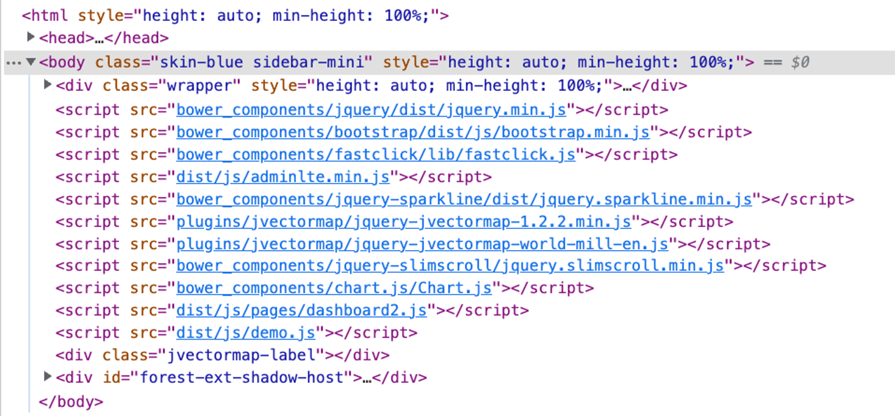
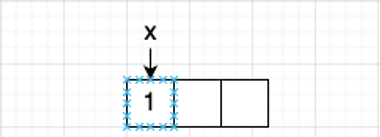
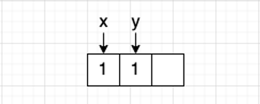
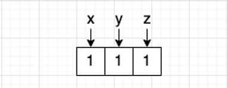
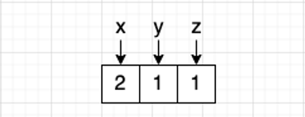
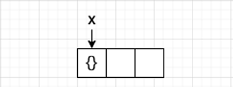
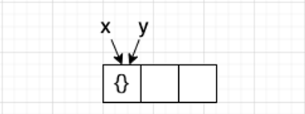
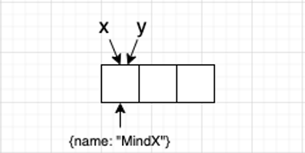
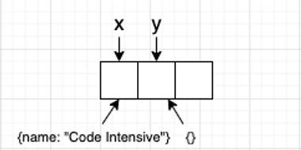

## Lesson 1: ES6 (ECMAScript 2015)

```
💡 Hiểu sâu hơn về các cú pháp của JS, những điểm mới trong ES6+
```

# 1. `let` và `const`

Cả `let` và `const` đều được sử dụng để khai báo các giá trị biến. Tuy nhiên `let` và `const` có một điểm khác biệt cơ bản:

- `let` sử dụng để khai báo các biến **có thể gán lại được**
- `const` sử dụng để khai báo các biến **không thể gán lại được**

Cả `let` và `const` đều có chung đặc điểm là **có phạm vi trong block (block-scoped)** và **không hỗ trợ hoisting**. Đây cũng là điểm khác biệt của chúng so với `var`.

`var` là từ khoá khai báo biến tương tự như `let`. Tuy nhiên var có phạm vi là global / function scope và có hỗ trợ hoisting.

```
💡 Trong Javascript thì chúng ta có 3 khái niệm liên quan tới phạm vi của biến gồm: Global, Function và Block. Block là một khối lệnh nằm trong cặp ngoặc nhọn “{}”. Ví dụ, các câu lệnh trong khối lệnh `if-else` , vòng lặp `for`, `while`...

Hoisting là hành vi của JS khi các câu lệnh khai báo được đẩy lên trên đầu của **scope hiện tại**.

```

Scope là một trong những điểm khác biệt cơ bản giữa `var` và `let, const`. Xét ví dụ sau:

```jsx
function run() {
  var a = "Foo";
  let b = "Bar";

  console.log(a, b); // Foo Bar

  {
    var c = "Fooz"
    let d = "Bazz";
    console.log(c, d); // Fooz Bazz
  }

  console.log(c); // Fooz
  console.log(d); // ReferenceError
}
```

Với biến `d`, chúng ta sẽ gặp lỗi `ReferenceError` do nó được khai báo với từ khoá `let`, khiến cho phạm vi của nó chỉ được nằm trong khối lệnh ở trên.

Với tính chất hoisting, chúng ta xem ví dụ bên dưới đây:

```jsx
console.log(x) // undefined
var x = 1
```

```jsx
var x
console.log(x) // undefined
x = 1
```

Các từ khoá `let` và `const` không có tính chất hoisting như trên. Do đó, khi ta truy cập vào một biến khi chưa khởi tạo nó, chương trình sẽ báo lỗi `ReferenceError`

`var` có thể bị coi là một bad practice trong Javascript hiện đại. Việc sử dụng `var` khiến cho code khó đọc hơn. Các giá trị cũng khó đoán hơn và code ít tự nhiên hơn. Đa phần các lập trình viên đều hiểu là các dòng lệnh được thực hiện từ trên xuống dưới. Do đó việc khai báo được đẩy lên trên cùng sẽ khiến họ bị bối rối.

Biến được khai báo với từ khoá `const` sẽ không cho phép gán lại giá trị sau đó. Tuy nhiên, với các trường hợp thay đổi giá trị **mà không gán lại** thì hoàn toàn có thể thực hiện được.

```jsx
const x = 0
x = 1 // TypeError: Assignment to constant variable
const arr = []
arr.push(1) // Valid: No assignment
arr = [1, 2] // TypeError: Assignment to constant variable
```

Với ví dụ trên, biến được khai báo với từ khoá `const` không thể thay đổi giá trị bằng phép gán. Tuy nhiên, việc chúng ta sử dụng `push` thì chương trình vẫn chạy hoàn toàn bình thường. Phần này sẽ được nói rõ hơn ở **Reference & Primitive data types.**

```
🤔 Trong thực tế, các lập trình viên ngày nay thường thích sử dụng `const` hơn `let` ở đa số các trường hợp. Hãy thử tìm hiểu tại sao lại như vậy.

```

---

# 2. Arrow Functions

Arrow functions là một cú pháp để khai báo function mới, xuất hiện từ Javascript ES6. Cú pháp cơ bản của arrow function như sau:

`(const/let) functionName = (params) => { /* function body */ }`

```jsx
// Function expression, hoisting supported
function sum(a, b) {
  console.log("sum 2 numbers");
	return a + b;
}

// Anonymous function, no hoisting supported
const sum = function(a, b) {
	console.log("sum 2 numbers");
	return a + b;
}

// Arrow function, no hoisting supported
const sum = (a, b) => {
	console.log("sum 2 numbers");
	return a + b;
}
```

Arrow function là một cú pháp khác để có thể khởi tạo một function. Tuy nhiên nó cũng có những đặc điểm khác so với cách khai báo tiêu chuẩn

- Arrow function không hỗ trợ hoisting.
- Không có binding cho `this` và `super`. Vì vậy không nên dùng nó với các trường của một object. `this` của arrow function là context gần nhất với nó, thay vì là đối tượng gọi nó.
- Không thể dùng như một “object constructor”.

Một số hình thái của arrow function:

```jsx
const sum = (a, b) => {
	return a + b;
} // arrow function
const sub = (a, b) => a - b // short handed return
const double = a => a * 2; // single param
const getAddress = () => ({city: 'Hanoi'}) // return an object
const getCoordinate = () => ([0, 1]) // return an array
```

Một vài lợi ích khi sử dụng arrow function trong ứng dụng Javascript:

- Giảm số lượng code, code trông sạch hơn.
- Tránh binding `this` trong một số trường hợp (event handling)

```
📌 Trong khoá học này, chủ yếu chúng ta sẽ sử dụng arrow function cho hầu hết các trường hợp. Vì vậy, hãy cố gắng nắm vững các khái niệm xung quanh nó.

```

---

# 3. T**emplate** literal

Template literal là một cú pháp mới, giúp chúng ta dễ dàng thực hiện các thao tác nối chuỗi trên nhiều dòng. Với template literal, chúng ta có thể dễ dàng thêm các giá trị JS vào bên trong của một chuỗi ký tự mà không cần dùng phép nối chuỗi.

```jsx
const name = "T3H";
const str = "hello " + name + "!"; // normal way
const str = `
hello, ${name}!
Welcome to our website.
`; // template literal, support multiple lines.
```

---

# 4. Module: Exports & Imports

JS có xuất phát điểm là một ngôn ngữ lập trình dành cho các công việc đơn giản trên trình duyệt. Nên ban đầu, nó không cần các khái niệm liên quan tới chia nhỏ ứng dụng ra thành nhiều module nhỏ. Tuy nhiên, việc các ứng dụng JS trở nên phức tạp hơn, đòi hỏi cần có sự chia nhỏ các module ra thành nhiều phần, giúp source code trở nên dễ quản lý hơn.



Source code của một ứng dụng web truyền thống. Các file JS cần phải được liên kết theo đúng thứ tự

Giả sử chúng ta có một cấu trúc ứng dụng như sau:

```jsx
index.html
main.js
modules/
	math.js
```

Để có thể sử dụng được module trong JS, ứng dụng bắt buộc phải được chạy với giao thức HTTP, và thẻ script cần phải có thuộc tính `type=”module”`

```html
<html>
	....
	<script src="main.js" type="module"></script>
</html>
```

Bên trong file `math.js` có một vài function: 

```jsx
const sum = (a, b) => a + b
const sub = (a, b) => a - b

export {sum, sub}; // export module
export const version = 'myMath 1.0'
```

`math.js` chính là một module trong ứng dụng. Khi chúng ta đã export một giá trị trong module đó, các module khác có thể import các giá trị đó và sử dụng chúng. Giả sử trong `main.js` chúng ta có source code như sau:

```jsx
import {sum} from "./modules/math.js"

console.log("Sum of a and b is " + sum(a, b))
```

Như vậy, chúng ta có thể tái sử dụng được các module đã viết sẵn trong ứng dụng.

Đối với module trong JS, chúng ta có 2 kiểu export như sau:

- Named export: export theo tên. Với name export, chúng ta có thể export nhiều hơn một giá trị từ trong module. Khi import vào một module khác, bắt buộc phải dùng đúng tên module đó.
- Default export: export mặc định. Chỉ có thể export default 1 giá trị trong một module. Khi import từ module khác, không nhất thiết phải dùng đúng tên biến đã export

```jsx
export const version = '1.0'; // named export
export function sum(a, b) {
	return a + b;
} // named export
const sub = (a , b) => {
	return a - b;
}
export {sub} // named export

const myMath = {
	sum: sum,
	sub: sub,
	version: version,
}

export default myMath // default export
```

```jsx
import {version, sum} from "./modules/math.js" // named import
import math from "./modules/math.js" // default import

console.log("math version: ", math.version);
```

```
🧑‍💻 Hãy thử viết một chương trình xử lý ngày tháng. Người dùng có thể chọn ngày tháng, sau đó có thể hiển thị ngày tháng đã chọn theo dạng mong muốn (US, UK, Japanese, Vietnam, ...). Các logic về xử lý ngày tháng có thể nằm trong module `date.js` của chính mình.

```

---

# 5. Spread & Rest Operator

Spread operator là một toán tử mới, giúp chúng ta có thể “trải phẳng” các phần tử của một đối tượng tập hợp (array, object, set).

Cú pháp của spread operator là dấu ba chấm (`...`)

```jsx
const arr = [1, 2, 3]
console.log(arr) // [1, 2, 3]
console.log(...arr) // 1 2 3
```

Một số ứng dụng với spread operator:

- Sao chép array, object
- Gộp array, object
- Thêm phần tử vào array, thêm key vào object.

Một vài ví dụ với spread operator:

```jsx
const arr = [4, 5, 6]
const arr2 = [1, 2, 3]

// use spread for getting a list of number.
const max = Math.max(...arr) // 6

// copy all elements from arr to another array and add 7 to tail
let arrCloned = [...arr, 7] // [4, 5, 6, 7]

// copy all elements from arr to another array and add 3 to head
arrCloned = [3, ...arr] // [3, 4, 5, 6]

// concat 2 arrays and add a number in between
const concatedArray = [...arr, 0, ...arr2] // [4, 5, 6, 0, 1, 2, 3]

const obj = {name: "T3H"}

// copy all fields in object to another object and add field
const obj2 = {...obj, address: "Hanoi"} // {name: "T3H", address: "Hanoi"}

// copy all fields in object to another object and overwrite field
const obj3 = {...obj, name: "Code Intensive"} // {name: "Code Intensive"}
const obj4 = {name: "Code Intensive", ...obj} // {name: "T3H"}
```

Spread operator là một cách đơn giản để giúp các thao tác với array, object. Đặc biệt hữu dụng với việc update state trong React mà chúng ta sẽ tìm hiểu những phần tiếp theo.

```
📖 Đọc thêm về spread operator ở đây:
https://developer.mozilla.org/en-US/docs/Web/JavaScript/Reference/Operators/Spread_syntax

```

Rest operator là cách để tạo ra một function với vô hạn tham số truyền vào.

```jsx
function sum(...args) {
  let total = 0
	for (let i = 0; i < args.length; i++) {
		total += args[i]
  }
  return total;
}
sum(1, 2, 3, 4, 5) // 15
```

Một ví dụ với rest operator là các hàm `Math.max`, `Math.min`.

Có một vài đặc điểm cần lưu ý với rest operator:

- Trong một function chỉ có một rest opertor
- Rest operator buộc phải là tham số sau cùng

Các ví dụ sai và đúng với cách sử dụng rest operator:

```jsx
// Wrong: multiple rest operator
const sum = (...first, ...second) => {...}

// Wrong: rest operator cannot be the first params
const sum = {...first, second, third} => {...}

// Correct
const sum = (first, second, ...third) => {...}
```

```
💡 Các phần tử trong rest operator không nhất thiết phải cùng một kiểu dữ liệu. Vì vậy cần chú ý khi sử dụng. Chúng ta có thể thử với câu lệnh `Math.max(1, “a”, 2)` và theo dõi kết quả.

```

---

# 6. Destructuring

Phép gán destructuring là một cú pháp cho phép “unpack” dữ liệu từ array, object trở thành các biến riêng biệt.

Thông thường, để có thể lấy được dữ liệu từ trong array và object, chúng ta cần phải làm như sau:

```jsx
const person = {name: "T3H", age: 20}
const name = person.name;
const age = person.age;

const coordinate = [0, 1, 1];
const x = coordinate[0];
const y = coordinate[1];
const z = coordinate[2];
```

Destructuring cho phép chúng ta sửa đoạn code trên thành như sau:

```jsx
const person = {name: "T3H", age: 7}
const {name, age} = person;

const coordinate = [0, 1, 1];
const [x, y, z] = coordinate;
```

Lưu ý với destructuring:

- Với object, destructuring hoạt động theo tên của trường dữ liệu
- Với array, destructring hoạt động theo vị trí trong array của phần từ
- Nếu key hoặc index không tồn tại trong object / array, biến đó sẽ mang giá trị `undefined`.

Một vài cách sử dụng cú pháp destructuring như sau:

```jsx
// Assignment separated from declaration
let x, y
[x, y] = [1, 2]

// Default value
const [a=2, b=3] = [1] // a = 1, b = 3

// Ignore some value
const [a, ,b] = [1, 2, 3] // a = 1, b = 3

// Use with rest
const [a, ...b] = [1, 2, 3] // a = 1, b = [2, 3]

// Nested object
const person = {
	name: "T3H",
	address: {city: "Hanoi", street: "Nguyen Chi Thanh"}
}
const {name, address: {city, street}} = person 
// name = "T3H", city = "Hanoi", street = "Nguyen Chi Thanh"

// Destrucring on params
const sayHello = ({name}) => {
	console.log(`Hello, my name is ${name}`);
}
sayHello({name: "T3H", age: 7})
```

Cú pháp destructring giúp giảm thiểu nhiều những dòng code không cần thiết. Giúp code trông sạch hơn.

```
🧑‍💻 Với cú pháp này, hãy thử tìm cách đảo giá trị 2 biến `x` và `y` mà không cần một biến phụ trong Javascript
- Input: x = 1, y = 2
- Output: x = 2, y = 1

```

```
🤔 Giả sử trong trường hợp có 2 object như sau: `const person1 = {name: “T3H”}`, `const person2 = {name: “Code Intensive”}`. Làm thế nào để có thể sử dụng cú pháp destructuring mà không bị trùng tên biến?

```

```
📌 Destructing sẽ được sử dụng khá nhiều trong khoá này khi chúng ta bắt đầu với ReactJS

```

```
📖 Đọc thêm về destructuring ở đây:
https://developer.mozilla.org/en-US/docs/Web/JavaScript/Reference/Operators/Destructuring_assignment

```

---

# 7. Reference & Primitive Data Types

Primitive data type là các kiểu dữ liệu nguyên thuỷ, còn reference data type là kiểu dữ liệu tham chiếu. Chúng khác nhau trong các đặc tính liên quan tới việc gán và so sánh.

Các kiểu dữ liệu sau được xếp vào nhóm các kiểu dữ liệu nguyên thuỷ:

- `string`
- `number`
- `boolean`
- `null`
- `undefined`
- `symbol`

Và kiểu dữ liệu sau là các kiểu dữ liệu tham chiếu:

- `object`

Mảng ở trong Javascript cũng là một `object`.

Đầu tiên, các giá trị biến trong chương trình được lưu trữ bên trong bộ nhớ của máy tính (RAM). Bộ nhớ của máy tính được chia thành nhiều ô nhớ khác nhau, và các biến chiếm một số lượng ô nhớ nhất định.

Để hiểu rõ về các hoạt động của 2 loại kiểu dữ liệu này, xét ví dụ sau.

**VD1**: kiểu dữ liệu nguyên thuỷ

```jsx
let x = 1;

let y = x;

console.log(x === y) // true
let z = 1;
console.log(x === z) // true

x = 2;
console.log(x) // 2
console.log(y) // 1
console.log(z) // 1

```

Máy tính cấp cho x một ô nhớ trong bộ nhớ



Copy giá trị x sang y. Máy tính tiếp tục cấp phát thêm **một ô nhớ mới** cho y



Dễ hiểu khi x bằng y. Tiếp tục khởi tạo biến z



Lúc này thay đổi giá trị của biến x thành 2. Máy tính cập nhập giá trị của x. Các giá trị của y và z vẫn được giữ nguyên.



**VD2**: kiểu dữ liệu tham chiếu:

```jsx
let x = {}

let y = x
console.log(x === y) // true

x.name = "T3H"
console.log(y) // {name: "T3H"}

x = {}
y = {}
console.log(x === y) // false
x.name = "Code Intensive"
console.log(y) // {}

```

Máy tính tiến hành cấp phát bộ nhớ, và địa chỉ được gán cho biến x



Gán y bằng x. Lúc này y và x **trỏ vào cùng một địa chỉ ô nhớ**, khiến cho phép so sánh có kết quả là true



Lúc này thay đổi giá trị name của x. Do x và y cùng trỏ vào một địa chỉ ô nhớ, nên y cũng sẽ được cập nhật theo



Khởi tạo lại x và y. Lúc này, x, y là 2 ô nhớ riêng biệt, khiến cho phép so sánh không còn bằng nhau nữa. Giá trị x riêng biệt với y. Việc update một trong hai sẽ không làm ảnh hưởng biến còn lại.



Qua hai ví dụ trên, chúng ta thấy được sự khác nhau giữa kiểu dữ liệu tham chiếu và nguyên thuỷ (tham trị). Có một lưu ý là điều này cũng đúng khi chúng ta truyển các tham số vào trong các function. Khi truyền kiểu dữ liệu tham chiếu, dữ liệu đó có thể bị chỉnh sửa bên trong thân hàm, khi hàm đó kết thúc, tham số đầu vào cũng sẽ bị thay đổi. Tuy nhiên điều đó thì không xảy ra với các biến thuộc kiểu dữ liệu nguyên thuỷ.

```jsx
// Primitive: a will not be changed after function executions
const a = 1
const run = (x) => {
	x = 2;
}
run(a)
console.log(a) // 1

// Reference: myArr will get updated after function executions
const myArr = []
const run = (arr) => {
	arr.push(1)
}
run(myArr)
console.log(arr) // [1]
```

Khi so sánh hai giá trị với nhau trong JS, nếu so sánh giữa 2 kiểu dữ liệu nguyên thuỷ, máy tính sẽ sử dụng giá trị của chúng để so sánh với nhau. Đối với kiểu giá trị tham chiếu, máy tính tiến hành so sánh địa chỉ ô nhớ của chúng với nhau. Vì vậy, chúng ta sẽ thấy hai array cùng có các phần tử giống nhau, tuy nhiên chúng lại không bằng nhau.

```
📌 Việc thay đổi dữ liệu của các tham số đầu vào có kiểu dữ liệu tham chiếu là điều không nên trong thực tế. Nó làm cho function có thể tạo ra những “tác dụng phụ” không đáng có. Và khiến cho function đó trở nên khó tái sử dụng hơn. Vì vậy cần cân nhắc trước khi làm điều này.

```

---

# 8. Array Functions

Một vài functions mới với array ở trong Javascript, giúp cho việc thao tác trên mảng được tiện lợi hơn.

1. `map`

Function này được sử dụng với mục đích để “biến đổi” các phần tử trong mảng theo một “công thức” nhất định mà không thay đổi giá trị của mảng ban đầu

```jsx
const arr = [1, 2, 3]
const arr2 = arr.map((item) => {
	return item * 2; // transform every item by double it.
})
console.log(arr2) // [2, 4, 6]
console.log(arr) // [1, 2, 3]
```

1. `filter`

Function này được sử dụng với mục đích để lọc các phần tử trong mảng theo một điều kiện nhất định mà không làm thay đổi giá trị của mảng ban đầu.

```jsx
const arr = [1, 2, 3]
const arr2 = arr.filter((item) => {
	return item % 2 === 0; // Get all even number
})
console.log(arr2) // [2]
console.log(arr) // [1, 2, 3]
```

1. `reduce`

Function này được sử dụng để thực thi một function nhất định cho tất cả các phần tử của mảng, với một giá trị tịnh tiến và trả lại một giá trị duy nhất.

```jsx
const arr = [1, 2, 3, 4, 5]
const sum = arr.reduce((total, item) => {
  // sum item and total, then assign the value back to the total
	return total + item;
}, 0)
```

```
📖 Các function khác của array có thể xem thêm ở đây:
https://developer.mozilla.org/en-US/docs/Web/JavaScript/Reference/Global_Objects/Array

```

```
🧑‍💻 Hãy thực hành thêm các function khác của array như `every`, `some`, `flatMap`, `flat`.

```