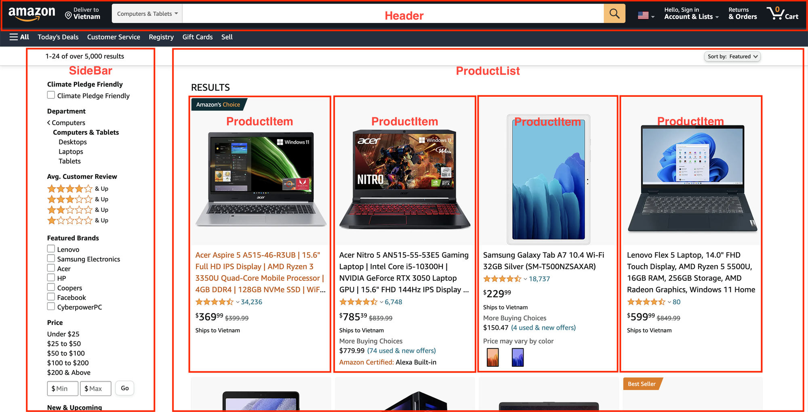
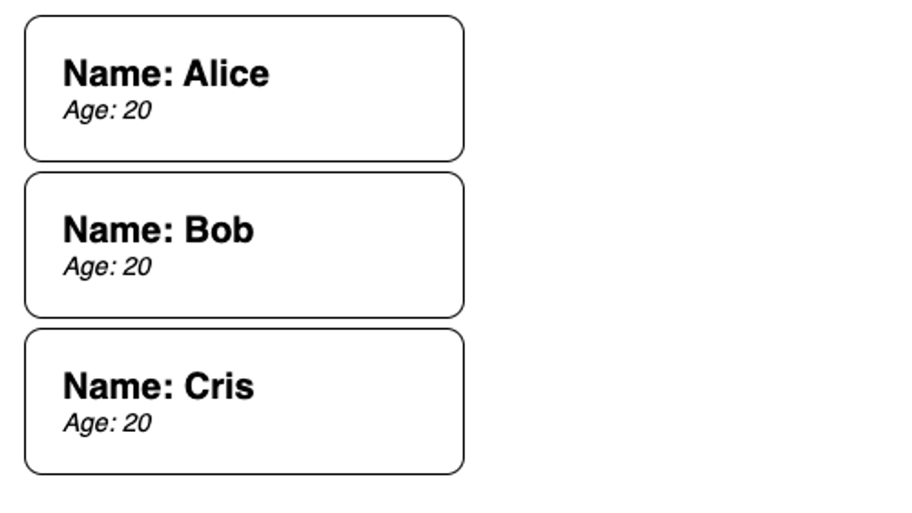
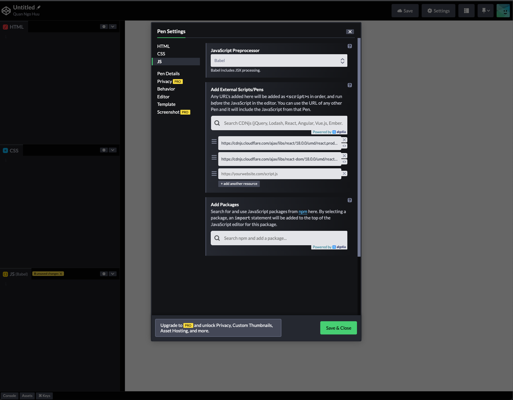

# Lesson 1: Introduction to React

>💡 Hiểu cơ bản React là gì, tại sao sử dụng React và cách tạo ra một ứng dụng React.

Trong khoá này, chúng ta sẽ tìm hiểu về React, thư viện phổ biến nhất hiện nay để xây dựng ứng dụng web. Hãy cùng tìm hiểu xem React là gì và tại sao lại sử dụng React.


# ReactJS là gì?

**ReactJS là thư viện dùng để xây dựng giao diện người dùng.** ReactJS được tạo ra bởi Facebook vào năm 2013. ReactJS và các thư viện khác xung quanh nó được sử dụng để xây dựng các ứng dụng web hiện đại, giàu tính năng và nhiều tương tác. React tiếp cận theo hướng **component**, chia nhỏ giao diện thành nhiều thành phần và kết hợp chúng lại với nhau để tạo thành một ứng dụng đầy đủ.

---

# Tại sao lại chọn ReactJS?

Các ứng dụng web càng ngày càng có nhiều tính năng phức tạp hơn. Người dùng cũng muốn có những trải nghiệm tốt hơn với khả năng phản hồi nhanh chóng. Javascript đã có thể giúp chúng ta làm được việc đó. Tuy nhiên, với những ứng dụng rất phức tạp và nhiều tính năng, việc chỉ sử dụng Javascript thuần tuý sẽ nhanh chóng khiến ứng dụng rất khó bảo trì và nâng cấp sau này. Các thư viện JS ra đời nhằm giúp lập trình viên có thể tạo ra các trang web nhanh chóng và dễ bảo trì sau này. React là một trong số các thư viện như vậy.

React có một vài đặc điểm đáng chú ý giúp nó trở nên phổ biến và được quan tâm nhiều ở thời điểm hiện nay:

- Code được viết theo hướng declarative: Thay vì quá tập trung vào các thao tác chỉnh sửa DOM (DOM manipulations), React giúp lập trình viên tập trung vào các thành phần logic và nó sẽ chịu trách nhiệm việc chỉnh sửa DOM tương ứng với các dữ liệu.
- React có hiệu năng tốt khi nó sử dụng DOM ảo (Virtual DOM). React sẽ tính toán các sự thay đổi trên DOM ảo để lấy được kết quả sau cùng. Sau đó mới tiến hành việc cập nhập lại giao diện người dùng sao cho những phần thay đổi là ít nhất.
- React được phát triển và duy trì bởi Facebook. Điều này khiến cho vòng đời của React có thể sẽ được kéo dài lâu.
- React có hệ sinh thái các plugin phong phú. Lập trình viên có thể dễ dàng tìm kiếm các thư viện mà không cần phải tự làm.
- React có hỗ trợ viết ứng dụng mobile với ReactNative. Như vậy trong team chỉ cần nắm được React là đã có thể hoàn thành các phần frontend.

---

# Những ai đang sử dụng ReactJS?

Có rất nhiều công ty nổi tiếng đang sử dụng React ở trong sản phẩm của mình. Có thể kể đến vài cái tên như Facebook, Netflix, Tesla... Những công ty trên đều là các công ty rất lớn với quy mô toàn cầu. Nghĩa là React đã được chứng minh trong thực tế là một thư viện giúp giải quyết được các vấn đề lớn.


>💡 Ngoài ra thì cũng có nhiều đối thủ của React trên thị trường. Một vài cái tên có thể là Angular, Vue, Svelte hoặc thậm chí là jQuery. Mỗi thư viện đều có những ý tưởng giống nhau và có những đặc điểm khác nhau. Nếu có thời gian, các bạn nên tìm hiểu thêm về các thư viện đó, và so sánh nó với React.

---

# Component là gì?


Component hiểu đơn giản là các thành phần riêng lẻ. Tuy nhiên chúng có thể kết hợp lại với nhau để tạo thành một hệ thống hoàn chỉnh.

Tư duy “chia để trị” này là một tư duy rất phổ biến trong các ngành kĩ thuật nói chung. Lấy ví dụ là một chiếc ô tô, ta thấy lốp xe và cửa kính chắn gió là hai bộ phận hoàn toàn riêng biệt. Tuy nhiên chúng phải tuân thủ những đặc điểm kĩ thuật nhất định (đường kính bánh, độ dày của kính, ...) Với việc chia nhỏ các thành phần ra và sản xuất chúng riêng rẽ, ta có được những lợi ích sau:

- **Dễ sửa chữa**: Kĩ sư có thể tháo chiếc lốp xe ra và sửa chữa nó mà không làm ảnh hưởng tới toàn bộ cấu trúc của chiếc xe.
- **Tái sử dụng**: Khi đã có một bản thiết kế cho thành phần đó hoàn chỉnh, các kĩ sư có thể dễ dàng dùng lại bản thiết kế đó để tạo ra một sản phẩm khác tương tự.
- **Dễ thay thế:** Người dùng có thể thực hiện nâng cấp một phần của chiếc xe. Họ có thể tìm một chiếc lốp xe với các đặc tính khác, miễn sao nó tuân thủ những đặc điểm kĩ thuật nhất định để có thể khớp với các thành phần khác của xe.
- **Chuyên môn hoá cao**: Các nhà sản xuất chỉ cần tập trung vào một mảng nhất định, có thể xây dựng những dây chuyền lớn để sản xuất hàng loạt một thành phần nào đó.

Trong việc xây dựng các ứng dụng web cũng vậy. Đây là hình ảnh của một trang web thương mại điện tử nổi tiếng:


Ứng dụng trên có nhiều tính năng. Tuy nhiên, chúng ta cũng có thể phân chia thành một vài thành phần như sau:

- Phần header có ô tìm kiếm và các menu điều hướng
- Phần sidebar với các bộ lọc
- Danh sách chi tiết các sản phẩm



Trong ứng dụng có nhiều san phẩm với các nội dung khác nhau. Tuy nhiên mỗi sản phẩm đều có cấu trúc giống nhau, bao gồm các thành phần: tên sản phẩm, đánh giá & reviews, giá, các phiên bản màu sắc, ... Như vậy, mỗi một sản phẩm là một đơn vị nhỏ. Khi chúng ta tái sử dụng các đơn vị đó nhiều lần, kết quả sẽ được một khối tổng thể là danh sách các sản phẩm như trên hình.

Hiểu được tư duy phân chia thành các component là cực kỳ quan trọng để có thể viết được các ứng dụng tốt, có tính tái sử dụng cao, dễ bảo trì sau này.

>🤔 Trong ví dụ trên, một component như ProductItem còn có thể được phân tách thành các component nhở hơn nữa. Các bạn có thể thử chia nhỏ các thành phần khác thành các component nhỏ hơn.

---

# Thử nghiệm đầu tiên với React Component

>💡 Truy cập vào ứng dụng https://codepen.io/pen/ để thực hiện live code

Ta có một ứng dụng cơ bản như sau:

```html
<div id="app">
  <div class="card">
    <div class="name">Name: Alice</div>
    <div class="age">Age: 20</div>
  </div>
  <div class="card">
    <div class="name">Name: Bob</div>
    <div class="age">Age: 20</div>
  </div>
  <div class="card">
    <div class="name">Name: Cris</div>
    <div class="age">Age: 20</div>
  </div>
</div>
```

```css
.card {
  width: 200px;
  border: 1px solid black;
  padding: 20px;
  border-radius: 10px;
  font-family: sans-serif;
  margin: 5px
}

.name {
  font-size: 20px;
  font-weight: bold;
}

.age {
  font-size: 14px;
  font-style: italic;
}
```

Khi chạy ứng dụng, chúng ta sẽ nhận được kế quả như hình dưới đây:



Đây là cách tiếp cận ứng dụng theo cách thông thường. Ba phần tử trong danh sách là ba phần khác nhau trong HTML. Với các ứng dụng đơn giản thì hoàn toàn bình thường. Tuy nhiên nó cũng bộc lộ một vài điểm yếu sau:

- Khi muốn thêm một phần tử mới vào danh sách, chúng ta cần copy lại HTML và sửa lại nội dung tên, tuổi tương ứng
- Khi thêm trường “Address”, chúng ta sẽ cần phải thêm vào cả 3 phần tử trong danh sách.
- Tương tự với việc sửa dữ liệu, chúng ta sẽ phải làm với cả 3 phần tử

Và vấn đề sẽ trở nên phức tạp hơn khi chúng ta có nhiều phần tử hơn!
Với ReactJS, ta có đoạn code như sau:

```jsx
function NameCard(props) {
  return (
    <div className="card">
      <div className="name">Name: {props.name}</div>
      <div className="age">Age: {props.age}</div>
    </div>
  )
}

ReactDOM.render(<div>
  <NameCard name="Alice" age="20" />
  <NameCard name="Bob" age="20" />
  <NameCard name="Cris" age="20" />
</div>, document.getElementById("app"))
```

Với ReactJS ta có thể thấy các đặc điểm sau:

- Function `NameCard` nhận vào một tham số đầu vào là “props”, và trả ra kết quả là một đoạn “HTML”? Là một cú pháp không tồn tại trong Javascript thông thường
- `class` được thay thế bằng `className`
- Một cú pháp đặc biệt `{}` để chèn nội dung từ JS vào trong HTML

>📌 Để có thể chạy được đoạn code trên, chúng ta cần thay đổi một vài cài đặt trong codepen:
- Click vào biểu tượng gear icon của phần JS
- Phần ***JavaScript Preprocessor*:** chọn ***Babel
-*** Phần **Add External Scripts/Pens,** chọn thêm 2 thư viện là `react` và `react-dom`



NameCard chính là một component trong React. Và sau khi có component đó, chúng ta có thể bắt đầu “tái sử dụng” nó bằng việc tạo ra 3 `NameCard` với các thuộc tính khác nhau. Cú pháp để  sử dụng là  `<NameCard ... />` , giống như việc sử dụng HTML. Đó cũng chính là cách React hoạt động: viết ra các component cũng chính là tạo ra các “thẻ HTML” tuỳ chỉnh và tái sử dụng chúng.

>🧑‍💻 Với kiến thức về component trong React, hãy thử tạo ra giao diện ứng dụng todo list đơn giản với. Chi tiết xem thêm tại Workbook

---

# Khởi tạo ứng dụng React ở trên máy tính

Để có thể cài đặt được ứng dụng ReactJS trên máy tính, máy tính sẽ cần phải được cài đặt các công cụ sau:

- NodeJS (https://nodejs.org/en/)
- npm  & npx (sẽ được cài đặt cùng với NodeJS)

>💡 Để kiểm tra NodeJS & npx đã được cài đặt ở trên máy tính hay chưa, chúng ta có thể sử dụng câu lệnh `node --version` và `npx --version` . Máy tính sẽ hiển thị phiên bản được cài đặt. Nếu nhìn thấy có lỗi xảy ra, không hiển thị phiên bản, hãy thử khởi động lại ứng dụng / máy tính.

Các bước để khởi tạo một ứng dụng React có tên là “hello-world”:

1. Tạo một thư mục trên máy tính
2. Mở cửa sổ dòng lệnh bên trong thư mục đó
3. Chạy câu lệnh `npx create-react-app hello-world` . Sau đó đợi để ứng dụng được khởi tạo
4. Sau khi đã khởi tạo thành công, di chuyển vào bên trong thư mục “hello-world” vừa được tạo bằng câu lệnh `cd hello-world` .
5. Khởi chạy ứng dụng bằng câu lệnh `npm start` .
6. Trình duyệt có thể sẽ tự động mở ra, và ứng dụng đã được khởi tạo thành công

Trong quá trình phát triển ứng dụng, cửa sổ dòng lệnh cần phải được giữ nguyên và không được tắt ứng dụng đang chạy trên cửa sổ đó. Để tắt ứng dụng đó trên cửa sổ dòng lệnh, có thể sử dụng tổ hợp phím `Ctrl + C` .

Để chạy lại ứng dụng, hãy mở cửa sổ dòng lệnh trong thư mục “hello-world” và sử dụng câu lệnh `npm start`

### Cấu trúc dự án của React

Trong dự án React, chúng ta cần quan tâm một vài file và thư mục sau:

- `package.json`
- `node_modules`
- `public`
- `src`

File `package.json` là file cấu hình cho dự án. File này đóng vai trò quan trọng, giúp chúng ta tuỳ chỉnh các cấu hình, cài và xoá các thư viện khác nhau. Các thành phần cần chú ý là `dependencies` và `scripts`

Thư mục `node_modules` là thư mục chứa các thư viện được tải xuống từ bên ngoài được cấu hình bên trong `package.json`. Thư mục này có thể được cài lại thông qua câu lệnh `npm install`

Thư mục `public` là thư mục chứa file HTML duy nhất của dự án React, nơi mà các component sẽ được render.

Thư mục `src` là thư mục chứa toàn bộ source code của ứng dụng. Đây sẽ là thư mục chúng ta viết các components bên trong.

>🧑‍💻 Hãy thử viết lại ứng dụng `NameCard` ở trên trong ứng dụng React vừa được khởi tạo.

# JSX là gì?

Cú pháp trông giống như HTML mà chúng ta sử dụng trong các component thực sự không phải HTML thông thường. Đó là một cú pháp mới có tên là JSX - Javascript XML.

JSX là cú pháp do đội ngũ React phát triển, sử dụng chủ yếu trong React. Tuy nhiên vẫn có thể sử dụng JSX cho một vài công cụ khác như VueJS.

Mục đích của JSX được tạo ra để có thể tạo ra các element một cách tường minh và đơn giản. JSX cho phép developer có thể tạo ra các đoạn HTML nhanh chóng, kèm với khả năng có thể chèn các giá trị JS vào bên trong để tạo ra trang web có nội dung động.

---

# Bạn có thể không cần dùng JSX với React

ReactJS có thể hoạt động mà không cần tới cú pháp JSX. React có sẵn một function giúp chúng ta có thể tạo ra phần view. Xét 2 ví dụ sau:

```jsx
function App() {
	return (
		<div className="app">
			<h1>Hello, World!</h1>
		</div>
	)	
}
```

```jsx
import React from 'react'

function App() {
	return React.createElement(
		"div",
		{className: "app"},
		React.createElement("h1", {}, "Hello, World!")
	)
}
```

Hai ví dụ này sẽ cho kết quả giống nhau. Tuy nhiên, dễ thấy cách viết thứ hai khó hơn khá nhiều. Và với những component có nhiều giao diện, cách viết thứ 2 sẽ trở nên rất khó bảo trì sau này. Vì vậy, mặc dù JSX là không hoàn toàn bắt buộc với React, tuy nhiên gần như toàn bộ tất cả các dự án React đều sử dụng JSX.

>💡 Thực tế thì JSX sau cùng sẽ được biến đổi thành `React.createElement` nhờ một công cụ là Babel. Đó là lý do tại sao ở ví dụ với CodePen ở bài trước, chúng ta cần chọn Babel làm JS Pre-processor.

---

# JSX không phải là HTML

JSX mặc dù có cú pháp trông rất giống HTML, tuy nhiên nó có một vài đặc điểm khác biệt so với HTML thông thường

1. Single parent root: Các component React cần phải return một thẻ bao ngoài duy nhất hoặc một array, không thể trả về nhiều hơn hai thẻ.
2. `className` thay vì `class`. Đây là một lý do kĩ thuật. `class` là một từ khoá trong JS. Vì vậy, đội ngũ React đã sử dụng `className` thay vì `class` để tránh các lỗi.
3. `style` nhận giá trị là một object, thay vì là cú pháp CSS thông thường
4. Các thuộc tính HTML sẽ được đổi tên theo kiểu `camelCase`
5. Đối với các đoạn JSX nằm trên nhiều dòng, JSX cần phải được bọc bên trong cặp ngoặc tròn `()`
6. Component do chúng ta viết buộc phải được sử dụng ở dưới dạng tên viết hoa.

Chúng ta sẽ đi sâu vào các thành phần trên ở các phần dưới.

---

# Render giá trị JS với JSX

JSX cho phép chúng ta có thể output các giá trị Javascript trực tiếp vào bên trong. Cú pháp để làm điều này là sử dụng dấu ngoặc nhọn `{}`. Xét ví dụ sau:

```jsx
const App = () => {
	const randomAge = Math.floor(Math.random() * 10)
	const imgSrc = "https://upload.wikimedia.org/wikipedia/commons/thumb/b/b6/Image_created_with_a_mobile_phone.png/640px-Image_created_with_a_mobile_phone.png"	
	return (
		<div>
			Hello, my name is MindX. I'm {randomAge} years old.
			
		</div>
  )
}
```

Bằng cách này, chúng ta có thể dễ dàng tạo ra các trang web có nội dung động, có thể hiển thị ra màn hình các giá trị JS cần thiết.

Một điểm lưu ý là các giá trị JS có thể được chèn vào các thuộc tính của các thẻ HTML. Như ở ví dụ trên, ta thấy thẻ `img` với thuộc tính `src` đã nhận vào giá trị là `imgSrc` có kiểu dữ liệu là `string`.

>📌 Không phải tất cả các kiểu dữ liệu đều có thể được **render** trong JSX. Kiểu dữ liệu object dạng key-value không thể được render vì nó không phải là một “React child” hợp lệ. Có thể biến object thành một string và sau đó render bằng function `toString`

>🧑‍💻 Các bạn có thể thử với array, function và các kiểu dữ liệu nguyên thuỷ khác và theo dõi output.

Có thể thực thi một số câu lệnh bên trong JSX, miễn sao chúng có kết quả là một **giá trị JS.** Xem ví dụ dưới đây:

```jsx
const weekday = [
	"Sunday",
  "Monday",
	"Tuesday",
	"Wednesday",
	"Thursday",
	"Friday",
	"Saturday"
];

const App = () => {
	return <div>Today is {weekday[new Date().getDay()]}</div>
}
```

Ở trong ví dụ trên, `weekday[new Date().getDay()]` sẽ trả ra kết quả là một `string` nên có thể được hiển thị trên màn hình. Tuy nhiên, chúng ta không thể sử dụng những câu lệnh `if`, `for`, `while` bên trong JSX, vì chúng không phải là các giá trị trong JS.

---

# JSX với styling:

Có nhiều cách để có thể style với JSX trong React, tương tự với HTML. Cơ bản sẽ có hai kiểu như sau:

1. Style với file CSS bên ngoài, sử dụng HTML `class` và `id`
2. Inline style

Với cách thứ nhất, cách viết CSS không có gì khác biệt. Điểm khác biệt ở đây là chúng ta cần dùng `className` thay cho `class` thông thường. Điểm khác biệt ở đây là chúng ta có thể import file css vào bên trong component với cú pháp `import "<file>.css"`. Xét ví dụ sau:

```css
.App {
	text-align: center;
  font-weight: bold;
}
```

```jsx
import "./App.css"

const App = () => {
	return (
    <div className="App">
			Hello, world!
    </div>
	)
}
```

Đối với inline-style, đây là một điểm khác biệt tương đối lớn so với HTML thông thường:

- `style` trong JSX nhận giá trị là một **object (key-value)**
- Các key CSS phải được viết dưới dạng `camelCase`
- Các value CSS cần phải được viết dưới dạng `string` hoặc `number`

>💡 `camelCase` là một quy ước đặt tên phổ biến. Đặc điểm của `camelCase` là từ đầu tiên sẽ bắt đầu với chữ thường, các từ tiếp theo sẽ được viết hoa chữ cái đầu tiên. Một vài ví dụ với `camelCase` là `totalValue`, `aboutUs`, `tenBien`... Với JS, quy ước đặt tên tiêu chuẩn là `camelCase`

Xét ví dụ inline-style sau:

```jsx
const App = () => {
	return (
		<div style={{backgroundColor: 'yellow', fontSize: 18}}>Hello, World!</div>
	)
}
```

Một điều lưu ý ở đây là với các giá trị CSS nhận vào là số, đơn vị được sử dụng sẽ là `px`. Nếu muốn đơn vị khác, chúng ta cần chuyển giá trị thành string và thêm đơn vị đo vào sau giá trị đó.

>📌 Cần lưu ý phân biệt hai dấu ngoặc nhọn ở trong ví dụ trên: dấu ngoặc nhọn thứ nhất là ký hiệu đánh dấu việc chúng ta chèn biến Javascript vào trong, dấu ngoặc nhọn thứ hai là ký hiệu bắt đầu của một object javascript.

---

# Props là gì?

Props là tham số đầu vào của các component trong React. Props là một trong những khái niệm cực kỳ quan trọng của React.

Props có giá trị là một object. Nó chính là tham số thứ hai trong function `React.createElement` (tham số thứ hai trong `React.createElement` chính là một object).

Liên tưởng đơn giản, props trong React chính là các thuộc tính trong HTML. Điểm khác biệt ở đây là chúng ta có thể tự định nghĩa những thuộc tính đó, thay vì với HTML, các thuộc tính được định nghĩa sẵn.

```jsx
const App = () => {
	const x = 1;
	const y = 2;
	return (
		<div>
			<Sum a={x} b={y} />
		</div>
	)
}

const Sum = (props) => {
	console.log(props) // {a: 1, b: 2}

	return <div>The value is: {props.a + props.b}</div>
}
```

Props có thể nhận giá trị thuộc tất cả các kiểu dữ liệu trong JS. Props chính là phương tiện để lưu chuyển dữ liệu bên trong React.

Props hoàn toàn do chúng ta tự định nghĩa. Các components do chúng ta định nghĩa không hiểu được các giá trị thuộc tính HTML như `src`, `id`, `className`. Chúng đơn thuần là các key trong một object props. Chúng ta sẽ cần gán lại cho các thẻ HTML tương ứng bên trong component.

```jsx
const App = () => {
	return (
		<div>
			<NameCard className="name-card" id="alice" />
		</div>
	)
}

const NameCard = (props) => {
	return (
		<div className={props.className}>
			<div id={props.id}>Name: Alice</div>
		</div>
	)
}
```

Props là read-only, nghĩa là chúng ta **không thể thay đổi** được giá trị props bên trong một component.

>📌 **Tầm quan trọng của props trong React**: props cho phép tạo ra các Component có khả năng tái sử dụng cao. Thay vì dữ liệu được hard-coded bên trong component, props cho phép component có thể nhận được dữ liệu đầu vào mỗi lần sử dụng nó. Đây chính là công cụ để kết nối các component lại với nhau. Vì vậy, props cho phép ứng dụng được chia nhỏ thành nhiều phần.

>🤔 Điều gì xảy ra nếu như Props nhận được một giá trị là một `function` thay vì các kiểu dữ liệu khác?

---

# Children Props

Các thẻ HTML có thể chứa bên trong nó các thẻ HTML khác, ví dụ như `div`, `p`, ... Tương tự như vậy, các thẻ “HTML” do chúng ta tự tạo cũng có thể làm được điều tương tự thông qua một giá trị props đặc biệt có tên là `children`. Xét ví dụ sau:

```jsx
import "./Card.css";

const Card = (props) => {
	return <div className="card">{props.children}</div>
}
```

```css
.card {
	padding: 10px;
	border: 1px solid black;
	border-radius: 8px;
	box-shadow: 0 4px 8px 0 rgba(0, 0, 0, 0.2), 0 6px 20px 0 rgba(0, 0, 0, 0.19);
}
```

```jsx
import Card from "./Card.js";

const App = () => {
	return (
		<Card>
			<div>Inside a card</div>
		</Card>
	)
}
```

Cũng tương tự như các props thông thường khác, `children` có thể nhận giá trị là bất cứ kiểu dữ liệu nào. Với ví dụ ở trên, children nhận vào giá trị là một React Element.

`children` props giúp chúng ta có khả năng “compose” các component lại với nhau. Thay vì cố định giá trị bên trong `Card`, lúc này `Card` có thể cho bất cứ component nào nằm trong nó có thêm các thuộc tính CSS ở trên.

>🤔 Điều gì xảy ra nếu như `children` props lại là một function, và function đó trả lại kết quả là JSX?

---

# Smart & dump components

Xét 2 ví dụ sau:

```jsx
const Sum = () => {
	const x = 1
	const y = 2
	return <div>{x + y}</div>
}

<Sum />
<Sum />
<Sum />
```

```jsx
const Sum = (props) => {
	const {x, y} = props

	return <div>{x + y}</div>
}
 
<Sum x={1} y={2} />
<Sum x={2} y={3} />
<Sum x={7} y={5} />
```

Trong ví dụ trên thì bên trái, component `Sum` có xử lý logic bên trong, còn bên phải thì không.

Phần bên trái là một Smart Component, và phần bên phải là một Dump Component. Trong thực tế thì chúng ta viết càng nhiều dump component nghĩa là chúng ta càng smart 🙂

Ở ví dụ bên trái, smart component không thể tái sử dụng, vì mỗi lần chúng ta dùng nó, nó luôn cho kết quả là 3.

Ngược lại, với ví dụ bên phải, dump component có thể được sử dụng để in ra tổng 2 số bất kỳ khi chúng ta truyền giá trị vào bên trong.

Tuy nhiên, không phải lúc nào dump component cũng tốt. Vì nếu cho phép truyền quá nhiều props sẽ dẫn đến code khó đọc và khó bảo trì hơn do nhiều thành phần tham gia vào logic của component hơn. Việc quyết định “dump” / “smart” bao nhiêu là đủ còn tuỳ thuộc khá nhiều vào kinh nghiệm của lập trình viên và từng tình huống xử lý khác nhau.