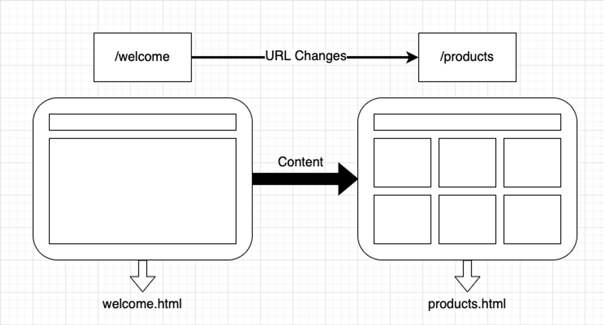
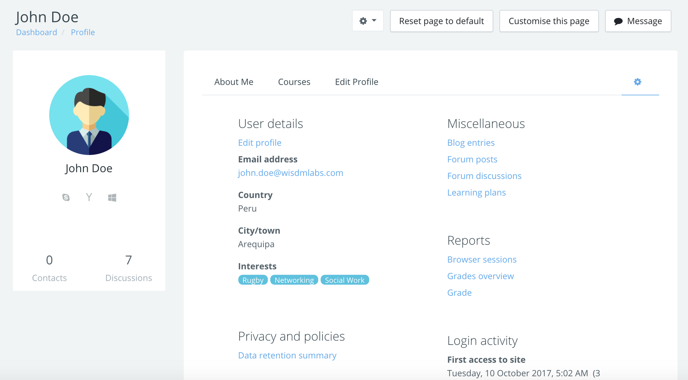
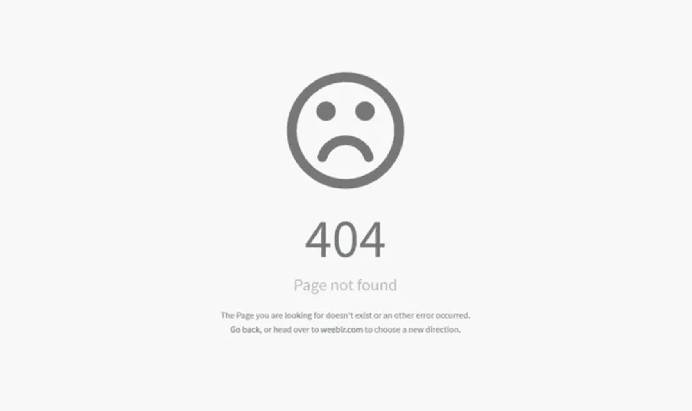

# Lesson 4: Routing

>💡 Điều hướng người dùng là một phần không thể thiếu trong các ứng dụng web. Học cách tạo ra các phần khác nhau của trang web với `react-router`

# Tại sao cần tới `react-router`

Một ứng dụng web thường sẽ là tổng hợp của nhiều trang web khác nhau. Mỗi một trang web sẽ có đưởng dẫn riêng. Các ứng dụng thông thường có một cơ chế đơn giản để thực hiện điều này:



Khi đường dẫn thay đổi từ `/welcome` qua `/products`, trình duyệt sẽ thực hiện việc request một trang HTML khác là `products.html`. Sau khi nhận được trang HTML cần thiết, trình duyệt đơn giản là sẽ render nội dung bên trong file `products.html` đó thay thế cho `welcome.html`

Cách làm như vậy vẫn hoạt động tốt. Tuy nhiên, việc load nhiều trang HTML khác nhau cho lại trải nghiệm không tốt. Người dùng sẽ cần phải tải lại nhiều lần. Có nhiều thành phần trong ứng dụng không thay đổi giữa các trang web. Với các ứng dụng SPA, việc điều hướng ứng dụng web thường diễn ra ở trình duyệt. Người dùng sẽ có trải nghiệm liền lạc và phản hồi tốt hơn. Thực tế với ứng dụng React, các component được render trong một file HTML duy nhất. Giao diện được cập nhật thông qua React và các component.

Để xử lý được vấn đề điều hướng người dùng ở phía trình duyệt với React, chúng ta sẽ sử dụng thư viện là `react-router`

Để cài đặt `react-router` phiên bản 6 cho ứng dụng web, ta sử dụng câu lệnh sau:

```bash
npm install react-router-dom@6
```

---

# Định nghĩa các Route:

Với React, chúng ta có thể tưởng tượng việc điều hướng người dùng sẽ đơn giản như sau

```bash
example.com/ => ComponentA
example.com/products => ComponentB
example.com/cart => ComponentC
example.com/about => ComponentD
```

Như vậy, ta render mỗi component tương ứng với đường dẫn của trình duyệt hiện tại. `react-router` có một component đặc biệt sử dụng để định nghĩa các đường dẫn trong ứng dụng.

Trước khi có thể làm việc với `react-router` bên trong các component, ta cần phải sử dụng một component đặc biệt là `BrowserRouter`. Component này cho phép các descendant components  có thể sử dụng các tính năng của `react-router`. Thường thì chúng ta sẽ sử dụng nó làm component trên cùng của ứng dụng. Ta có thể update file `index.js` như sau:

```jsx
import ReactDOM from 'react-dom'
import BrowserRouter from 'react-router-dom'
import App from './App'

ReactDOM.render(
	<BrowserRouter>
		<App />
	</BrowserRouter>,
document.getElementById("root")
)
```

Sau khi đã đặt `BrowserRouter` lên trên đầu của cây, ta có thể sử dụng component `Routes` và `Route` để định nghĩa các component với các đường dẫn tương ứng như sau:

```jsx
import {Routes, Route} from 'react-router-dom'

const App = () => {
	return (
		<div>
			<Routes>
				<Route path="/" element={<Home />} />
				<Route path="/welcome" element={<Welcome />} />
				<Route path="/products" element={<ProductList />} />
			</Routes>
			<footer>Made by MindX</footer>
		</div>
	)
}

const Home = () => {
	return <h1>Home</h1>
}

const Welcome = () => {
	return <h1>Welcome</h1>
}

const ProductList = () => {
	return (
		<ul>
			<li>Product 1</li>
			<li>Product 2</li>
			<li>Product 3</li>
		</ul>
	)
}
```

Dựa vào URL hiện tại, các component tương ứng sẽ được render. `Route` đảm bảo rằng component đó chỉ được render khi URL trùng khớp với giá trị `path` của nó.

Các thành phần nằm bên ngoài `Routes` sẽ không chịu ảnh hướng bởi điều kiện trên. Trong ví dụ, `footer` sẽ luôn luôn xuất hiện trên màn hình ở tất cả các đường dẫn của ứng dụng. Điều này giúp chúng ta có thể dễ dàng tạo ra các thành phần được chia sẻ giữa các trang một cách đơn giản.

---

# `Link` và `NavLink`

Với việc sử dụng `react-router` trong ứng dụng, thẻ `a` mặc định sẽ gửi một request để yêu cầu một trang HTML mới và trình duyệt sẽ thay thế ứng dụng hiện tại với trang HTML nhận được. Việc này đem lại trải nghiệm không tốt với ứng dụng SPA. `react-router` cung cấp một component đặc biệt để thay thế thẻ `a` là component `Link`

```jsx
import {Routes, Route} from 'react-router-dom'

const Header = () => {
	return (
		<ul>
			<li>
				<Link to="/">Home</Link>
			</li>
			<li>
				<Link to="/welcome">Welcome</Link>
			</li>
			<li>
				<Link to="/products">Products</Link>
			</li>
		</ul>
	)
}

const App = () => {
	return (
		<div>
			<Header />
			<Routes>
			...
			</Routes>
			<footer></footer>
		</div>
	)
}
```

Component `Link` chính là thẻ `a` trong `react-router`. Điểm khác biệt ở đây là với `Link`, `react-router` sẽ giúp chúng ta ngăn chặn việc điều hướng mặc định của thẻ `a`. Việc điều hướng sẽ được xử lý bên trong ứng dụng web hiện tại.

Trong nhiều trường hợp khi làm việc với các component điều hướng (Navigation bar, side bar, ...), ta sẽ muốn chỉnh sửa các thuộc tính CSS của phần tử tương ứng với đường dẫn hiện tại. `react-router` cung cấp thêm một component đặc biệt là `NavLink`. Về cơ bản, `NavLink` hoạt động giống như component `Link`. Tuy nhiên, `NavLink` cho phép người dùng chỉnh sửa style hoặc class khi URL hiện tại trùng khớp với giá trị `to` của nó.

```jsx
import {NavLink} from 'react-router-dom'

const activeClass = (params) => {
	return params.isActive ? "active-item" : ""
}

const Header = () => {
	return (
		<ul>
			<li>
				<NavLink to="/" className={activeClass}>Home</Link>
			</li>
			<li>
				<NavLink to="/welcome" className={activeClass}>Welcome</Link>
			</li>
			<li>
				<NavLink to="/products" className={activeClass}>Products</Link>
			</li>
		</ul>
	)
}
```

---

# Route lồng nhau với `Outlet`

Trong nhiều ứng dụng, một trang web có thể có nhiều thành phần con nằm bên trong.



Ở ví dụ trên, ta thấy bên trong trang Profile có thể có thể các trang nhỏ hơn là “About”, “Courses”, “EditProfiles” và “Settings”. Có thể thấy đường dẫn của chúng sẽ như sau:

```bash
example.com/profile => Aboutme
example.com/profile/courses => Courses
example.com/profile/edit => EditProfile
example.com/profile/settings => Settings
```

Như vậy, bên trong trang profile, chúng ta có tới 4 trang nhỏ hơn, gọi là các “nested routes” (Route lồng nhau).

`react-router` cung cấp khả năng xử lý tình huống trên khá đơn giản:

```jsx
import React from 'react'
import {Routes, Route, Outlet} from 'react-router-dom'

const Profile = () => {
	return (
		<div>
			<h1>This is profile page</h1>
			<Outlet />
		</div>
	)
}

const App = () => {
	return (
		<Routes>
			<Route path="/profile" element={<Profile/>}>
				<Route path="/" element={<AboutMe />} />
				<Route path="/courses" element={<Courses />} />
				<Route path="/edit" element={<EditProfile />} />
				<Route path="/settings" element={<Settings />} />
			<Route/> 
		</Routes>
	)
}
```

Với `Route` profile, ta có các `Route` nằm lồng bên trong. Đặc điểm của chúng như sau:

- “nested url”: Các routes lồng ở trong đó sẽ có đường dẫn với tiền tố `/profile` ở trước: `/courses => /profile/courses`
- “nested UI”: Khi người dùng vào bên trong các đường dẫn con, component `Profile` sẽ luôn luôn được render. Sau đó, tuỳ vào URL hiện tại, các components con khác sẽ được render tương ứng.

Để có thể render được các component con vào bên trong `Profile`, chúng ta cần sử dụng component đặc biệt là `Outlet`. `Outlet` cho phép người dùng định nghĩa vị trí mà các component con có thể được render khi URL trùng khớp. Trong ví dụ. `Outlet` sẽ có thể là một trong bốn components, tương ứng với bốn `Route` con.

---

# Xử lý “No match” 404

Người dùng có thể truy cập ứng dụng với các đường dẫn được định sẵn như trên. Tuy nhiên, nếu người dùng truy cập tới các đường dẫn không tồn tại trong ứng dụng, cách thức tiêu chuẩn để xử lý những trường hợp trên là tạo ra một trang web đặc biệt thường được gọi là “Not found”



Với `react-router`, chúng ta sẽ tạo ra một `Route` đặc biệt với giá trị `path` là `*`

```jsx
import {Routes, Route} from 'react-router-dom'
const App = () => {
	return (
		<Routes>
			<Route path="*" element={<h1>Page not found</h1>} />
		</Routes>
	)
}
```

Đường dẫn `*` có ý nghĩa là sẽ trùng khớp với bất cứ đường dẫn nào trên trình duyệt. Vì vậy, nó thường được sử dụng như một “fallback” URL: khi tất cả các đường dẫn khác không trùng khớp, `react-router` sẽ render `Route` có `path="*"`

---

# URL params & search params

```jsx
import {Routes, Route} from 'react-router-dom'

const App = () => {
	return (
		<div>
			<Routes>
				<Route path="/products" element={<Products />} />
			</Routes>
		</div>
	)
}

const ProductList = () => {
	return (
		<ul>
			<li>Product 1</li>
			<li>Product 2</li>
			<li>Product 3</li>
		</ul>
	)
}
```

Ta thấy tương ứng với đường dẫn `/products` là component `ProductList`. Đây là trang “danh sách sản phẩm”, nơi mà chúng ta hiển thị tất cả sản phẩm có trong hệ thống. Thường thì chúng ta cũng sẽ có một trang khác là “chi tiết sản phẩm”, nơi mà chúng ta sẽ hiển thị thông tin chi tiết của sản phẩm đó. Đường dẫn đó thường có dạng là `/products/1` với số 1 là “ID” của sản phẩm đó.

Các đường dẫn `/products/2` hoặc `/products/3` đều là đường dẫn tới trang chi tiết sản phẩm. Do đó, ứng dụng đều sẽ cần render trang chi tiết sản phẩm giống nhau. Tuy nhiên, để biết được ID của sản phẩm, chúng ta cần phải đọc được nó từ trong URL.

Trước hết. Để có thể tạo ra một `Route` với ID tuỳ ý, chúng ta có:

```jsx
import {Routes, Route, Outlet, useParams} from 'react-router-dom'

const App = () => {
	return (
		<div>
			<Routes>
				<Route path="/products" element={<Products />}>
					<Route path=":productId" element={<ProductDetail />} />
				</Route>
			</Routes>
		</div>
	)
}

const ProductList = () => {
	return (
		<div>
			<ul>
				<li>Product 1</li>
				<li>Product 2</li>
				<li>Product 3</li>
			</ul>
			<Outlet />
		</div>
	)
}

const ProductDetail = () => {
	const params = useParams();
	return (
		<div>Product {params.productId}</div>
	)
}
```

Với việc sử dụng ký hiệu `:` trong đường dẫn, chúng ta đã nói cho `react-router` biết ở vị trí đó là một **tham số trên đường dẫn (URL params).** `react-router` sẽ hiểu rằng các đường dẫn `/products/1`, `/products/2`, ... sẽ tương ứng với `<Route path=":productId" ... />`. Đây là cú pháp để định nghĩa các thành phần động trên URL.

`react-router` cung cấp một hook đặc biệt giúp chúng ta đọc được dữ liệu từ URL là `useParams`. Function này trả ra kết quả là một object, bao gồm các tham số trên đường dẫn đã được cấu hình. Trong ví dụ này, params bao gồm một key là `productId`, vì khi cấu hình, chúng ta đã sử dụng `:productId`

`:<name>` ⇒ `params.<name>`

Bên cạnh việc sử dụng các URL params, chúng ta cũng thường sử dụng một loại tham số khác:

```jsx
example.com/products?sortBy=name&sort=asc
```

Các giá trị đằng sau dấu `?` đó được gọi là search query. Chúng ta thưởng sử dụng search query để truyền các tham số liên quan tới filter hoặc sorting. Ở đây chúng ta có `sortBy` và `sort` với giá trị tương ứng là `name` và `asc`

`react-router` có một function hook khác để xử lý search params này là `useSearchParams`. Hook này hoạt động khá giống với `useState` của React: trả ra một array gồm 2 phần tử, với phần tử đầu tiền là object chưa các query, phần tử thứ 2 là object sử dụng để thay đổi các query đó.

```jsx
import {useSearchParams} from 'react-router-dom'

const ProductList = () => {
	const [searchParams, setSearchParams] = useSearchParams()

	const handleSortChange = (event) => {
		setSearchParams({sort: event.target.value})
	}

	return (
		<select value={searchParams.get("sort")} onChange={handleSortChange}>
			<option value="asc">Ascending</option>
			<option value="desc">Descending</option>
		</select>
	)
}
```

---

# Navigate người dùng “tự động”

Trong một số trường hợp, ứng dụng có thể muốn điều hướng người dùng mà không thông qua việc sử dụng các component `Link` . Ví dụ như: điều hướng người dùng về trang chủ khi thực hiện đăng nhập thành công, điều hướng người dùng về trang đăng nhập khi người dùng đăng xuất.

Để thực hiện được việc này, `react-router` cung cấp một hook khác giúp chúng ta dễ dàng điều hướng người dùng tự động là `useNavigate`:

```jsx
import {useNavigate} from 'react-router-dom'

const Login = () => {
	
	const navigate = useNavigate();

	return (
		<div>
			<button 
				onClick={() => {
					navigate("/welcome")
				}}
			>
				Login
			</button>
		</div>
	)
}
```

---

>📖 Ngoài các thành phần trên, trong `react-router` còn rất nhiều những tính năng thú vị khác. Xem thêm ở đây: https://reactrouter.com/docs/en/v6/api
