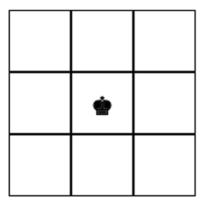

# Lesson 5: External Resources

```
💡 Một vài thư viện nên sử dụng trong hệ sinh thái của React
```

Đây là một vài thư viện mang tính chất tham khảo để chúng ta có thể áp dụng trong các project React của mình.

# Xử lý Form với Formik

Xử lý dữ liệu với form là một trong những phần cơ bản của bất cứ ứng dụng web nào. Đối với React, việc xử lý form nếu không làm tốt có thể sẽ dẫn đến nhiều code bị trùng lặp, gây khó đọc. Các logic liên quan tới kiểm tra dữ liệu (validation) và các trạng thái của input cũng dẫn đến nhiều vấn đề phức tạp. Formik là một trong các thư viện giúp chúng ta xử lý form khá dễ dàng và đơn giản trong React. Formik có thể kết hợp vơi yup là một thư viện liên quan tới validation để tạo ra trải nghiệm người dùng tốt.

Để cài đặt hai thư viện trên, chúng ta dùng câu lệnh sau:

```bash
npm install formik yup
```

Ta có ứng dụng đơn giản sau:

```jsx
import { useFormik } from "formik";

export default function App() {
  const formik = useFormik({
    initialValues: {
      username: "",
      password: "",
      rememberMe: false
    },
    onSubmit: (values) => {
      console.log(values);
    }
  });

  return (
    <div>
      <form onSubmit={formik.handleSubmit}>
        <div>
          <label>Username</label>
          <input
            type="text"
            value={formik.values.username}
            onChange={formik.handleChange}
            name="username"
          />
        </div>
        <div>
          <label>Password</label>
          <input
            type="password"
            value={formik.values.password}
            onChange={formik.handleChange}
            name="password"
          />
        </div>
        <div>
          <label>Remember me</label>
          <input
            type="checkbox"
            value={formik.values.rememberMe}
            onChange={formik.handleChange}
            name="rememberMe"
          />
        </div>
        <button>Submit</button>
      </form>
    </div>
  );
}
```

Trong ứng dụng trên, ta có một form gồm 3 trường dữ liệu là Username, Password và Remember Me. Formik cung cấp một hook là `useFormik`, nhận vào tham số là một object, cho phép chúng ta cấu hình nhiều thành phần của form. Hiện tại chúng ta cài đặt `initialValues` là giá trị mặc định của các trường dữ liệu và `onSubmit` là function được gọi khi sự kiện submit của form được đẩy ra. `useFormik` trả ra kết quả là một object gồm rất nhiều thông số liên quan đến form.

Đối với các trường dữ liệu bển dưới, chúng ta cần gán các thuộc tính `value` và `onChange` tương ứng bên trong kết quả trả ra của `useFormik`. Để có thể xử lý được sự kiện submit của form, ta gán thuộc tính `onSubmit` của form bằng với trường `handleSubmit` của formik.

### Form validation với yup và formik

Formik có thể dùng kết hợp với yup để thực hiện việc data validation khá đơn giản. Đầu tiên ta cần khai báo một “*validation schema”* với yup. Sau đó truyền vào bên trong `useFormik` với trường dữ liệu là `validationSchema`

```jsx
import * as yup from 'yup';

const validationSchema = yup.object().shape({
  username: yup
    .string()
    .min(2, "Too Short!")
    .max(10, "Too Long!")
    .required("Required"),
  password: yup
    .string()
    .min(2, "Too Short!")
    .max(10, "Too Long!")
    .required("Required")
});

...

const formik = useFormik({
  initialValues: {
    username: "",
    password: "",
    rememberMe: false
  },
  onSubmit: (values) => {
    console.log(values);
  },
  validationSchema: validationSchema
});

console.log(formik.errors);
```

Khi này ta sử dụng `formik.errors` để có thể truy cập vào object chứa lỗi của các trường dữ liệu nếu có.

```
📖 Xem nhiều tính năng khác của formik ở đây: https://formik.org/docs/overview
Xem thêm về việc setup yup validation ở đây: https://github.com/jquense/yup

```

---

# Sử dụng React Bootstrap

Bootstrap là một trong những thư viện CSS phổ biến nhất ở thời điểm hiện tại. Để việc sử dụng Bootstrap trong ứng dụng React được thuận tiện, ta có thể sử dụng một thư viện là `react-bootstrap`. Thư viện này đóng gói các component của bootstrap thành các component trong React và cho phép chúng ta tương tác với nó như một component thông thường.

Các bước để thực hiện việc cài đặt `react-bootstrap`

- Cài đặt package: `npm install react-bootstrap bootstrap`
- Import file css của bootstrap vào bên trong ứng dụng:
`import 'bootstrap/dist/css/bootstrap.min.css';`

Đọc thêm về cách cài đặt và cấu hình khác ở đây: https://react-bootstrap.github.io/getting-started/introduction

Một ví dụ xây dựng form với `react-bootstrap`:

```jsx
import { Form, Button } from "react-bootstrap";

export default function App() {
  return (
    <div style={{ padding: 10 }}>
      <Form>
        <Form.Group className="mb-3" controlId="formBasicEmail">
          <Form.Label>Email address</Form.Label>
          <Form.Control type="email" placeholder="Enter email" />
          <Form.Text className="text-muted">
            We'll never share your email with anyone else.
          </Form.Text>
        </Form.Group>

        <Form.Group className="mb-3" controlId="formBasicPassword">
          <Form.Label>Password</Form.Label>
          <Form.Control type="password" placeholder="Password" />
        </Form.Group>
        <Form.Group className="mb-3" controlId="formBasicCheckbox">
          <Form.Check type="checkbox" label="Check me out" />
        </Form.Group>
        <Button variant="primary" type="submit">
          Submit
        </Button>
      </Form>
    </div>
  );
}
```


Giao diện được tạo ra với `react-bootstrap`

Sử dụng `react-bootstrap` giúp lập trình viên giảm thời gian viết code CSS thông qua việc sử dụng các component đã được thiết kế sẵn, đảm bảo tính thẩm mỹ và responsive.

Ngoài ra, vì đã cài đặt cả Bootstrap và liên kết file CSS vào ứng dụng, các CSS classes của bootstrap cũng có thể được sử dụng bên trong mà không cần phải khai báo gì thêm.

```
📖 Tham khảo các component của `react-bootstrap`: https://react-bootstrap.github.io/components/alerts
Tham khảo các tính năng của bootstrap: https://getbootstrap.com/docs/5.1/getting-started/introduction/

```

Ngoài `react-bootstrap`, chúng ta cũng có nhiều thư viện tương tự có thể được sử dụng:

- MUI: https://mui.com/
- Ant Design: https://ant.design/
- BlueprintJS: https://blueprintjs.com/
- Grommet: https://v2.grommet.io/

---

# Kéo thả với `react-dnd`

Trong nhiều trường hợp chúng ta muốn người dùng có thể kéo thả các thành phần trên ứng dụng. Điển hình như với Trello, người dùng có thể kéo thả để sắp xếp các task, hoặc kéo sang những cột khác. `react-dnd` là thư viện giúp chúng ta có thể đơn giản hoá công việc trên.

Câu lệnh để cài đặt: `npm install react-dnd react-dnd-html5-backend`

Ví dụ với việc di chuyển quân cờ bằng cách kéo thả:



Đầu tiên ta tạo ra các component và game state như bên dưới: 

```jsx
import { useState } from "react";
import "./styles.css";

export default function App() {
  const [board, setBoard] = useState([
    ["", "", ""],
    ["", 1, ""],
    ["", "", ""]
  ]);
  return (
    {board.map((row, rowIdx) => {
        return (
          <div className="row" key={rowIdx}>
            {row.map((col, colIdx) => {
              return (
                <Square
                  key={colIdx}
                  hasKing={col === 1}
                  x={rowIdx}
                  y={colIdx}
                />
              );
            })}
          </div>
        );
    })}
  );
}

const Square = (props) => {
  return (
    <div className="square">
      {props.hasKing ? <King /> : ""}
    </div>
  );
};

const King = () => {
  return (
    <span style={{ fontSize: 30, cursor: "pointer" }}>
      ♚
    </span>
  );
};
```

```css
.row {
  display: flex;
}

.square {
  width: 50px;
  height: 50px;
  display: flex;
  justify-content: center;
  align-items: center;
  border: 1px solid black;
}
```

Để có thể bắt đầu thực hiện kéo thả, react-dnd cần chúng ta cài đặt một **Provider** bên ngoài. `DndProvider` yêu cầu một backend để xử lý việc kéo thả đó. Do chúng ta đang làm việc với web nên phần backend đó là `HTML5Backend`

```jsx
import { DndProvider } from "react-dnd";
import { HTML5Backend } from "react-dnd-html5-backend";

export default function App() {
  const [board, setBoard] = useState([
    ["", "", ""],
    ["", 1, ""],
    ["", "", ""]
  ]);

  return (
    <DndProvider backend={HTML5Backend}>
      {board.map((row, rowIdx) => {
        return (
          <div className="row" key={rowIdx}>
            {row.map((col, colIdx) => {
              return (
                <Square
                  key={colIdx}
                  hasKing={col === 1}
                  x={rowIdx}
                  y={colIdx}
                />
              );
            })}
          </div>
        );
      })}
    </DndProvider>
  );
}
```

Tiếp theo, để xử lý việc kéo với quân cờ bên trong mỗi ô, chúng ta setup với hook `useDrag` như sau:

```jsx
import { useDrag } from "react-dnd";

const King = () => {
  const [dragState, drag] = useDrag(() => ({
    type: "KING",
    collect: (monitor) => ({
      isDragging: !!monitor.isDragging()
    })
  }));

  return (
    <span style={{ fontSize: 30, cursor: "pointer" }} ref={drag}>
      ♚
    </span>
  );
};
```

`useDrag` trả về kết quả là một mảng 2 phần tử:

- Phần tử đầu tiên là các dữ liệu liên quan tới dragging được lấy thông qua ***collector***
- Phần tử thứ 2 là một object ref, sử dụng để truyền cho element chúng ta muốn kéo thả