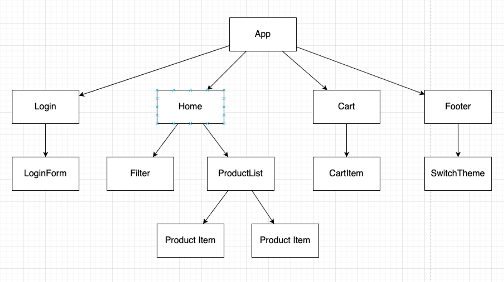
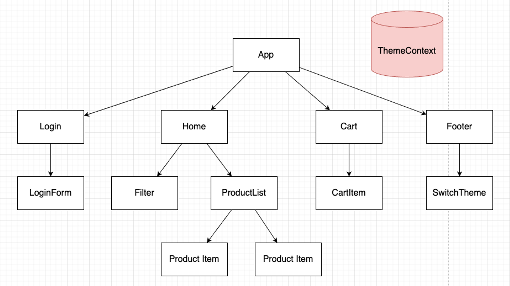
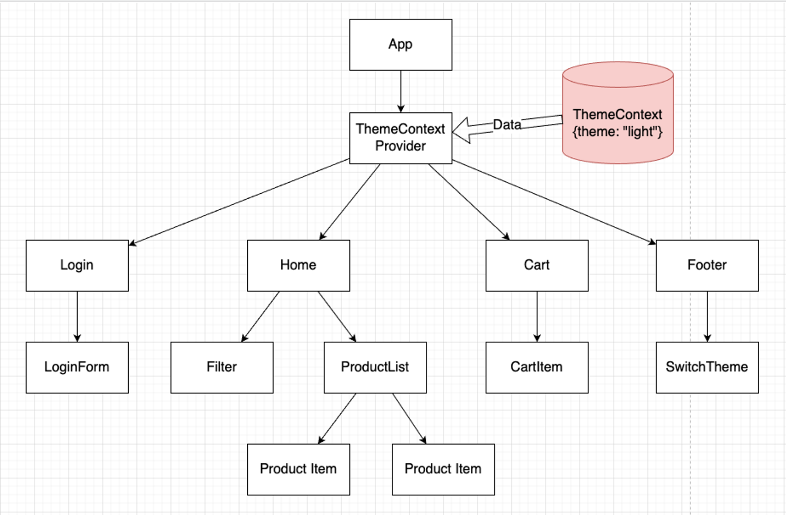
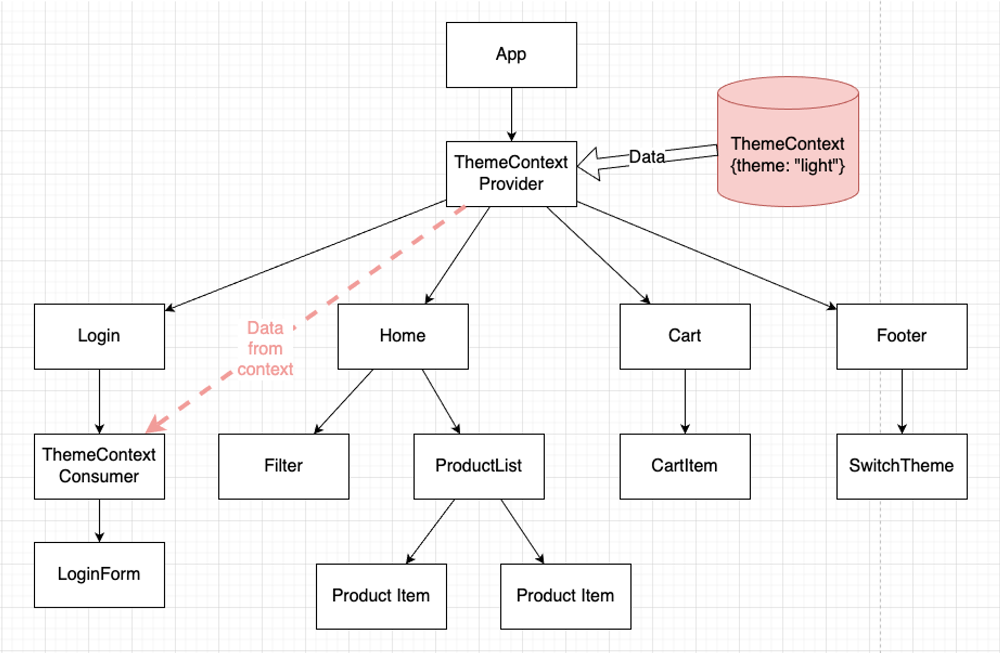
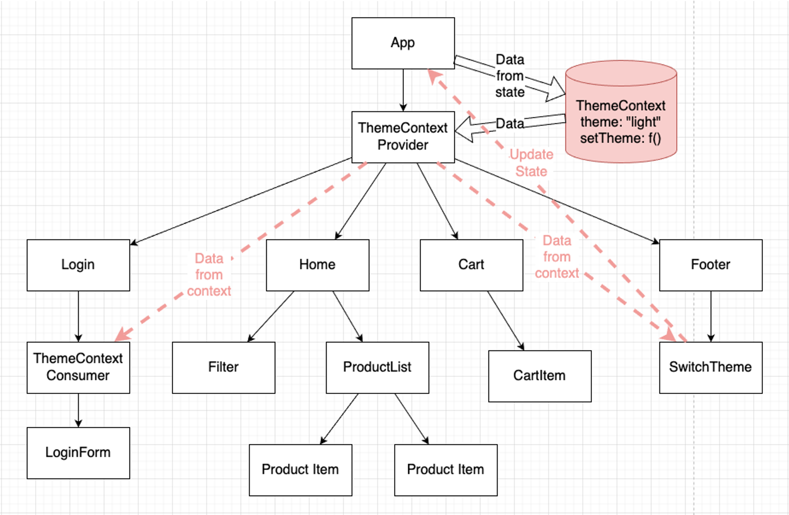

# Lesson 9: Context

```
💡 Sử dụng context để giải quyết các vấn đề liên quan tới chia sẻ dữ liệu giữa nhiều component.

```

# Vấn đề của React

Trong React, dữ liệu được truyền từ trên xuống dưới (cha tới con) thông qua props. Tuy nhiên có rất nhiều trường hợp trong thực tế, có những loại dữ liệu, ví dụ như “đa ngôn ngữ” hoặc “giao diện sáng/tối”, chúng ta muốn nhiều component bên trong ứng dụng cần truy cập vào nó.



Một ứng dụng React sẽ bao gồm rất nhiều components. Giả sử chúng ta cần làm giao diện sáng và tối cho ứng dụng, sẽ có rất nhiều thành phần của ứng dụng chịu ảnh hưởng. Khi này, việc truyền dữ liệu qua props thông thường sẽ làm code rất rối và trở nên không cần thiết.

Trong hình vẽ trên, ta thấy có component `SwitchTheme` được đặt trong component `Footer`. Nếu chúng ta muốn khi thay đổi giá trị của theme, toàn bộ ứng dụng sẽ chuyển đổi theo, bao gồm cả các components nằm trên những nhánh khác như `LoginForm` hay `ProductItem` . Theo cách thông thường, chúng ta sẽ cần phải sử dụng tới kĩ thuật "Lifting state up”: đặt giá trị “theme” của ứng dụng ở vị trí component App. Sau đó, truyền giá trị “theme” đó tới các nhánh của cây qua props.

Context cung cấp khả năng có thể chia sẻ dữ liệu giữa các component mà không cần truyền props qua nhiều cấp độ trong cây. Giúp giảm thiểu code rườm rà, lặp lại nhiều lần.

---

# Sử dụng Context để giải quyết vấn đề trên

React cung cấp một function để chúng ta khởi tạo một object context trong ứng dụng:

```jsx
import { createContext } from "react";

const defaultValue = { theme: "light" };
const ThemeContext = createContext(defaultValue);

export default ThemeContext;
```

Trong context, chúng ta có một vài khái niệm như sau:

- Context: Hoạt động giống như một kho dữ liệu, cung cấp dữ liệu cho các thành phần cần tới nó.
- Context Provider: một React component, sử dụng để cung cấp dữ liệu từ trong kho dữ liệu tới các component con.
- Context Consumer: một React component, được sử dụng để lấy dữ liệu từ trong kho context.

Sau khi đã khởi tạo context, ta có thể hình dung ứng dụng sẽ có hình dạng cây như sau:



ThemeContext được khởi tạo. Hiện tại, nó nằm ngoài component tree

### Context Provider

```jsx
import ThemeContext from "./ThemeContext";

const App = () => {
  return (
    <ThemeContext.Provider value={{ theme: "light:" }}>
      ...
    </ThemeContext.Provider>
  );
};
```

Context Provider là một component của React. Nhiệm vụ của Provider là cho phép các component con được phép nhận sự thay đổi từ trong context.
Context Provider nhận vào một props là `value`. Đây là giá trị mà tất cả các **_descendants nodes_** nằm trong provider có thể nhận được thông qua Context Consumer.

Lúc này, component tree của chúng ta sẽ được cập nhật như sau:



Tất cả các **_descendants nodes_** nằm trong **\*\***`ThemeContext.Provider` nếu như sử dụng tới giá trị bên trong context đều sẽ được re-render khi giá trị context thay đổi.

### Context Consumer

```jsx
import ThemeContext from "./ThemeContext"

const Login = () => {
	return (
		<div>
			<ThemeContext.Consumer>
				{(themeCtx) => {
					return (
						<div
							style={{
								backgroundColor: themeCtx.theme === 'light': 'white': 'black'
							}}
						>
							<LoginForm />
						</div>
					)
				}}
			</ThemeContext.Consumer>
		</div>
	)
}

export default Login
```

Context Consumer là một component đặc biệt. Consumer nhận vào một children props là một function. Tham số đầu vào của function đó chính là giá trị nằm bên trong Context. Function này. trả ra kết quả là một React Node. Khi giá trị nằm trong Context Provider thay đổi, các nodes nằm bên trong Context consumer này cũng sẽ được tự động cập nhật lại. Ta có hình vẽ như sau:



Chúng ta có thể tạo ra nhiều hơn một Context Consumer nằm dưới một Context Provider, và tất cả các context consumer này sẽ đều được cập nhật khi giá trị nằm trong provider thay đổi.

```
📖 Việc children props của một component có giá trị là function là một trong những pattern khá phổ biến của React, được gọi là **Render props.** Đọc thêm về render props ở đây:
https://reactjs.org/docs/render-props.html

```

### Sử dụng context với `useContext`

Từ phiên bản 16.8 trở đi, React giới thiệu thêm các hooks. Với context, React có một hook giúp người dùng có thể dễ dàng tạo ra một Context Consumer mà không cần sử dụng tới Render props như `Context.Consumer` thông thường. Component `Login` có thể được viết lại như sau:

```jsx
import {useContext} from 'react'
import ThemeContext from "./ThemeContext"

const Login = () => {

	const themeCtx = useContext(ThemeContext)

	return (
		<div
			style={{
				backgroundColor: themeCtx.theme === 'light': 'white': 'black'
			}}
		>
			<LoginForm />
		</div>
	)
}

export default Login
```

`Context.Consumer` và `useContext` là 2 cách cho phép component có thể truy cập được vào giá trị bên trong context. Ý nghĩa của chúng cũng sẽ giống nhau.

```
📌 Vì chúng ta đang sử dụng phiên bản React hỗ trợ hook, nên trong khoá này, chúng ta sẽ sử dụng `useContext`

```

```
🧑‍💻 Hãy thử sử dụng giá trị của context ở bên trong các component khác.

```

### Các lưu ý khi sử dụng context:

- Context Provider không nhất thiết phải nằm ở trên cùng trong cây component. Context Provider cho phép đưa dữ liệu xuống cho các component khi chúng là các **_descendant nodes_** của Provider đó.
- Có thể có nhiều Context Provider lồng vào nhau. Các consumer sẽ lấy giá trị nằm trong provider gần nó nhất.
- Nếu như consumer không tìm thấy provider của nó ở trong nhánh hiện tại, giá trị mặc định lúc này của consumer sẽ là giá trị nằm trong function `createContext` được sử dụng để tạo ra context.

---

# Giá trị Context động

Làm thế nào để có thể thay đổi được giá trị bên trong Context Provider? Ta có thể đặt Context Provider vào bên trong một component, và để giá trị `value` của nó phụ thuộc vào state của component đó.

```jsx
import { useState } from "react";
import ThemeContext from "./ThemeContext";

const App = () => {
  const [theme, setTheme] = useState({ theme: "light" });

  return (
    <ThemeContext.Provider value={{ theme: theme, setTheme: setTheme }}>
      ...
    </ThemeContext.Provider>
  );
};
```

Lúc này, giá trị bên trong của context chính là giá trị của state trong component `App`. Chúng ta cho giá trị của context là một object. Đi cùng với giá trị `theme` là function `setTheme` mà chính là function được sử dụng để thay đổi giá trị state của component `App`. Các component bên dưới khi nhận được giá trị từ trong context sẽ có thể sử dụng function này để cập nhật state của `App`. Qua đó thay đổi dữ liệu trong context và dẫn đến các consumer được cập nhật. Ví dụ với việc đổi theme thông qua component `Footer`

```jsx
import { useContext } from "react";
import ThemeContext from "./ThemeContext";

const Footer = () => {
  const themeCtx = useContext(ThemeContext);

  const onSelectTheme = (event) => {
    themeCtx.setTheme(event.target.value);
  };

  return (
    <div>
      <select value={themeCtx.theme} onChange={onSelectTheme}>
        <option value="light">Light</option>
        <option value="dark">Dark</option>
      </select>
    </div>
  );
};

export default Footer;
```

Cây component sẽ có dạng như sau:



---

# Bạn có thể không cần context

Sử dụng context consumer trong các component sẽ khiến cho việc tái sử dụng chúng trở nên khó khăn hơn. Lý do ở đây là vì các component lúc này sẽ phụ thuộc vào giá trị cả bên trong context, khiến cho chúng có thể có nhưng kết quả khó đoán hơn.

```
📌 Chỉ sử dụng context với các dữ liệu mang tính chất “toàn cục” như: giao diện của ứng dụng, người dùng đang đăng nhập hiện tại, ngôn ngữ đang được chọn, ... Không nên lạm dụng context cho các loại dữ liệu khác khi chúng không có sự chia sẻ lớn trong ứng dụng: danh sách sản phẩm, danh sách các mặt hàng trong giỏ hàng, ...

```

Trong một vài trường hợp đơn giản khi chúng ta muốn truyền dữ liệu theo chiều sâu thuần tuý (truyền dữ liệu đơn thuần trong một nhánh cây), việc sử dụng các kĩ thuật tương tự như là **Render props (component composition)** có thể coi là đơn giản và dễ dùng hơn. Xét ví dụ sau:

```jsx
import { useState } from "react";

const App = () => {
  const [theme, setTheme] = useState("light");

  return (
    <ProductList theme={theme}>
      <ProductItem theme={theme}>
        <Price theme={theme} />
      </ProductItem>
      <ProductItem theme={theme}>
        <Price theme={theme} />
      </ProductItem>
    </ProductList>
  );
};

const ProductList = (props) => {
  return <div className="product-list">{props.children}</div>;
};

const ProductItem = (props) => {
  return <div className="product-item">{props.children}</div>;
};

const Price = (props) => {
  return <div className="product-price"></div>;
};
```

Tuy nhiên, với việc dữ liệu cần được chia sẻ cho nhiều component nằm sâu trong các nhánh nhỏ, hoặc nằm ở những nhánh khác, context sẽ là giải pháp hợp lý hơn.

```
🤔 Hãy thử liệt kê một vài trường hợp mà việc lưu trữ dữ liệu trong context là hợp lý.

```

```
💡 Giới thiệu thêm các hook cần biết trong React.

```

# `useRef`

Trong nhiều trường hợp, chúng ta cần truy cập tới các phần tử HTML của component. Xét ví dụ sau:

```jsx
const App = () => {
  const handleFocus = () => {
    document.getElementById("myTxt").focus();
  };

  return (
    <div>
      <input id="myTxt" type="text" />
      <button onClick={handleFocus}>Focus</button>
    </div>
  );
};
```

Khi click vào button “Focus”, ta muốn con trỏ chuột sẽ được “focus” vào phần tử input để người dùng có thể nhập liệu. Với cách làm thông thường, ta sử dụng một giá trị id cho `input` và tiến hành sử dụng các function mặc định để truy vấn tới thẻ `input` đó.

Tuy nhiên, giả sử chúng ta có nhiều hơn các component `App` cần được render, thì các `input` sẽ có trùng một id. Điều này dẫn tới button “Focus” không hoạt động theo mong muốn.

React cung cấp một giải pháp để có thể truy cập đến các phần tử “HTML” trong component với `useRef`. Ứng dụng trên có thể viết lại như sau:

```jsx
import { useRef } from "react";

const App = () => {
  const inputRef = useRef(null);

  const handleFocus = () => {
    inputRef.current.focus();
  };

  return (
    <div>
      <input ref={inputRef} type="text" />
      <button onClick={handleFocus}>Focus</button>
    </div>
  );
};
```

`useRef` là một hook trong React. Ta khởi tạo một object React Reference là `inputRef` trong component `App`. Tất cả các thẻ HTML trong JSX đều có một thuộc tính đặc biệt là `ref` . Thuộc tính này sẽ nhận giá trị là một React Reference. Khi này, ta có thể truy cập tới thẻ HTML thông qua `ref.current`

`inputRef` trong ví dụ trên là độc lập giữa các instance của component `App`. Giả sử trong trường hợp chúng ta có nhiều hơn một component `App` xuất hiện trên màn hình, mỗi một component đó sẽ có một giá trị `inputRef` riêng để tham chiếu tới thẻ `input` của nó.

```
📖 Chỉ có các thẻ HTML có sẵn của JSX là có thể sử dụng thuộc tính `ref` này. Các component do user định nghĩa sẽ coi `ref` giống như các giá trị props thông thường khác. Để tham chiếu tới một thẻ HTML bên trong của một component tự định nghĩa, ta cần sử dụng một kĩ thuật là “chuyển tiếp ref”. Xem thêm ở đây: https://reactjs.org/docs/forwarding-refs.html

```

Ngoài khả năng tham chiếu tới các thẻ HTML, `useRef` còn có thể được sử dụng để lưu trữ **các giá trị qua những lần render** của component. Xét ví dụ sau:

```jsx
import {useRef, useState} from 'react'

const App = () => {

	let count = 0;
	const countRef = useRef(0);
	const [countState, setCountState] = useState(0);

	console.log("count: ", count);
	console.log("countRef: ", countRef.current);
	console.log("countState", countState);

	const increase = () => {
		count ++
	}

	const increaseRef = () => {
		countRef.current++
	}

	const increaseState = () => {
		setCountState(countState + 1)
	}

	return (
		<div>
			<div>
				{count}
				<button onClick={increase}>Increase Count<button>
			</div>
			<div>
				{countRef.current}
				<button onClick={increaseRef}>Increase CountRef<button>
			</div>
			<div>
				{countState}
				<button onClick={increaseState}>Increase CountState<button>
			</div>
		</div>
	)
}
```

Trong ví dụ trên, ta thấy:

- Khi cập nhật `countRef` và `count`, giao diện không được cập nhật
- Khi thay đổi giá trị `countState` , giao diện được cập nhật. Giá trị của `count` sẽ trở về 0, giá trị của `countRef` vẫn sẽ được giữ nguyên.

Bản chât của việc render lại của React chính là chạy lại function `App` một lần nữa. Với việc sử dụng `useRef`, React hiểu rằng nó cần phải giữ lại giá trị của `ref` đó sau mỗi lần re-render. Tuy nhiên, khác với state, việc thay đổi giá trị của `ref` không khiến cho React thực hiện render lại component. Vì vậy, `useRef` có thể được sử dụng để lưu trữ các giá trị cần được giữ nguyên qua nhiều lần render, nhưng không ảnh hưởng tới UI của ứng dụng React. Một vài ví dụ có thể dùng `useRef` là timer, các object từ thư viện bên thứ 3.

```
🧑‍💻 Hãy thử viết một ứng dụng đồng hồ bấm giờ với 3 thành phần đơn giản: Thời gian đã chạy, button Start và button Stop. Render nhiều component để có nhiều đồng hồ bấm giờ riêng biệt nhau.

```

---
