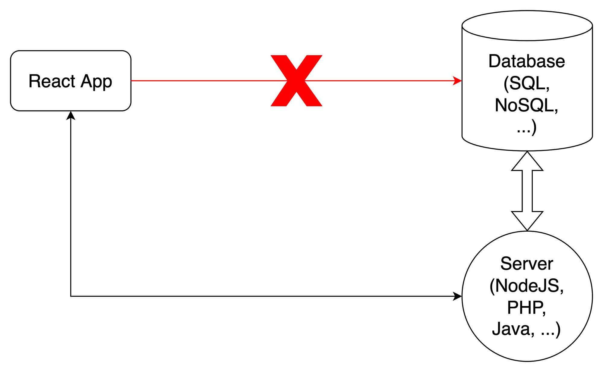
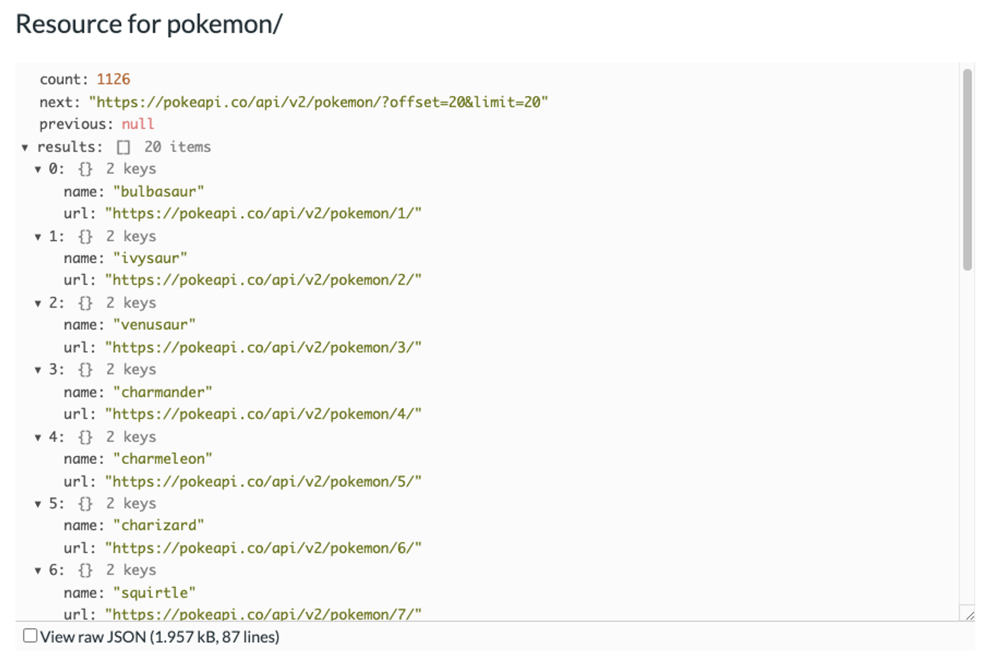

# Lesson: HTTP

```
💡 Hiểu cách sử dụng HTTP trong ứng dụng web để thực hiện việc giao tiếp giữa client và server.

```

# 1. React không kết nối trực tiếp tới Database.

Một ứng dụng web thường sẽ có nhiều người cùng truy cập và sử dụng chung dữ liệu. Ví dụ như trong một ứng dụng thương mại điện tử, người dùng sẽ thực hiện đặt một đơn hàng. Đơn hàng cần phải được lưu trữ bên trong một hệ thống, và người quản trị sẽ cần phải nhìn thấy được đơn hàng mà khách hàng của mình đã đặt. Như vậy, dữ liệu cần phải được chia sẻ giữa nhiều người dùng trong hệ thống.

Các ứng dụng React trên các trình duyệt khác nhau của nhiều người dùng trong thực tế không nói chuyện trực tiếp với nhau. Chúng ta thường có một máy tính trung tâm làm nhiệm vụ điều phối và cung cấp dữ liệu cho các người dùng trong hệ thống, giống như việc kết nối nhiều thiết bị điện thoại với nhau trong một mạng lưới.


Trong thực tế, một trong những mô hình ứng dụng web phổ biến nhất là client-server. Khi đó, chúng ta có một máy chủ chịu trách nhiệm lưu trữ dữ liệu. Các ứng dụng web chạy trên trình duyệt đóng vai trò như các máy khách, có thể làm thay đổi dữ liệu trên máy chủ hoặc lấy dữ liệu từ máy chủ ra và hiển thị cho người dùng.

### Ứng dụng React không nên kết nối trực tiếp tới database



Trong thực tế, các ứng dụng web chạy dưới trình duyệt không nên kết nối trực tiếp vào các hệ thống cơ sở dữ liệu. Chúng sẽ dẫn tới nhiều vấn đề như:

- Các thông tin đăng nhập vào CSDL sẽ bị lộ, vì người dùng có thể xem toàn bộ code Javascript dưới trình duyệt. Dẫn đến ứng dụng kém an toàn
- Nhiều vấn liên quan tới hiệu năng khi ứng dụng có nhiều người dùng

Các hệ thống web thường sẽ có một ứng dụng khác chạy bên phía máy chủ, thường được gọi là **backend application.** Ứng dụng này sẽ giao tiếp với ứng dụng web chạy trên trình duyệt và thực hiện các kết nối tới CSDL. Qua đó, các thông tin liên quan tới CSDL (username, password) sẽ bị ẩn bên trong backend application, tạo ra một kết nối an toàn hơn tới CSDL.

Lúc này nảy sinh một vấn đề: giao tiếp giữa ứng dụng frontend và ứng dụng backend sẽ được thực hiện như thế nào? HTTP được tạo ra nhằm giải quyết vấn đề này.

```
💡 Việc tạo ra các ứng dụng backend sẽ được học ở trong các phần sau. Trong phần này, chúng ta sẽ sử dụng các ứng dụng backend được viết sẵn ở trên internet.

```

---

# 2. Giao tiếp với HTTP API:

### Giới thiệu cơ bản về API:

API là viết tắt của **Application Programming Interface.** API là một từ được sử dụng rộng rãi trong lập trình nói chung. API có thể hiểu là những gì được phơi ra bên ngoài, được truyền vào từ bên ngoài để thực hiện một số tác vụ nhất định. API trong ngữ cảnh HTTP được hiểu là các đường dẫn mà máy chủ cung cấp ra bên ngoài để các ứng dụng phía client có thể gọi tới và sử dụng dụng dữ liệu.

Ví dụ với đường dẫn sau:

```jsx
https://pokeapi.co/api/v2/pokemon
```

PokeAPI là một ứng dụng backend, cho phép lấy dữ liệu liên quan tới các Pokemon. PokeAPI cung cấp một loại các đường dẫn. Khi ứng dụng client gửi request tới các đường dẫn đó, PokeAPI tiến hành trả về các kết quả theo một format nhất định. Các đường dẫn khác nhau sẽ dẫn tới các kết quả khác nhau:

```bash
https://pokeapi.co/api/v2/pokemon => Get list of pokemons
https://pokeapi.co/api/v2/pokemon/ditto => Pokemon Ditto
https://pokeapi.co/api/v2/pokemon/pikachu => Pokemon Pikachu
```

### Thực hiện lấy dữ liệu từ API

React tạo ra một ứng dụng web JS chạy trên trình duyệt. Do đó, chúng ta có thể sử dụng bất cứ thư viện của Javascript nào để xử lý HTTP. JS có sẵn một thư viện để xử lý vấn đề này là “Fetch API”.

```jsx
import { useState } from "react";

const App = () => {
  const [pokemons, setPokemons] = useState([]);

  const handleFetchPokemon = () => {
    fetch("https://pokeapi.co/api/v2/pokemon")
      .then((response) => {
        return response.json();
      })
      .then((data) => {
        console.log(data);
        setPokemons(data.result);
      });
  };

  return (
    <div>
      <button onClick={handleFetchPokemon}>Fetch Pokemon</button>
      <ul>
        {pokemons.map((pokemon) => {
          return <li key={pokemon.url}>{pokemon.name}</li>;
        })}
      </ul>
    </div>
  );
};
```

Function `fetch` của JS nhận vào tham số là đường dẫn tới địa chỉ API. Và nó trả về kết quả là một `Promise`. Gửi HTTP request qua mạng là một tác vụ bất đồng bộ. Do đó, kết quả trả về sẽ không tới ngay lập tức. `Promise` được tạo ra để giải quyết vấn đề trên. `Promise` cung cấp `then` function, giúp chúng ta thực hiện các câu lệnh tiếp theo sau khi tác vụ bất đồng bộ hoàn thành. Với ví dụ trên, ta sẽ nhận được kết quả là một danh sách các pokemon như hình



Giá trị trả về là một `object`. Ta thấy danh sách các pokemon nằm trong trướng `results` của response. Ta có thể lưu trữ chúng với `state` của React và hiển thị chúng lên màn hình.

### Sử dụng `async/await`:

Với những version JS mới hơn, ta có một cú pháp thay thế cho `.then()`, giúp code dễ đọc hơn, trông giống với code đồng bộ hơn là `async/await`

```jsx
const handleFetchPokemon = async () => {
  const response = await fetch("https://pokeapi.co/api/v2/pokemon");
  const data = await response.json();
  console.log(data);
  setPokemons(data.result);
};
```

Giống như `Promise`, `async / await` là tính năng của JS, không phải của React. Vì vậy, chúng ta có thể viết `async / await` với bất cứ thư viện JS nào. Chúng cho phép đoạn code trông “sạch” hơn so với `Promise`

### Sử dụng thư viện `axios`

Ngoài “Fetch API” đã mặc định có sẵn với JS, có nhiều thư viện khác có thể được sử dụng để xử lý HTTP request / response với JS. Một thư viện rất phổ biến là `axios`. Nó cung cấp thêm các tính năng nâng cao như interceptors, cancel request, bảo vệ khỏi tấn công xsrf từ client... Để cài đặt thư viện này, ta sử dụng câu lệnh sau:

```jsx
npm install axios
```

Và function `handleFetchPokemon` sẽ trở thành:

```jsx
import axios from 'axios'

...

const handleFetchPokemon = async () => {
		const response = await axios.get('https://pokeapi.co/api/v2/pokemon');
		console.log(response);
}
```

```
📌 `axios` là một trong những thư viện phổ biến nhất được sử dụng trong ứng dụng web để xử lý HTTP. Hãy tìm hiểu thêm về tính năng interceptors của nó

```

---

# 3. Xử lý trạng thái “Loading” và xử lý lỗi khi gọi dữ liệu API:

Thường khi ứng dụng đang ở trạng thái đang tải dữ liệu từ phía API về, chúng ta sẽ muốn hiển thị một biểu tương để người dùng nhận biết được dữ liệu đang được tải xuống.


Trong ứng dụng React, điều này có thể dễ dàng thực hiện thông qua một giá trị state khác. Chúng ta sẽ cập nhật giá trị này thành `true` khi bắt đầu thực hiện việc gọi API, và cập nhật nó lại thành `false` sau khi việc gọi API hoàn tất. Với giá trị state này, ta có thể dễ dàng hiển thị một “biểu tượng đang tải về” khi đang trong quá trình tải xuống dữ liệu.

```jsx
import { useState } from "react";

const App = () => {
  const [pokemons, setPokemons] = useState([]);
  const [isLoading, setIsLoading] = useState(false);

  const handleFetchPokemon = async () => {
    setIsLoading(true);
    const response = await fetch("https://pokeapi.co/api/v2/pokemon");
    const data = await response.json();
    console.log(data);
    setPokemons(data.result);
    setIsLoading(false);
  };

  return (
    <div>
      <button onClick={handleFetchPokemon}>Fetch Pokemon</button>
      {isLoading && <p>Loading ...</p>}
      {!isLoading && pokemons.length == 0 && <p>No Pokemons</p>}
      {!isLoading && pokemons.length > 0 && (
        <ul>
          {pokemons.map((pokemon) => {
            Ï;
            return <li key={pokemon.url}>{pokemon.name}</li>;
          })}
        </ul>
      )}
    </div>
  );
};
```

Trong rất nhiều trường hợp, API sẽ trả về giá trị lỗi, thay vì luôn luôn thành công như trên. Có rất lý do cho việc này: ứng dụng backend gặp lỗi, đường truyền mạng, ... Để xử lý lỗi với ứng dụng React, ta có thể sử dụng thêm một giá trị state nữa để lưu lại khi có bất cứ vấn đề gì xảy ra. Ứng dụng trên có thể được cập nhật thành như sau:

```jsx
import { useState } from "react";

const App = () => {
  const [pokemons, setPokemons] = useState([]);
  const [isLoading, setIsLoading] = useState(false);
  const [error, setError] = useState("");

  const handleFetchPokemon = async () => {
    try {
      setIsLoading(true);
      const response = await fetch("https://pokeapi.co/api/v2/pokemon");
      const data = await response.json();
      console.log(data);
      setPokemons(data.result);
      setIsLoading(false);
    } catch (err) {
      setError(err.message);
      setIsLoading(false);
    }
  };

  if (error) {
    return <div>Something went wrong: {error}</div>;
  }

  return (
    <div>
      <button onClick={handleFetchPokemon}>Fetch Pokemon</button>
      {isLoading && <p>Loading ...</p>}
      {!isLoading && pokemons.length == 0 && <p>No Pokemons</p>}
      {!isLoading && pokemons.length > 0 && (
        <ul>
          {pokemons.map((pokemon) => {
            Ï;
            return <li key={pokemon.url}>{pokemon.name}</li>;
          })}
        </ul>
      )}
    </div>
  );
};
```

---

# 4. Gọi API ngay khi component được render với `useEffect`

Có nhiều trường hợp, dữ liệu cần phải được tải xuống ngay khi ứng dụng vừa mới được truy cập từ người dùng. Để làm được điều này, chúng ta sẽ cần xử lý logic lấy dữ liệu từ API ở bên trong `useEffect`. Nhờ đó có thể thực hiện việc API ngay khi component vừa được render lần đầu

```jsx
import {useState, useEffect} from 'react'

const App = () => {

	const [pokemons, setPokemons] = useState([])
	const [isLoading, setIsLoading] = useState(false)
	const [error, setError] = useState("")

	const handleFetchPokemon = async () => {
		try {
			setIsLoading(true)
			const response = await fetch('https://pokeapi.co/api/v2/pokemon');
			const data = await response.json();
			console.log(data);
			setPokemons(data.result)
			setIsLoading(false)
		}
		catch(err) {
			setError(err.message)
			setIsLoading(false)
		}
	}

	useEffect(() => {
		try {
			setIsLoading(true)
			const response = await fetch('https://pokeapi.co/api/v2/pokemon');
			const data = await response.json();
			console.log(data);
			setPokemons(data.result)
			setIsLoading(false)
		}
		catch(err) {
			setError(err.message)
			setIsLoading(false)
		}
	}, [])

	if (error) {
		return <div>Something went wrong: {error}</div>
	}

	return (
		<div>
			<button onClick={handleFetchPokemon}>Fetch Pokemon</button>
			{isLoading && <p>Loading ...</p>}
			{!isLoading && pokemons.length == 0 && <p>No Pokemons</p>}
			{!isLoading && pokemons.length > 0 &&
				(<ul>
					{pokemons.map(pokemon => {Ï
						return <li key={pokemon.url}>{pokemon.name}</li>
					})}
				</ul>)
			}
		</div>
	)
}
```

````
🤔 Có thể nhận thấy sự trùng lặp code ở trong ví dụ. Thực tế, chúng ta không thực hiện việc gọi function `handleFetchPokemon` ngay bên trong effect. Điều này cần một kĩ thuật đặc biệt với `useCallback`. Hãy tìm hiểu thêm và giải thích lý do cho hiện tượng trên.

```s
````
